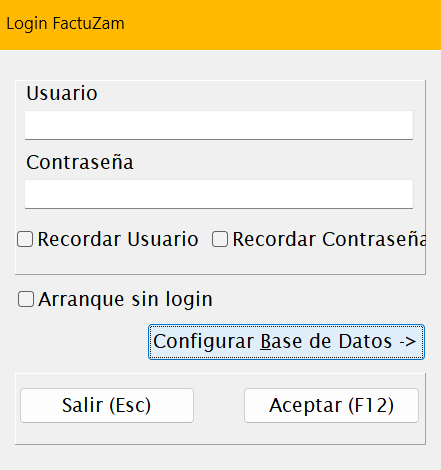
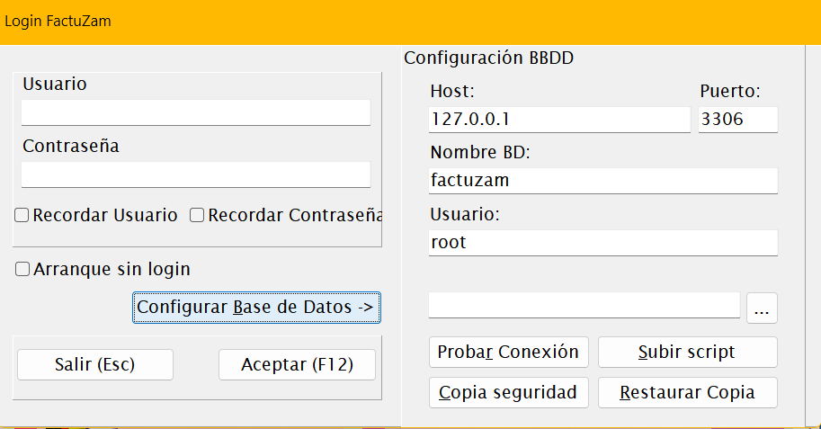
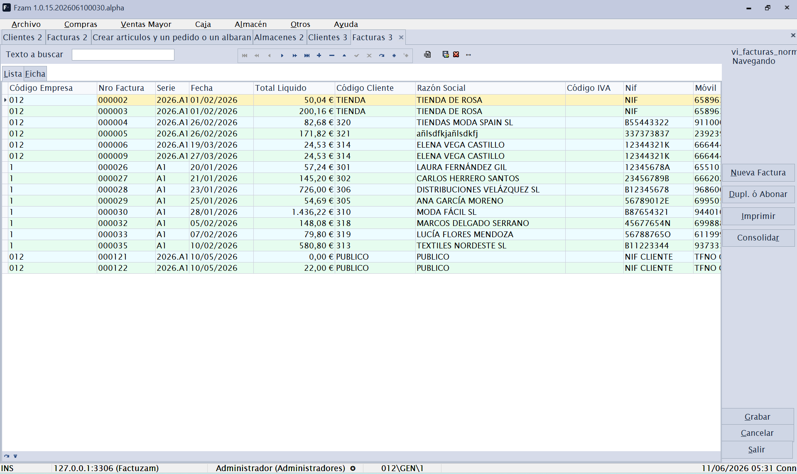

# 00 · Acceso y primeros pasos

[◀ Volver al índice](README.md)

Este capítulo describe lo que ocurre desde que arrancas Factuzam hasta que
tienes la ventana principal lista para trabajar.

> **Práctica en programa DEMO:** en la primera entrada, usa el usuario
> administrador de la demo solo para crear tu usuario propio con contraseña
> en [Otros ▸ Usuarios, Grupos y Perfiles](07-menu-otros.md#usuarios-grupos-y-perfiles).
> Asígnalo al grupo **Administradores** y después entra de nuevo desde
> *Archivo ▸ Invocar login* para continuar las pruebas con tu usuario.

---

## 1. Pantalla de presentación (Splash)

Al ejecutar la aplicación se muestra durante unos segundos la pantalla de
presentación con el logotipo y el **número de versión**. Es informativa; no
requiere ninguna acción. La misma pantalla puede consultarse en cualquier
momento desde *Ayuda ▸ Acerca de*.

*▢ Captura pendiente — Pantalla de presentación (Splash).*

---

## 2. Inicio de sesión (Login)

A continuación aparece la ventana **Login FactuZam**:

*▢ Captura pendiente — Ventana de login.*

| Campo | Descripción |
|-------|-------------|
| **Usuario** | Nombre de usuario de la aplicación. |
| **Contraseña** | Clave del usuario. |
| **Recordar Usuario** | Guarda el usuario para el próximo arranque. |
| **Recordar Contraseña** | Guarda también la contraseña (úsalo solo en equipos de confianza). |
| **Arranque sin login** | Si se marca, la aplicación entra directamente la próxima vez sin pedir credenciales. |

Si hay un cambio de usuario dentro de la misma sesión, en la aplicación se
puede invocar desde *Archivo ▸ Invocar login* o desde la combinación de
teclas `[Ctrl]+[Mayúsculas]+[L]`.

**Botones:**

- **Aceptar (F12)** — valida las credenciales y entra a la aplicación.
- **Salir (Esc)** — cierra la aplicación sin entrar.

> El usuario determina tu **perfil de permisos**, que decide qué menús y
> qué acciones tienes disponibles dentro de la aplicación.

---

## 3. Configuración de la base de datos

Desde la propia ventana de login, el botón **Configurar Base de Datos ▸**
despliega el panel **Configuración BBDD**. Aquí se indican los datos de
conexión al servidor **MariaDB/MySQL** donde residen los datos:

*▢ Captura pendiente — Login con el panel Configuración BBDD desplegado.*

| Campo | Descripción |
|-------|-------------|
| **Host** | Servidor donde está la base de datos (p. ej. `localhost` o una IP). |
| **Puerto** | Puerto del servidor (MariaDB usa `3306` por defecto). |
| **Nombre BD** | Nombre de la base de datos de Factuzam. |
| **Usuario** | Usuario de la base de datos. |
| **Contraseña** | Clave del usuario de la base de datos. |

**Botones del panel:**

- **Probar Conexión** — comprueba que los datos son correctos y que el
  servidor responde, sin necesidad de entrar.
- **Configurar/cambiar credenciales del servidor** (`...`) — utilidades
  avanzadas de administración de la conexión.

> Esta configuración normalmente la realiza **una sola vez el instalador o
> administrador**. Un usuario habitual no necesita tocarla. Si al arrancar
> aparece un error de conexión, avisa al administrador antes de cambiar
> nada aquí.

---

## 4. La ventana principal

Tras validar el login se muestra la ventana principal de Factuzam, con:

*▢ Captura pendiente — Ventana principal con varias pestañas abiertas.*

- La **barra de menú** en la parte superior (Archivo, Compras, Ventas
  Mayor, Caja, Almacén, Otros, Verifactu, Ayuda). Es el eje de navegación
  de toda la aplicación y la estructura que sigue este manual.
- Un **área de trabajo con pestañas**: cada opción de menú que abres se
  carga como una pestaña dentro de la ventana principal, de modo que
  puedes tener varias pantallas abiertas a la vez y cambiar entre ellas con
  la combinación de teclas Control + Tab.
- Una **barra de estado** inferior con información de contexto (usuario,
  empresa activa, versión…).

### Cómo se abren las pantallas

Cuando eliges una opción de menú, la aplicación abre la pantalla de
mantenimiento correspondiente **como una pestaña nueva** (o reutiliza la
que ya esté abierta). Algunas pantallas admiten **varias instancias
simultáneas** (verás un número junto al título, p. ej. *Clientes 2*).

> El funcionamiento interno de cada pantalla (lista, ficha, búsqueda,
> navegación, grabado…) es **común a casi todos los mantenimientos** y se
> explica una sola vez en el capítulo
> [01 · Conceptos comunes](01-conceptos-comunes.md). Conviene leerlo antes
> de los capítulos de cada menú.

---

## 5. Práctica en programa DEMO: datos básicos

Después de entrar con tu usuario propio, usa la demo para preparar un
entorno mínimo de pruebas. La idea es crear pocos registros, pero bien
relacionados, para poder comprar, vender y revisar stock sin depender de
datos reales.

> En la demo puedes probar sin miedo, pero conviene seguir este orden:
> primero datos de administración, después catálogos de tallas/colores y,
> al final, artículos y documentos.

### 5.1 Empresas, documentos y formas de pago

1. Abre *Archivo ▸ Empresas* y crea o revisa una empresa de prueba. Rellena
   los datos fiscales básicos y entra en la sub-pestaña **Series** para
   definir las series de facturación que usarán los documentos.
2. Abre *Otros ▸ Impuesto IVA* y *Otros ▸ Grupos de IVA*. En una demo
   normalmente basta con revisar los tipos existentes antes de tocar nada.
3. Abre *Otros ▸ Contadores* y comprueba la numeración inicial de facturas,
   albaranes, pedidos y otros documentos por empresa y serie.
4. Abre *Otros ▸ Formas de pago documentos* y crea las formas habituales
   para compras y ventas mayor: contado, transferencia, giro, etc.
5. Si más adelante se va a probar el TPV, deja previstas también las formas
   de cobro de caja: efectivo, tarjeta, vale o las que necesites.

### 5.2 Almacenes y cajas de venta

1. Abre *Archivo ▸ Almacenes* y crea al menos un almacén de venta. Rellena
   su nombre, dirección si procede y los usos del almacén.
2. En la sub-pestaña **Cajas de Venta**, crea las cajas físicas asociadas a
   ese almacén. Cada caja representa un puesto, mostrador o terminal de
   venta dentro del almacén.
3. Si hay varios puestos de cobro, crea una caja por puesto para poder
   separar después las operaciones, arqueos y movimientos de efectivo.
4. En una práctica sencilla basta con un almacén de venta y una caja de
   venta activa.

### 5.3 Tallas, colores, temporadas y tarifas

1. Abre *Archivo ▸ Tablas Auxiliares ▸ Atributos básicos* y da de alta los
   valores elementales que vas a usar: tallas, colores y equivalencias
   normalizadas.
2. Abre *Archivo ▸ Tablas Auxiliares ▸ Tipos de Variaciones* y crea los
   ejes **Talla** y **Color**. En cada uno, añade sus atributos: S, M, L,
   XL, 38, 40, rojo, azul, negro, etc.
3. Abre *Archivo ▸ Tablas Auxiliares ▸ Colecciones de Atributos* y prepara
   los sistemas de tallas reutilizables, por ejemplo *Mujer S-XL*,
   *Calzado 36-41* o *Niño 2-16*. Así podrás aplicarlos a varios artículos
   sin repetir la misma curva.
4. Abre *Archivo ▸ Tablas Auxiliares ▸ Propiedades* y crea la propiedad
   **Temporada** con valores como *Primavera-Verano*, *Otoño-Invierno* o el
   año/campaña que uses en la prueba.
5. Abre *Archivo ▸ Tablas Auxiliares ▸ Tarifas* y crea una tarifa de venta
   de prueba. Más adelante, al crear artículos o sesiones de compra,
   asignarás precios a esa tarifa.

### 5.4 Artículos de prueba y primer circuito

1. Abre *Archivo ▸ Artículos* y crea un artículo sencillo: descripción,
   familia, unidad de medida, IVA y tarifa.
2. En la ficha del artículo, usa las variaciones y colecciones para generar
   sus SKUs de talla/color. Cada SKU representa una combinación vendible y
   con stock propio.
3. Para probar una entrada real de género, abre *Compras ▸ Sesiones*. Ahí
   puedes crear artículos con colores y tallas, repartir unidades por talla
   y generar el pedido o albarán de compra.
4. Comprueba el resultado en *Almacén ▸ Informes* o en la consulta de stock
   del artículo. Con esto quedan preparados los datos básicos para probar
   después compras, ventas o movimientos.

Cuando termines esta práctica, tendrás creados los datos básicos mínimos:
empresa, documentos, almacén, caja, tallas, colores, sistemas de tallas,
temporadas, tarifas y artículos de prueba.

---

[◀ Índice](README.md) · [Siguiente ▶ Conceptos comunes](01-conceptos-comunes.md)
