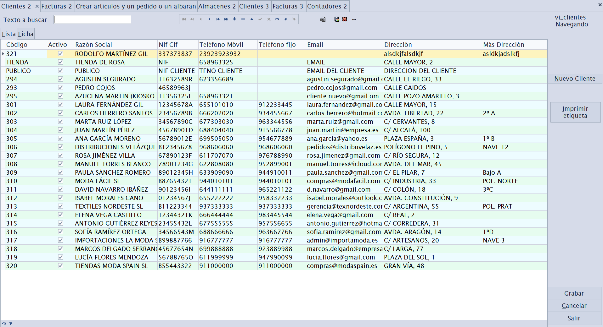
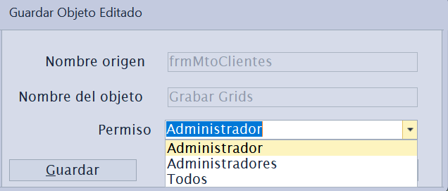
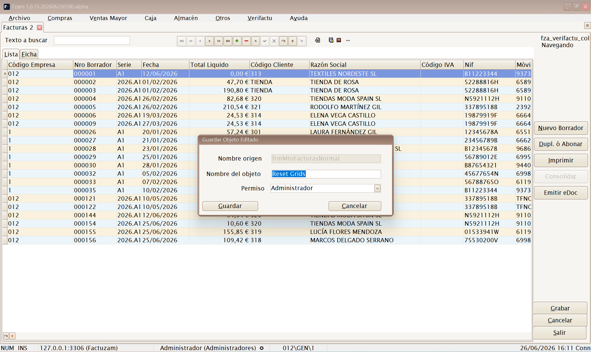
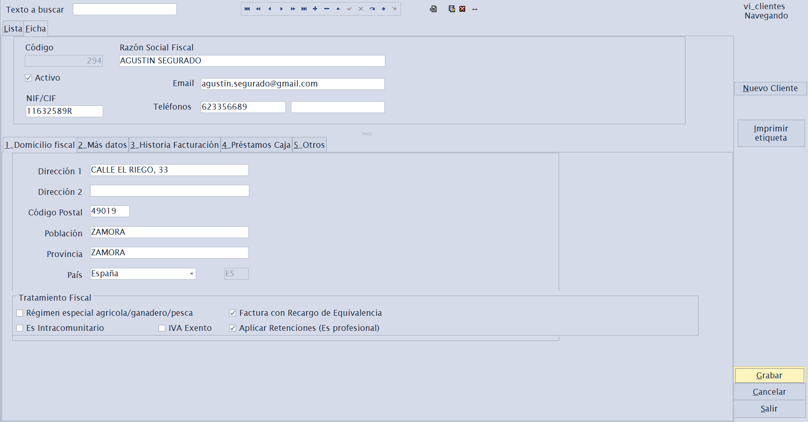
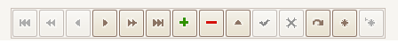
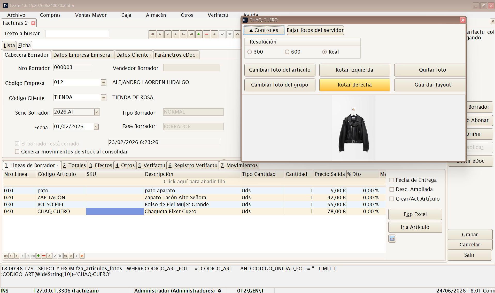
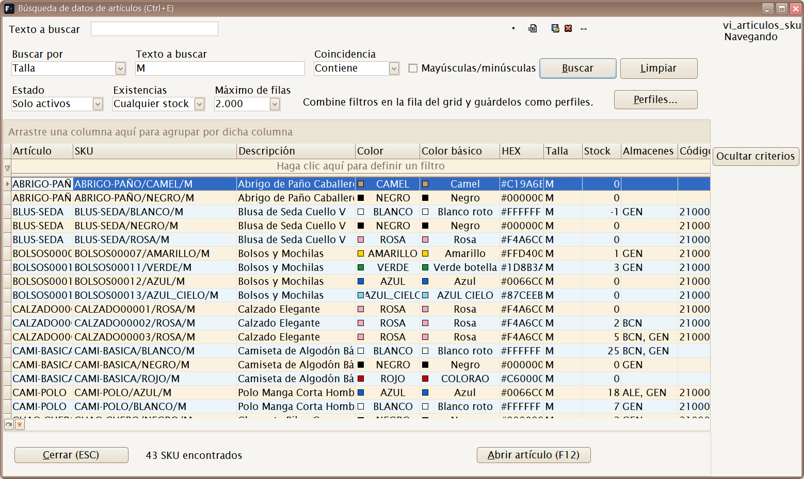

# 01 · Conceptos comunes a todas las pantallas

[◀ Volver al índice](README.md)

Casi todas las opciones de menú abren una **pantalla de mantenimiento** con
la misma estructura. Si entiendes cómo funciona una, las entiendes todas.
Este capítulo explica esa estructura común; los capítulos siguientes solo
añaden lo específico de cada pantalla.

---

## 1. Estructura de una pantalla de mantenimiento

Una pantalla de mantenimiento típica tiene **dos pestañas principales**:

### Pestaña **Lista**

Muestra una **rejilla (grid)** con todos los registros de la tabla (clientes,
artículos, facturas…). Desde aquí puedes:

- **Ordenar** por cualquier columna pulsando en su cabecera.
- **Agrupar, filtrar y reorganizar** columnas (funciones del grid
  DevExpress).
- **Buscar** texto en la rejilla.
- Hacer **doble clic** en una fila para abrir su **Ficha**.

#### Guardar la disposición de la rejilla

Puedes personalizar la rejilla a tu gusto (qué columnas se ven, su orden,
ancho, ordenación y agrupación) y **dejarla guardada** para las próximas
veces. Se gestiona con estos atajos (y con sus botones equivalentes sobre
la rejilla):

| Atajo | Acción | Qué hace |
|-------|--------|----------|
| `[Alt]+[F12]` | **Guardar layout** | Guarda la disposición actual de la rejilla. Al pulsarlo aparece un diálogo donde eliges el **alcance** de la grabación (ver abajo). |
| `[Ctrl]+[F12]` | **Resetear layout** | Borra la personalización guardada y vuelve a la disposición por defecto. También pregunta el **alcance** (a quién se le resetea). |
| `[Ctrl]+[F10]` | **Ajustar anchos** | Ajusta automáticamente el ancho de las columnas a su contenido (*best fit*). Es local y no guarda nada hasta que pulses `[Alt]+[F12]`. |

**Alcance de la grabación (campo «Permiso» del diálogo).** Tanto al guardar
como al resetear, el diálogo te deja elegir **a quién afecta** el cambio:

| Opción | Alcance |
|--------|---------|
| **Usuario** *(por defecto)* | Solo a **ti**. Tu vista personalizada; el resto de usuarios no la ven. |
| **Grupo** | A **todos los usuarios de tu grupo** de permisos (p. ej. *Cajeros*). Útil para fijar una vista estándar del equipo. |
| **Todos** | A **todos los usuarios** de la aplicación. Solo disponible si eres **administrador** (grupo root). |

> Por defecto se guarda **solo para tu usuario**, así que puedes ajustar tu
> rejilla sin afectar a nadie. Elige **Grupo** o **Todos** únicamente cuando
> quieras imponer la misma vista a más gente; ten en cuenta que **Todos**
> sobrescribe la disposición de todos los usuarios y solo lo puede hacer un
> administrador.

### Pestaña **Ficha**

Muestra el **detalle de un único registro** con todos sus campos
organizados en sub-pestañas (Datos principales, Más datos, etc.). Es donde
se **da de alta, se consulta y se edita** un registro concreto.

> Algunas pantallas tienen además una pestaña **Perfil** (visible solo para
> administradores) para configurar columnas, captions y comportamiento de
> la propia pantalla por usuario/perfil.

---

## 2. El navegador de registros

En la parte inferior (o lateral) de la pantalla hay una **barra de
navegación** con los botones estándar. Sus acciones son siempre las mismas:

| Botón | Atajo | Acción |
|-------|-------|--------|
| **Primer registro** | `[Ctrl]+[Inicio]` | Va al primer registro de la lista (respeta la ordenación del grid). |
| **Registro anterior** | `[RePág]` | Retrocede un registro. |
| **Registro siguiente** | `[AvPág]` | Avanza un registro. |
| **Último registro** | `[Ctrl]+[Fin]` | Va al último registro de la lista (respeta la ordenación del grid). |
| **Insertar registro** | `[Insert]` | Crea un registro nuevo en blanco para rellenar. |
| **Editar registro** | `[F2]` | Pone en modo edición el registro actual. |
| **Eliminar registro** | `[Ctrl]+[Supr]` | Borra el registro actual (pide confirmación). |
| **Grabar registro** | `[F12]` | Confirma y guarda los cambios en la base de datos. |
| **Retroceder bloque** | `[Ctrl]+[RePág]` | Retrocede un bloque de registros (paginación). |
| **Avanzar bloque** | `[Ctrl]+[AvPág]` | Avanza un bloque de registros (paginación). |

En artículos y documentos aparecen además botones específicos:

| Botón | Atajo | Acción |
|-------|-------|--------|
| **Foto artículo** | `[Ctrl]+[F]` | Muestra la foto del artículo. |
| **Consulta stock** | `[Ctrl]+[U]` | Consulta el stock del artículo actual. |
| **Búsqueda de datos** | `[Ctrl]+[E]` | Abre la **búsqueda avanzada de artículos y SKU** (ver abajo). |

> Los atajos del navegador funcionan cuando la pantalla de mantenimiento
> tiene el foco. **Grabar** dispone de dos atajos equivalentes: `[F12]`
> (botón **Grabar registro** del navegador) y `[Alt]+[G]` (botón
> **Grabar** de acción, ver abajo).

### Foto flotante del artículo / SKU

`[Ctrl]+[F]` abre una ventana flotante con la foto del artículo o SKU que
esté activo en la pantalla. Si cambias de pestaña, de documento o de línea,
la ventana sigue al registro seleccionado.

Desde esa ventana puedes:

- Ver la foto en resolución **300**, **600** o **real**.
- Cambiar la foto del artículo o del SKU/nivel de color seleccionado.
- Quitar o rotar la foto.
- Bajar fotos del servidor si la instalación tiene configurada la descarga
  en la categoría **Fotos** de parámetros.

> Las fotos se guardan en la carpeta configurada en `appDirFotos`. En
> instalaciones con varios puestos conviene que sea una ruta compartida en
> red para que todos vean las mismas imágenes.

### Búsqueda de datos de artículos (Ctrl+E)

`[Ctrl]+[E]` abre desde **cualquier ventana** del programa la **búsqueda
avanzada de artículos y SKU**: una pantalla de consulta rápida para
localizar referencias por cualquier dato, sin salir de lo que estés
haciendo.

*Búsqueda por talla «M»: cada fila es un SKU, con su color, stock y almacenes.*

Criterios de búsqueda:

- **Buscar por** — el campo sobre el que buscar: todos los campos, código
  de artículo, SKU, descripción, **talla**, **color**, código de barras,
  familia, proveedor, referencia de proveedor, temporada, almacén,
  atributos y propiedades, **color básico** o **proximidad de paleta**
  (encuentra colores parecidos al indicado).
- **Coincidencia** — contiene, empieza por, es igual a, termina en o no
  contiene, con opción de distinguir mayúsculas/minúsculas.
- **Estado** — solo activos, todos o solo inactivos.
- **Existencias** — cualquier stock, con existencias o sin existencias.
- **Máximo de filas** — límite de resultados (500 / 2.000 / 5.000).

Sobre la rejilla de resultados se pueden **combinar más filtros en la fila
de filtro** del grid y guardar la combinación como **perfil** (botón
**Perfiles...**) para repetir búsquedas habituales.

Desde los resultados:

- **F12** o doble clic — **abre la ficha del artículo** seleccionado.
- Menú contextual **Añadir a Documento de Trabajo...** — apunta el SKU en
  un [Documento de Trabajo](06-menu-almacen.md#documentos-de-trabajo).
- **Ocultar criterios** — pliega la zona de filtros para ver más filas.
- **Esc** — cierra la ventana y devuelve el foco a la pantalla anterior.

---

## 3. Botones de acción

Independientemente del navegador, las pantallas suelen mostrar tres botones
de acción principales. La letra subrayada es su **mnemónico** (`[Alt]` +
esa letra):

- **Grabar** (`[Alt]+[G]`) — guarda los cambios del registro en edición.
- **Cancelar** (`[Alt]+[C]`) — descarta los cambios no guardados y vuelve
  al estado anterior.
- **Salir** (`[Alt]+[S]`) — cierra la pestaña de la pantalla.

---

## 4. Flujo de trabajo: alta, modificación y baja

**Dar de alta un registro nuevo:**

1. Pulsa **Insertar registro**, `[Insert]`, (o el botón de alta +).
2. Rellena los campos en la **Ficha**. Los campos obligatorios suelen estar
   marcados o se validan al grabar.
3. Pulsa **Grabar**.

**Modificar un registro existente:**

1. Localízalo en la **Lista** y ábrelo en la **Ficha** (doble clic).
2. Opcionalmente, puede omitirse, pulsa **Editar registro** ó F2.
3. Cambia lo necesario y pulsa **Grabar** ó F12.

**Dar de baja un registro:**

1. Sitúate sobre el registro.
2. Pulsa **Eliminar registro** y confirma o `[Ctrl]+[Supr]`.

> Muchas tablas no se borran realmente, sino que se **desactivan** mediante
> una marca **Activo (S/N)**. Así se conserva el histórico y la integridad
> de documentos antiguos. Cuando exista esa marca, prefiérela al borrado.

---

## 5. Búsquedas

Las pantallas ofrecen dos formas de buscar:

- **Buscar BBDD** — busca en **toda la base de datos** según el texto
  introducido en *Texto a buscar*. Útil para encontrar un registro que no
  está cargado en la página actual.
- **Buscar Grid** — busca **solo dentro de los datos ya cargados** en la
  rejilla.

> **`[Ctrl]+[A]`:atajo de menú que abre la pantalla de Artículos** (igual que
> `[Ctrl]+[P]` abre Proveedores o `[Ctrl]+[K]` abre Clientes). Cada
> mantenimiento tiene su propio atajo de menú; los encontrarás indicados
> en el capítulo de cada menú y resumidos en
> [Atajos de menú](#7-atajos-de-menu).

---

## 6. Exportar a Excel e imprimir

- La mayoría de listas permiten **exportar a Excel** el contenido de la
  rejilla (con los filtros y columnas visibles en ese momento).
- Los documentos (facturas, albaranes, pedidos…) y los informes generan
  **vistas previas imprimibles** (FastReport) desde las que se imprime o se
  exporta a PDF.

---

## 7. Atajos de menú

Cada opción de la barra de menú tiene un **atajo de teclado** que abre esa
pantalla directamente, estés donde estés. Estos atajos se indican también
junto a cada opción en los capítulos siguientes.

### Archivo

| Pantalla | Atajo |
|----------|-------|
| Empresas | `[Ctrl]+[E]` |
| Almacenes | `[Ctrl]+[L]` |
| Clientes | `[Ctrl]+[K]` |
| Proveedores | `[Ctrl]+[P]` |
| Artículos | `[Ctrl]+[A]` |
| Tarifas | `[Ctrl]+[T]` |
| Familias | `[Ctrl]+[N]` |
| Paises | `[Ctrl]+[Alt]+[L]` |
| Unidades de Medida | `[Ctrl]+[Alt]+[U]` |
| Propiedades | `[Ctrl]+[Alt]+[Y]` |
| Tipos de Variaciones | `[Ctrl]+[Alt]+[T]` |
| Colecciones de Atributos | `[Ctrl]+[Alt]+[S]` |
| Atributos básicos | `[Ctrl]+[Alt]+[B]` |
| Invocar login | `[Shift]+[Ctrl]+[L]` |
| Salir | `[Alt]+[F4]` |

### Compras

| Pantalla | Atajo |
|----------|-------|
| Sesiones (crear artículos y documento) | `[Ctrl]+[S]` |
| Pedidos | `[Shift]+[Ctrl]+[P]` |
| Albaranes | `[Shift]+[Ctrl]+[A]` |
| Borradores de compra | `[Shift]+[Ctrl]+[Alt]+[F]` |
| Efectos de pago | `[Ctrl]+[Alt]+[C]` |

### Ventas Mayor

| Pantalla | Atajo |
|----------|-------|
| Borradores | `[Ctrl]+[Alt]+[F]` |
| Pedidos | `[Ctrl]+[Alt]+[P]` |
| Albaranes | `[Ctrl]+[Alt]+[A]` |
| Listados de ventas | `[Ctrl]+[Alt]+[V]` |

### Caja

| Pantalla | Atajo |
|----------|-------|
| Menú de Caja | `[F5]` |
| Parámetros de Caja | `[Ctrl]+[F5]` |
| Formas de Pago Caja | `[Shift]+[Ctrl]+[Q]` |
| Depósitos de Clientes | `[Ctrl]+[D]` |
| Histórico de Pagos de Caja | `[Shift]+[Ctrl]+[J]` |
| Histórico de Vales | `[Shift]+[Ctrl]+[V]` |
| Histórico de Operaciones | `[Shift]+[Ctrl]+[O]` |
| Histórico de Arqueos | `[Shift]+[Ctrl]+[H]` |
| Borradores Simplificados | `[Shift]+[Ctrl]+[F]` |

### Almacén

| Pantalla | Atajo |
|----------|-------|
| Movimientos de almacén | `[Ctrl]+[M]` |
| Inventarios | `[Ctrl]+[Alt]+[I]` |

### Otros

| Pantalla | Atajo |
|----------|-------|
| Parámetros del entorno | `[Ctrl]+[F10]` |
| Grupos de IVA | `[Ctrl]+[O]` |
| Impuesto IVA | `[Ctrl]+[I]` |
| Contadores | `[Ctrl]+[R]` |
| Formas de pago documentos | `[Shift]+[Ctrl]+[G]` |
| Usuarios | `[Ctrl]+[H]` |
| Empleados | `[Ctrl]+[Alt]+[E]` |
| Grupos | `[Ctrl]+[J]` |
| Perfiles | `[Ctrl]+[W]` |
| Permisos | `[Ctrl]+[Q]` |
| Hacer Copia de Seguridad | `[Ctrl]+[Y]` |
| Recuperar Copia de Seguridad | `[Ctrl]+[Z]` |
| Generador de Procesos | `[Ctrl]+[G]` |

## 8. Campos de auditoría

Todos los registros guardan automáticamente **quién y cuándo** los creó y
los modificó por última vez (instante de alta/modificación y usuario). No
hay que rellenarlos: la aplicación los gestiona sola. Son útiles para
trazabilidad y soporte.

---

[◀ Acceso](00-acceso-y-primeros-pasos.md) · [Índice](README.md) · [Siguiente ▶ Menú Archivo](02-menu-archivo.md)
