# 02 · Menú Archivo

[◀ Volver al índice](README.md)

El menú **Archivo** contiene los **datos maestros** del negocio: la
información estable sobre la que se apoyan todos los documentos (empresas,
almacenes, clientes, proveedores, artículos) y las **tablas auxiliares**
que los clasifican. Es el primer menú que se configura al poner en marcha
la aplicación.

> Recuerda: todas estas pantallas comparten el funcionamiento descrito en
> [01 · Conceptos comunes](01-conceptos-comunes.md) (lista, ficha,
> navegador, búsqueda, grabar/cancelar). Aquí se describe solo lo propio de
> cada una.

Estructura del menú:

```
Archivo
├── Empresas
├── Almacenes
├── Clientes
├── Proveedores
├── Artículos
├── Tablas Auxiliares
│   ├── Tarifas
│   ├── Familias
│   ├── Paises
│   ├── Unidades de Medida
│   ├── Propiedades
│   ├── Tipos de Variaciones
│   ├── Colecciones de Atributos
│   └── Atributos básicos
├── Invocar login
└── Salir
```

---

## Empresas

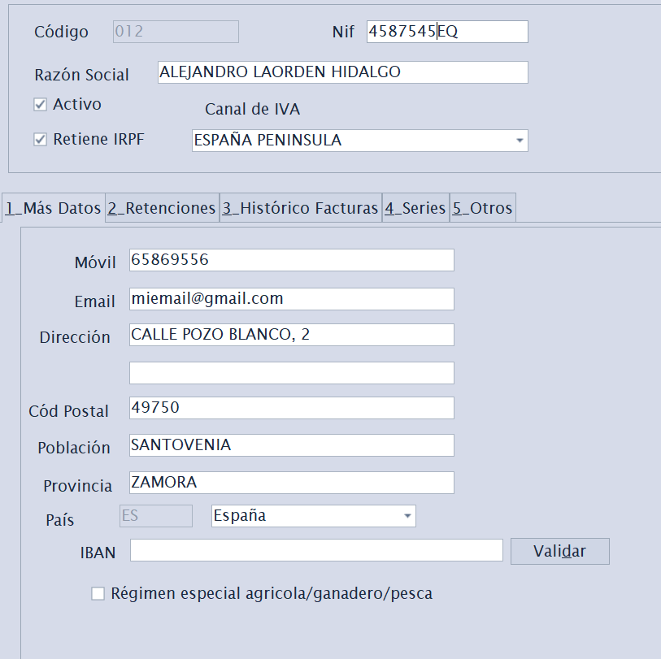
*▢ Captura pendiente — Ficha de Empresas con sus sub-pestañas (Series, Retenciones, Certificado).*

**Atajo de menú:** `[Ctrl]+[E]`

Mantiene las **empresas emisoras** que facturan desde Factuzam (puede haber
más de una). Cada empresa concentra sus datos fiscales y la configuración
de facturación. Todas ellas comparten artículos/familias/clientes...

**Datos principales:** Código, Orden, Activo, Razón Social, NIF, dirección
completa (dirección, población, provincia, código postal), Móvil, Email.

**Datos fiscales y de facturación** (en sub-pestañas):

- **Más datos** — contacto y datos complementarios.
- **Retenciones** — código y **% de retención** aplicable; marca *Aplica
  Retenciones* y *Es REAGP* (Régimen Especial Agricultura, Ganadería y
  Pesca).
- **Series** — **series de numeración** de los documentos de la empresa
  (puedes añadir varias series de facturación).
- **Bancos** — cuentas bancarias propias de la empresa. Se usan para
  preseleccionar la cuenta de **cobro** en recibos de cliente y la cuenta de
  **pago** en efectos/remesas de proveedor.
- **Certificado / Verifactu** — *Número de Serie* y *Tipo de Certificado*
  para la firma y el envío de facturas al sistema **Verifactu (AEAT)**.
- **Texto en Factura** — texto legal que se imprimirá en los documentos.
- **Zona de IVA principal** — régimen de IVA por defecto de la empresa.

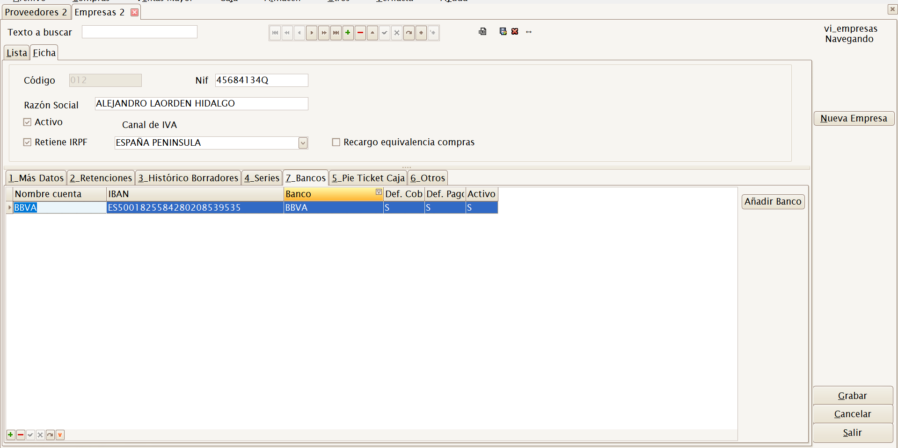
*▢ Captura pendiente — Pestaña Bancos con IBAN, banco y marcas de cobro/pago por defecto.*

> La configuración correcta de **NIF, series y certificado** es
> imprescindible para emitir facturas válidas y para la integración con
> Verifactu. Si tienes dudas fiscales, consúltalas con tu asesoría antes de
> facturar.

---

## Almacenes

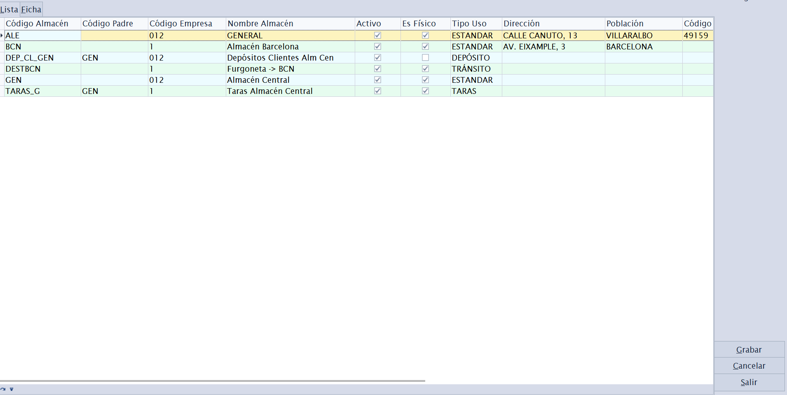
*▢ Captura pendiente — Ficha de Almacenes.*

**Atajo de menú:** `[Ctrl]+[L]`

Mantiene los **almacenes** físicos o lógicos donde se ubica el stock. Cada
movimiento de stock, inventario o documento de mercancía referencia un
almacén.

Sub-pestañas de la ficha:

- **Dirección física** — ubicación del almacén.
- **Cajas de Venta** — cajas/TPV asociadas a este almacén (relación
  almacén ↔ caja para el módulo Caja).
- **Usos Almacén** — para qué se usa el almacén (venta, depósito, etc.).
- **Otros** — datos complementarios.

---

## Clientes

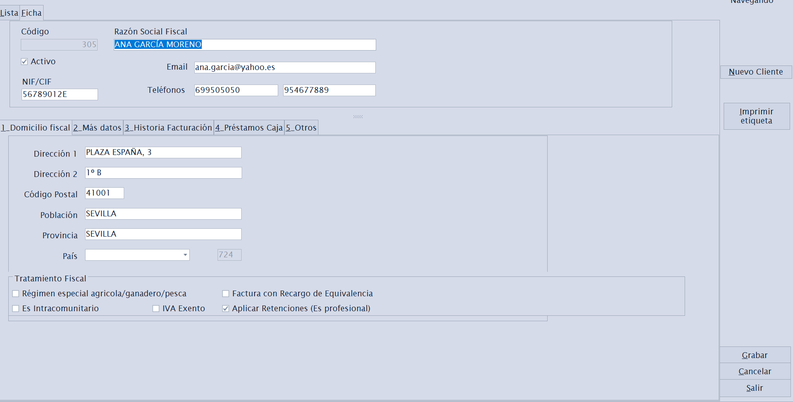
*▢ Captura pendiente — Ficha de Clientes con los indicadores fiscales.*

**Atajo de menú:** `[Ctrl]+[K]`

Mantiene la **ficha de clientes** a quienes se vende y factura.

**Datos generales:** Código, Activo, Razón Social, NIF/CIF, teléfonos
(móvil y fijo), Email, dirección completa, País, Observaciones, Referencia,
Contacto y teléfono de contacto, Nº de cuenta.

**Datos fiscales** que determinan cómo se calcula cada factura del cliente:

| Campo | Efecto |
|-------|--------|
| **Forma de pago por defecto** | Se propone automáticamente en sus documentos. |
| **Banco cobro** | Cuenta de la empresa que se propone al generar recibos de cobro para este cliente. |
| **Aplicar RE** | Aplica **Recargo de Equivalencia**. |
| **Aplicar Retenciones** | Aplica retención de IRPF. |
| **Tiene IVA exento** | El cliente no soporta IVA. |
| **Es Intracomunitario** | Operación intracomunitaria (IVA 0 con condiciones). |
| **Es Agricultor** | Régimen especial agrario. |
| **Razón Social Fiscal** | Nombre fiscal si difiere del comercial. |
| **Texto Legal Factura** | Texto específico para las facturas de este cliente. |

> Estos indicadores afectan directamente al **cálculo de impuestos** en
> ventas. Configúralos con cuidado al dar de alta el cliente.

---

## Proveedores

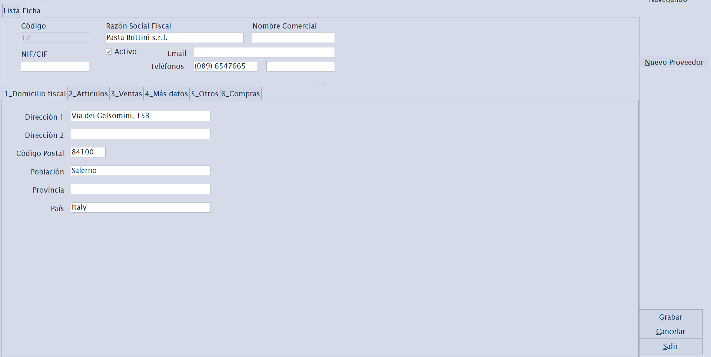
*▢ Captura pendiente — Ficha de Proveedores.*

**Atajo de menú:** `[Ctrl]+[P]`

Mantiene la **ficha de proveedores** a quienes se compra mercancía.
Estructura análoga a Clientes, orientada a compras.

Sub-pestañas de la ficha:

- **Domicilio fiscal** — datos fiscales y de dirección.
- **Artículos** — artículos que suministra el proveedor (con sus
  referencias y precios de compra).
- **Ventas** — histórico/relación comercial.
- **Más datos** y **Otros** — información complementaria.
- **Compras** — **parámetros por defecto para las sesiones de compra** de
  este proveedor (ver abajo).
- **Pagos** — forma de pago habitual y banco de la empresa desde el que se
  pagarán sus efectos o remesas.

### Pestaña Compras (parámetros de compra del proveedor)

Concentra valores que se **proponen automáticamente** cuando creas una
[sesión de compra](03-menu-compras.md) para este proveedor, para no
repetirlos en cada entrada de género.

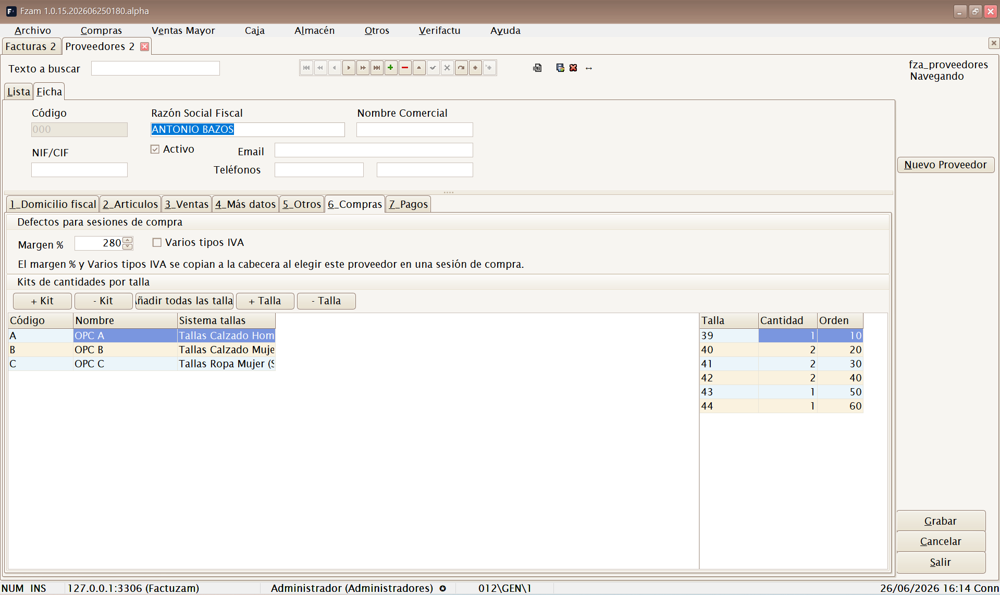
*▢ Captura pendiente — Pestaña Compras con los defectos y la biblioteca de kits.*

**Defectos para sesiones de compra:**

| Campo | Para qué sirve |
|-------|----------------|
| **Margen %** | Margen comercial habitual de este proveedor. Al elegirlo en una sesión de compra, se copia como margen de la sesión y sirve para **calcular el precio de venta** a partir del precio de compra. |

> Estos valores solo **se proponen**; siempre puedes cambiarlos dentro de
> la sesión. Solo se copian si el proveedor los tiene rellenos.

**Kits de cantidades por talla:**

Un **kit** es una **plantilla de reparto de unidades por talla** que se
repite a menudo con ese proveedor (por ejemplo, un surtido *1-2-2-1* en
*S-M-L-XL*). Aquí se mantiene la **biblioteca de kits** del proveedor para
luego aplicarlos de un clic en las sesiones de compra.

La pestaña tiene dos rejillas: la de **kits** (cabecera) y la de **tallas
del kit** (detalle).

| Botón | Acción |
|-------|--------|
| **+ Kit / − Kit** | Crea o borra un kit. Cada kit tiene **Código**, **Nombre**, **Sistema de tallas** y **Descripción**. |
| **Tallas del sistema** | Rellena el detalle del kit con **una fila por cada talla** del sistema de tallas elegido (todas con cantidad 0), listas para teclear las unidades. |
| **+ Talla / − Talla** | Añade o quita filas de talla del kit a mano. |

Cada línea de detalle es una **Talla** con su **Cantidad** y un **Orden**
de presentación.

> **Cómo se usan los kits:** dentro de una sesión de compra, sobre la línea
> de un artículo, el botón **Aplicar kit** vuelca las cantidades del kit en
> la matriz de tallas de esa línea. Así, en lugar de teclear talla a talla,
> aplicas el surtido completo de golpe. Es ideal cuando el proveedor sirve
> packs con un reparto de tallas estándar.

### Pestaña Pagos

Permite indicar los valores que se propondrán al registrar facturas de
compra de este proveedor:

| Campo | Para qué sirve |
|-------|----------------|
| **Forma de pago** | Se copia a la factura de compra y define los vencimientos al generar efectos. |
| **Banco para pagos (empresa)** | Cuenta propia de la empresa que se preselecciona al generar efectos o incluirlos en remesas. |

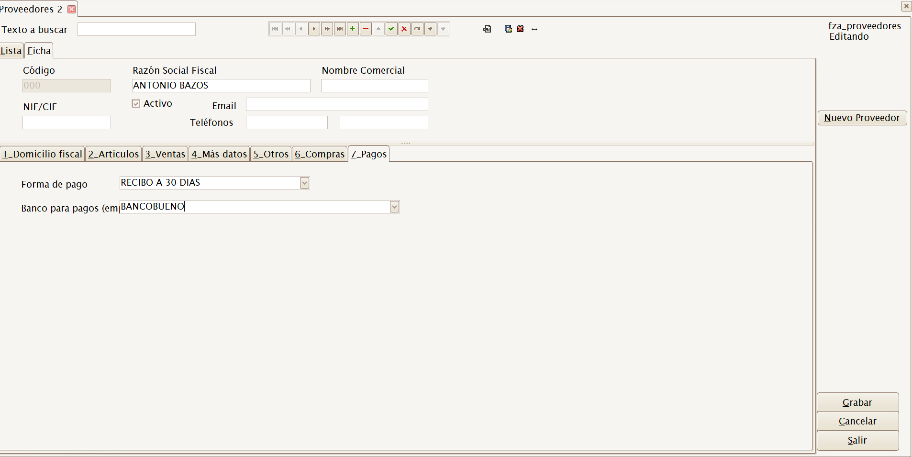
*▢ Captura pendiente — Pestaña Pagos con forma de pago y banco de empresa por defecto.*

---

## Artículos

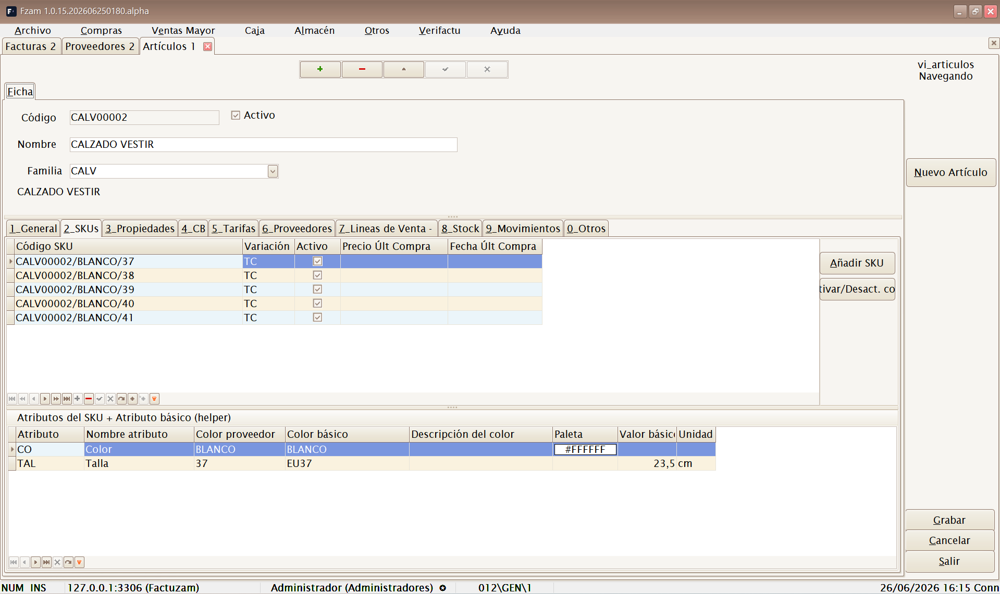
*▢ Captura pendiente — Ficha de Artículos con la pestaña SKUs.*

**Atajo de menú:** `[Ctrl]+[A]`

Es la pantalla central del catálogo. Mantiene los **artículos** y sus
variantes (las distintas tallas/colores se denominan **SKU**).

Sub-pestañas de la ficha:

- **General** — datos básicos: descripción, familia, unidad de medida,
  IVA, etc.
- **SKUs** — las **variantes** del artículo (combinaciones de talla, color
  u otros atributos). Cada SKU es una referencia vendible con su propio
  stock y código de barras. Existe un asistente para **generar SKUs** a
  partir de las variaciones definidas.
- **Propiedades** — propiedades descriptivas asignadas al artículo.
  Algunas propiedades pueden informarse por **artículo**, por **color** o
  por **SKU**; si un color tiene una temporada distinta, el informe de
  stock y las búsquedas usan la temporada efectiva de ese color.
- **CB** — **códigos de barras** del artículo y sus SKUs.
- **Tarifas** — precios del artículo en las distintas tarifas.
- **Proveedores** — proveedores que lo suministran y sus referencias.

Desde la lista/ficha puedes además consultar **stock** y la **foto** del
artículo con los botones del navegador.

La gestión de fotos trabaja a nivel artículo o SKU/color. Si un SKU no
tiene foto propia, hereda la del nivel más cercano disponible. Las fotos
se pueden usar también en tickets, listados y balances.

> El concepto de **SKU** (variante de talla/color) es clave en Factuzam:
> el stock, los precios y los códigos de barras se llevan a nivel de SKU,
> no solo de artículo.

---

## Tablas Auxiliares

Submenú con los **catálogos de apoyo** que clasifican y describen a los
artículos. Conviene definirlos **antes** de cargar el catálogo de
artículos.

### Tarifas

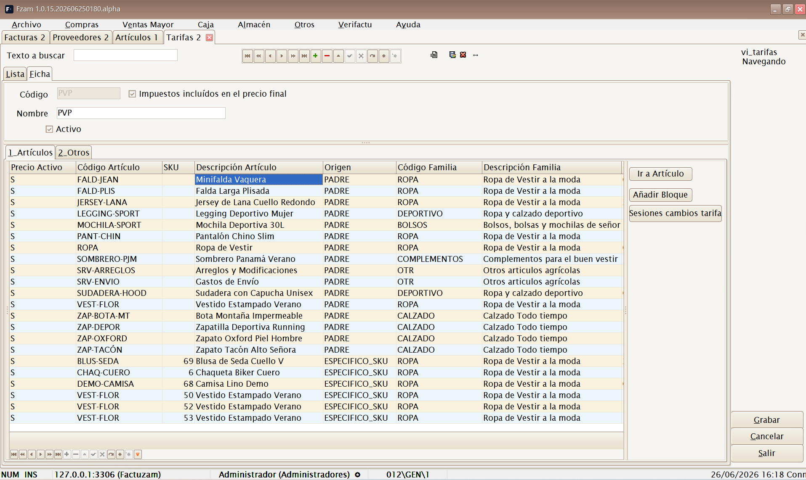
*▢ Captura pendiente — Mantenimiento de Tarifas con los precios por artículo.*

**Atajo de menú:** `[Ctrl]+[T]`

Define las **listas de precios** (tarifa general, ofertas, mayoristas…).
Cada tarifa contiene los precios de los artículos.

- **Artículos** — precios de cada artículo/SKU en esta tarifa. Incluye
  utilidades para **añadir precios** en bloque y **calcular márgenes**.
- **Otros** — parámetros de la tarifa (vigencia, redondeos, etc.).
- **Dto. desde / Dto. hasta** — ventana de fechas en la que se aplican los
  descuentos de la tarifa. Fuera de esa ventana, se cobra el precio de
  salida sin descuento aunque la línea de tarifa tenga descuento informado.

El botón **Sesiones cambios** abre una pantalla para preparar cambios
masivos de precios, revisar las líneas calculadas y aplicarlas a la tarifa
destino cuando estén validadas.

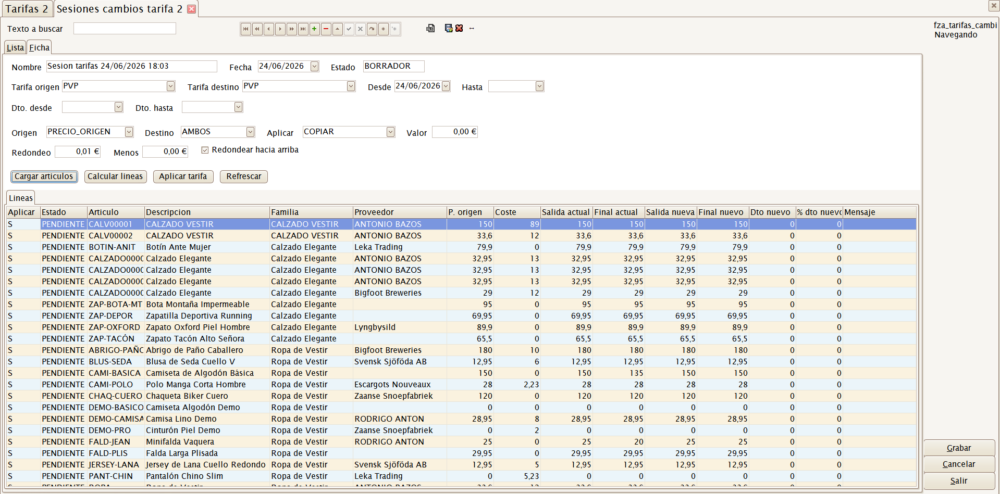
*▢ Captura pendiente — Sesión de cambios de tarifa con cabecera, líneas calculadas y botón Aplicar tarifa.*

### Familias

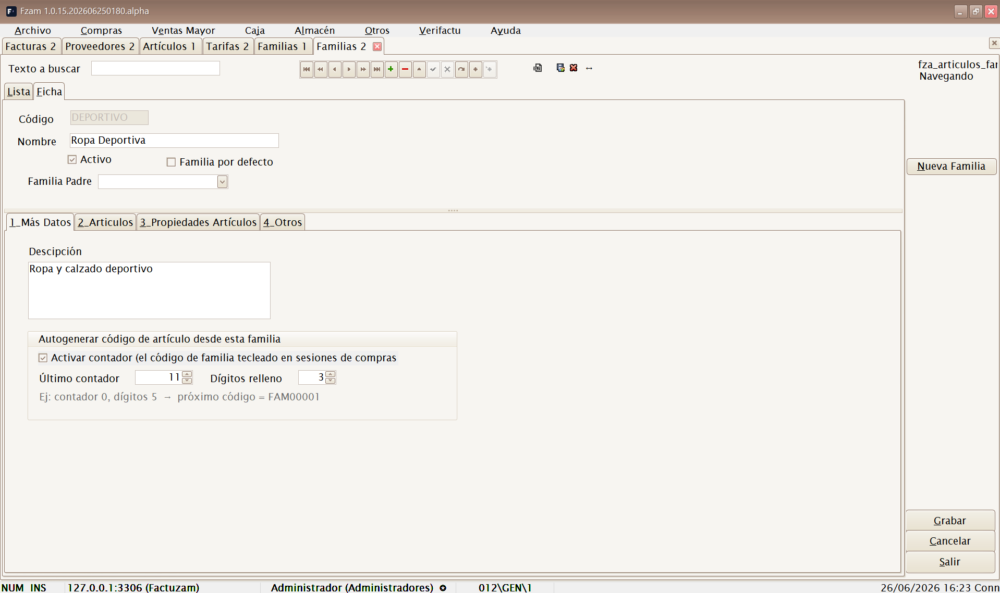
*▢ Captura pendiente — Mantenimiento de Familias.*

**Atajo de menú:** `[Ctrl]+[N]`

**Clasificación jerárquica** de los artículos (familias y subfamilias).
Permite agrupar el catálogo para informes, filtros y precios.

- **Más Datos** — datos de la familia.
- **Artículos** — artículos pertenecientes a la familia.
- **Propiedades Artículos** — propiedades que heredan los artículos de la
  familia.
- **Otros**.

### Paises

**Atajo de menú:** `[Ctrl]+[Alt]+[L]`

Catálogo de **países** usado en las direcciones de clientes, proveedores y
empresas (y para la clasificación fiscal intracomunitaria/extracomunitaria).

### Unidades de Medida

**Atajo de menú:** `[Ctrl]+[Alt]+[U]`

Catálogo de **unidades** en que se compran/venden los artículos (unidad,
par, caja, metro, kilo…).

Cada unidad define los **decimales** que se muestran y se admiten al
vender o mover stock. Por ejemplo, una unidad `Uds` puede trabajar sin
decimales y una unidad `m` puede trabajar con dos decimales para telas.

### Propiedades

**Atajo de menú:** `[Ctrl]+[Alt]+[Y]`

Define **propiedades descriptivas** de artículos (p. ej. *Material*,
*Temporada*) y sus **valores disponibles**.

- **Valores Disponibles** — lista de valores posibles de la propiedad.
- **Artículos** — artículos que usan esta propiedad.

### Tipos de Variaciones

**Atajo de menú:** `[Ctrl]+[Alt]+[T]`

Define los **ejes de variación** que generan SKUs (p. ej. *Talla*,
*Color*) y sus atributos.

- **Atributos** — valores de la variación (S, M, L, XL… o la gama de
  colores).
- **Artículos** — artículos que usan este tipo de variación.
- **Otros**.

### Colecciones de Atributos

**Atajo de menú:** `[Ctrl]+[Alt]+[S]`

Define **conjuntos reutilizables de atributos** (p. ej. una colección de
tallas estándar) que luego se aplican a varios artículos para generar sus
SKUs sin redefinirlos cada vez.

- **Valores** — atributos que componen la colección.
- **Artículos** — artículos que la utilizan.
- **Otros**.

### Atributos básicos

**Atajo de menú:** `[Ctrl]+[Alt]+[B]`

Catálogo de los **atributos elementales** (los valores individuales de
talla, color, etc.) que componen las variaciones y colecciones.

Además del valor visible, cada atributo puede enlazarse con un
**atributo básico** o equivalente estándar: color normalizado, medida en
centímetros, paleta HEX, etc. Factuzam lo resuelve por prioridad:
artículo, conjunto y valor global. Esto permite que el mismo texto de
proveedor tenga equivalencias distintas según el artículo.

> **Orden recomendado de configuración del catálogo:**
> Unidades de Medida y Países → Familias → Atributos básicos → Tipos de
> Variaciones / Colecciones de Atributos → Propiedades → Tarifas →
> finalmente, los **Artículos** y sus SKUs.

---

## Invocar login

**Atajo de menú:** `[Shift]+[Ctrl]+[L]`

Vuelve a mostrar la ventana de **Login** sin cerrar la aplicación. Sirve
para **cambiar de usuario** (por ejemplo, que entre otra persona con su
perfil) sin reiniciar el programa.

---

## Salir

**Atajo de menú:** `[Alt]+[F4]`

**Cierra la aplicación.** Si hay cambios sin guardar, la aplicación avisará
antes de salir.

---

[◀ Conceptos comunes](01-conceptos-comunes.md) · [Índice](README.md) · [Siguiente ▶ Menú Compras](03-menu-compras.md)
