# 03 · Menú Compras

[◀ Volver al índice](README.md)

El menú **Compras** gestiona todo el ciclo de **aprovisionamiento**: desde
el pedido al proveedor hasta la recepción de mercancía, las devoluciones y
las facturas de compra. Es el flujo que **da entrada de stock** al almacén.

Estructura del menú:

```
Compras
├── Sesiones
│   └── Crear artículos y un pedido o un albarán
├── Pedidos
├── Albaranes
├── Devoluciones a Proveedor
├── Crear borradores de albaranes...
├── Borradores
├── Efectos de pago
├── Remesas de pago
├── Cargar efectos en remesa...
└── Listados
    ├── Listado de documentos proveedor
    └── Listado de efectos de pago
```

> Flujo habitual de compra:
> **Pedido de compra** → recepción como **Albarán de compra** (entra el
> stock) → **Factura de compra**. Las **Devoluciones** restan stock y
> generan el abono al proveedor.

---

## Sesiones ▸ Crear artículos y un pedido o un albarán

**Atajo de menú:** `[Ctrl]+[S]`

Asistente de **alta rápida de compra**. Pensado para cuando llega género
nuevo del proveedor: en una sola pantalla das de alta los artículos (con
sus colores y tallas), fijas precios de compra y venta, y al terminar la
sesión se **materializa** generando automáticamente los artículos, los
SKUs, los códigos de barras y el **pedido y/o albarán de compra**.

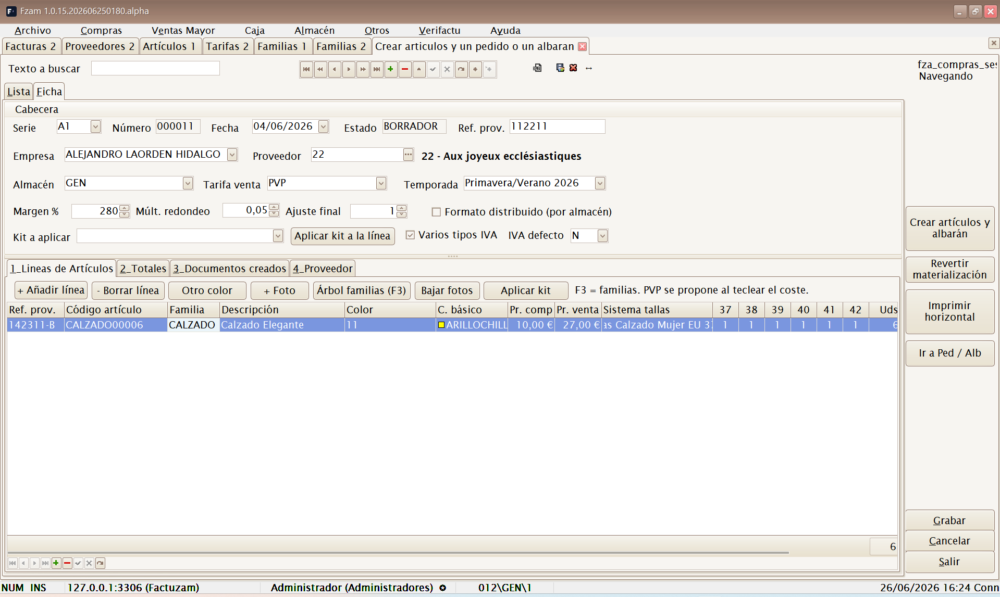

### 1. La cabecera de la sesión

| Campo | Descripción |
|-------|-------------|
| **Serie / Número / Fecha** | Identificación de la sesión (numeración por contador). |
| **Estado** | `ABIERTA` (editable) o `CERRADA` (ya materializada). |
| **Empresa** | Empresa compradora. |
| **Proveedor** | Proveedor del género (botón de búsqueda). |
| **Ref. prov.** | Referencia del documento del proveedor (su albarán/factura). |
| **Almacén** | Almacén de destino de la mercancía. |
| **Tarifa venta** | Tarifa donde se grabarán los precios de venta calculados. |
| **Temporada** | Temporada a la que pertenece el género. |
| **Formato distribuido (por almacén)** | Actívalo si la entrada viene repartida entre varios almacenes/tiendas; las cantidades se introducen por almacén. |

**Cálculo automático del precio de venta** a partir del precio de compra:

| Campo | Efecto |
|-------|--------|
| **Margen %** | Porcentaje de margen que se aplica sobre el precio de compra. |
| **Múlt. redondeo** | Redondea el precio resultante al múltiplo indicado. |
| **Ajuste final** | Ajuste que se suma al final (p. ej. `-0,05` para acabar en ,95). |

Puedes aceptar el precio propuesto o corregirlo línea a línea.

> El **Margen %** se **propone automáticamente** a partir de los
> [parámetros de compra del proveedor](02-menu-archivo.md#pestana-compras-parametros-de-compra-del-proveedor)
> cuando lo eliges en la cabecera. El sistema de tallas se decide en cada
> línea o al aplicar un kit de proveedor.

### 2. Pestaña «Líneas de Artículos»

Cada línea es un **artículo + color** con su escandallo de tallas:

| Columna | Descripción |
|---------|-------------|
| **Familia (F3)** | Familia del artículo; `[F3]` abre el **árbol de familias** para elegirla. |
| **Cód. artículo** | Código del artículo (nuevo o existente). |
| **Modelo prov.** | Referencia/modelo del proveedor. |
| **Descripción** | Descripción del artículo. |
| **Color / C. básico** | Color comercial y color básico de clasificación. |
| **Pr. compra / Pr. venta** | Precio de compra y precio de venta (propuesto por el margen). |
| **Sistema tallas** | Colección de tallas del artículo (S-M-L-XL, numérico…). |
| **Total tallas** | Total de unidades; las cantidades se reparten **por talla** en la matriz. |
| **Importe s/IVA** | Importe de la línea (compra). |

**Botones de la pestaña:**

- **+ Añadir línea / − Borrar línea** — gestiona las líneas de la sesión.
- **Otro color** — duplica la línea actual para meter el **mismo modelo en otro color** sin reescribir los datos.
- **Aplicar kit** — vuelca una curva de tallas definida en el proveedor
  sobre la línea actual. En formato distribuido abre el distribuidor para
  aplicarlo por almacén.
- **+ Foto / Bajar fotos** — asocia fotografías al artículo o las descarga.

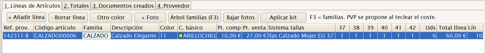

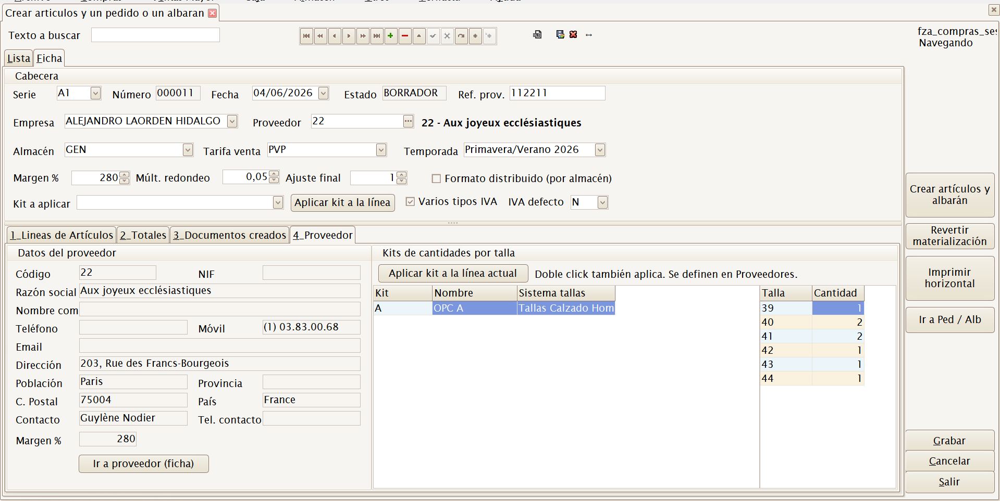

> **Código duplicado.** Si tecleas un código de artículo que **ya existe**
> en el catálogo, la aplicación lo detecta y pregunta qué hacer:
> **Reusar el artículo existente** (no se crea uno nuevo, se le añade la
> compra) o **Renombrar el código en esta sesión**.

### 3. Materializar la sesión

Cuando la sesión está completa, pulsa **«Crear artículos y albarán»**. Se
abre el asistente **«Crear artículos y albarán / pedido»** donde confirmas
qué documentos generar:

| Opción | Efecto |
|--------|--------|
| **Generar albarán (mueve stock)** | Crea el albarán de compra: la mercancía **entra en el almacén destino**. Eliges su **serie**. |
| **Generar pedido (pdte. de recibir)** | Crea un pedido de compra (no mueve stock, queda pendiente de recibir). Eliges su **serie**. |
| **Fecha** | Fecha de los documentos. |
| **Almacén destino / Tarifa venta / Temporada** | Se proponen desde la cabecera; puedes ajustarlos. |
| **Ref. documento proveedor** | Referencia del documento del proveedor. |
| **Agrupación almacén** (solo formato distribuido) | **Agrupar todos los almacenes en un solo documento** o **generar un documento por almacén**. |

Si marcas **ambos** documentos, se generan en orden: **primero el pedido,
luego el albarán**.

Tras pulsar **Generar**, un último aviso resume lo que va a ocurrir
(*«Se van a crear los artículos, SKUs, códigos de barras y enlaces al
proveedor según el detalle de la sesión»*) y pide confirmación
(`[F12]` Confirmar / `[Esc]` Cancelar).

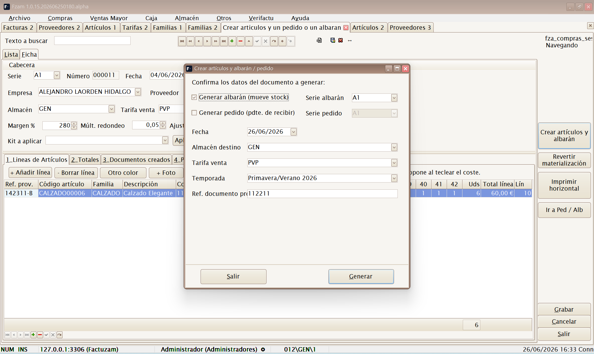

**Qué hace exactamente la materialización:**

1. Crea (o reutiliza) los **artículos** de las líneas.
2. Genera los **SKUs** por cada combinación de color/talla.
3. Genera los **códigos de barras** de los SKUs.
4. Crea los **enlaces artículo–proveedor** con sus referencias.
5. Graba los **precios de venta** en la tarifa elegida.
6. Genera el **pedido y/o albarán de compra** (el albarán da entrada al stock).
7. La sesión pasa a estado **`CERRADA`** y deja de ser editable.

### 4. Pestaña «Documentos creados»

Tras materializar, esta pestaña lista los documentos generados (tipo,
serie, número, almacén, fecha de alta, usuario). El botón
**«Ir a documento (F12)»** abre directamente el pedido o albarán generado.
También hay accesos rápidos **Ir a Artículos**, **Ir a Albaranes de
Compra** e **Ir a Pedidos de Compra**.

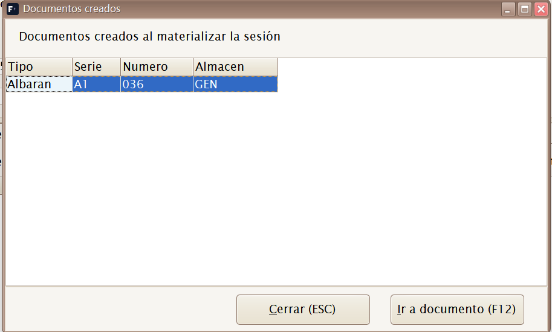

### 5. Revertir materialización

El botón **«Revertir materialización»** (disponible solo en sesiones
`CERRADA`) **deshace** lo generado: elimina los documentos creados por la
sesión y la devuelve al estado `ABIERTA` para corregirla y volver a
materializar.

> ⚠️ Úsalo solo si los documentos generados **no se han trabajado todavía**
> (no se han facturado, ni servido, ni modificado). Si el albarán ya metió
> stock y ha habido ventas posteriores, revisa el stock tras revertir.

### 6. Imprimir horizontal

El botón **«Imprimir horizontal»** saca un listado de la sesión con las
**tallas en columnas** (formato apaisado), útil para repasar la entrada de
género contra el albarán del proveedor.

### 7. Fotos de la sesión

La pantalla permite fotografiar y reconocer el género **antes de que el
artículo exista en el catálogo**. Selecciona una línea y usa una de estas
acciones:

- **+ Foto** — elige una imagen local (`PNG`, `JPG`, `JPEG`, `WEBP`,
  `AVIF` o `BMP`) y la asocia a la línea activa.
- **Bajar fotos** — descarga las imágenes disponibles en el servidor y
  guarda como foto provisional una imagen representativa de la línea.

La pestaña **Fotos provisionales** permite revisar las imágenes de la
sesión. La lista muestra la línea, el código de artículo tentativo, el
modelo de proveedor, la descripción, el color, la asignación y el fichero;
al cambiar de fila se actualizan la vista previa y el texto que indica a
qué artículo o SKU se asignará.

Mientras la sesión está abierta, las fotos se conservan como
**provisionales** y quedan ligadas a su serie, número y línea. Al
materializar:

1. Se crea o reutiliza el artículo y sus SKUs.
2. La foto provisional se migra al artículo o SKU definitivo.
3. Se renombran las copias de 300 px, 600 px y resolución real.
4. Si el artículo ya tenía fotos, la nueva se añade con el siguiente
   índice disponible, sin sobrescribirlas.

> Comprueba la vista previa antes de materializar. Después, la imagen se
> gestiona como cualquier otra foto del catálogo mediante
> `[Ctrl]+[F]` (ver [Foto flotante del artículo / SKU](01-conceptos-comunes.md#foto-flotante-del-articulo-sku)).

---

## Pedidos

Mantenimiento de **Pedidos de Compra**. Registra lo que se ha **encargado**
a un proveedor. Mientras solo exista el pedido, la cantidad figura como
**pendiente de recibir** y no aumenta las existencias.

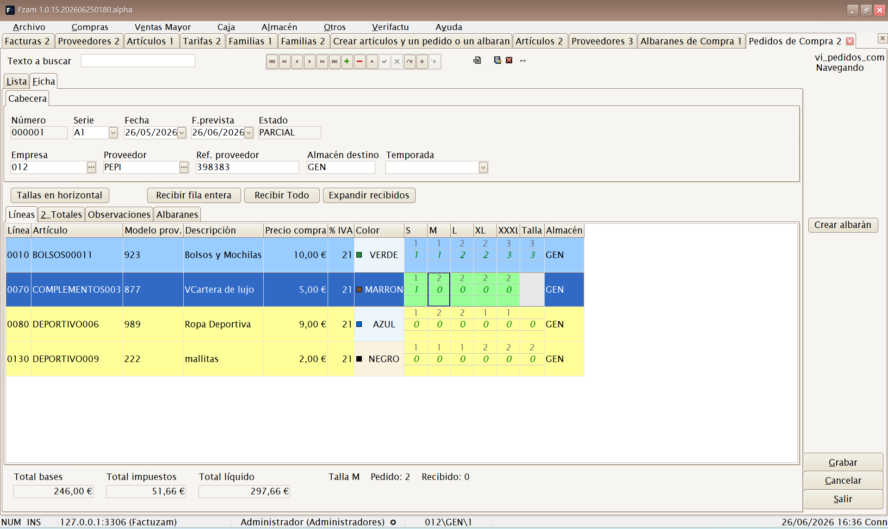

**Atajo de menú:** `[Shift]+[Ctrl]+[P]`

Un pedido tiene una **cabecera** (empresa, proveedor, serie/número, fechas,
temporada y almacén de destino predeterminado) y un **detalle de líneas**
(artículo/SKU, almacén efectivo, cantidad pedida, recibida, pendiente,
precio e impuestos). Los indicadores de cabecera resumen **Pedida**,
**Recibida**, **Pendiente** y **A albaranar**. En la lista, un pedido con
cantidad pendiente y **fecha tope de recepción vencida** aparece resaltado.

### Presentación de las líneas y cantidades a recibir

Dentro de **Líneas**, `[F1]` recorre cuatro presentaciones:

1. **Auto (desglose)** — artículo y atributos en columnas separadas.
2. **SKU** — una línea por variante.
3. **Tallas en línea** — tallas como columnas de entrada.
4. **Tallas horizontales** — grupos por artículo/color con las bandas
   **Pedido**, **A recibir** y **Pendiente**.

La pantalla suele abrir en **Tallas en línea**; si ese modo no puede
construirse, pasa a SKU. El botón **Expandir recibidos** salta directamente
a **Tallas horizontales**. Consulta también la explicación general de
[los modos con F1](01-conceptos-comunes.md#cambiar-la-presentacion-de-las-lineas-con-f1).

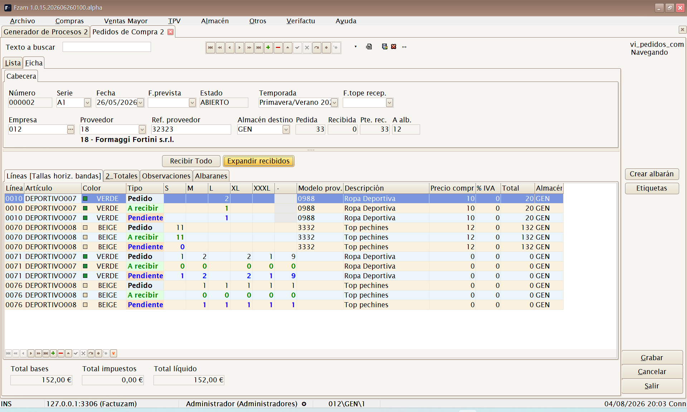

Para preparar una recepción:

- Escribe en **A recibir** solo las unidades que han llegado. Se puede
  informar por línea o por talla, según el modo activo.
- **Recibir Todo** copia a **A recibir** todo lo que queda pendiente en el
  pedido. Después todavía puedes corregir una línea o una talla.
- Factuzam no permite que **A recibir** supere
  `Pedida − Recibida`: reduce automáticamente el exceso al máximo pendiente
  y emite un aviso sonoro.
- Si una línea tiene un artículo con variaciones pero no tiene SKU, al
  grabar se muestra un aviso: esa línea no puede mover stock correctamente.

> **Importante:** si pulsas **Crear albarán** sin haber informado ninguna
> cantidad en **A recibir**, Factuzam aplica el flujo clásico y recibe **todo
> lo pendiente del almacén elegido**. Informa cantidades antes si la entrega
> es parcial.

### Recibir el pedido: crear o ampliar un albarán

1. Revisa **A recibir** y pulsa **Crear albarán**.
2. Elige el **almacén destino**. Se puede seleccionar cualquier almacén
   activo; solo se procesan las líneas cuya ubicación efectiva coincide con
   el almacén elegido.
3. Para un albarán nuevo, confirma la **serie** propuesta para ese almacén,
   la **referencia del proveedor**, la **fecha de recepción** y la
   **temporada**.
4. Si la entrega continúa un albarán anterior, marca **Incorporar a un
   albarán ya existente de este pedido** y selecciona el documento destino.
5. Acepta con `[F12]`. Factuzam crea o amplía el albarán, mueve el stock,
   actualiza las cantidades recibidas y pendientes del pedido y recalcula su
   estado en una sola operación.

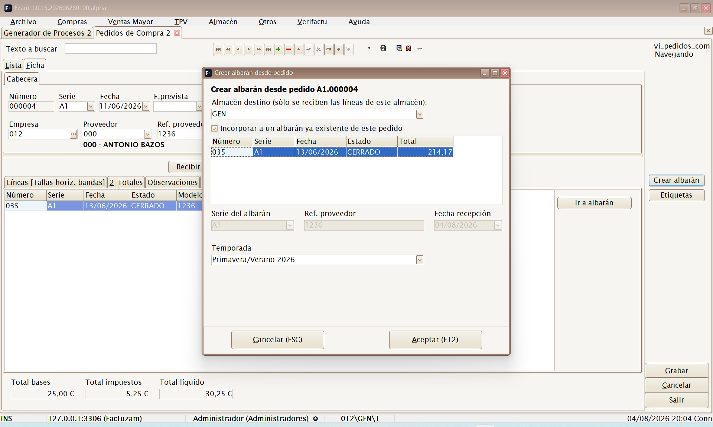

Después de una recepción correcta, las cantidades **A recibir** del almacén
procesado se limpian; las de otros almacenes permanecen para poder continuar
con la siguiente tienda o recepción. Un resumen muestra el albarán resultante
y permite **Ir a documento**.

El estado del pedido se mantiene automáticamente:

| Estado | Significado |
|--------|-------------|
| **ABIERTO** | Todavía no se ha recibido ninguna unidad. |
| **PARCIAL** | Se ha recibido una parte y queda mercancía pendiente. |
| **RECIBIDO** | Ya no queda cantidad pendiente. |
| **CANCELADO** | El pedido no se continuará recibiendo. |

La recepción es transaccional: si falla la creación, la incorporación o el
movimiento de stock, Factuzam deshace el conjunto y deja el pedido como estaba.

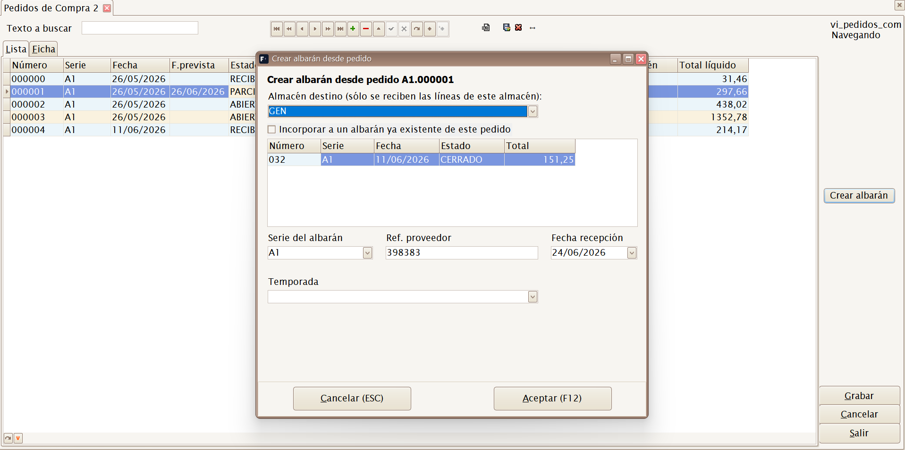

---

## Albaranes

Mantenimiento de **Albaranes de Compra**. Registra la **recepción real** de
la mercancía: al confirmar el albarán **entra el stock** en el almacén
indicado.

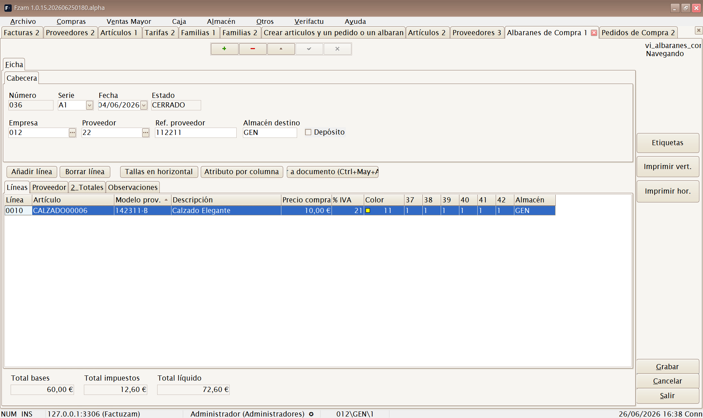

**Atajo de menú:** `[Shift]+[Ctrl]+[A]`

Puede crearse:

- A partir de un **pedido** previo (recepción de lo pedido).
- Directamente (compra sin pedido previo).
- Automáticamente desde una **sesión de compra** materializada.

El albarán es el documento que **mueve existencias**; la factura es solo el
documento contable/fiscal asociado.

En cabecera existe la marca **Depósito**. Es informativa: permite indicar
que la mercancía está en depósito, pero no cambia el movimiento de stock ni
la facturación.

---

## Devoluciones a Proveedor

Mantenimiento de **Devoluciones a Proveedor**. Registra la mercancía que se
**devuelve** al proveedor (defectos, exceso, etc.). Al confirmarla, **resta
stock** del almacén y sirve de base para el **abono** del proveedor.

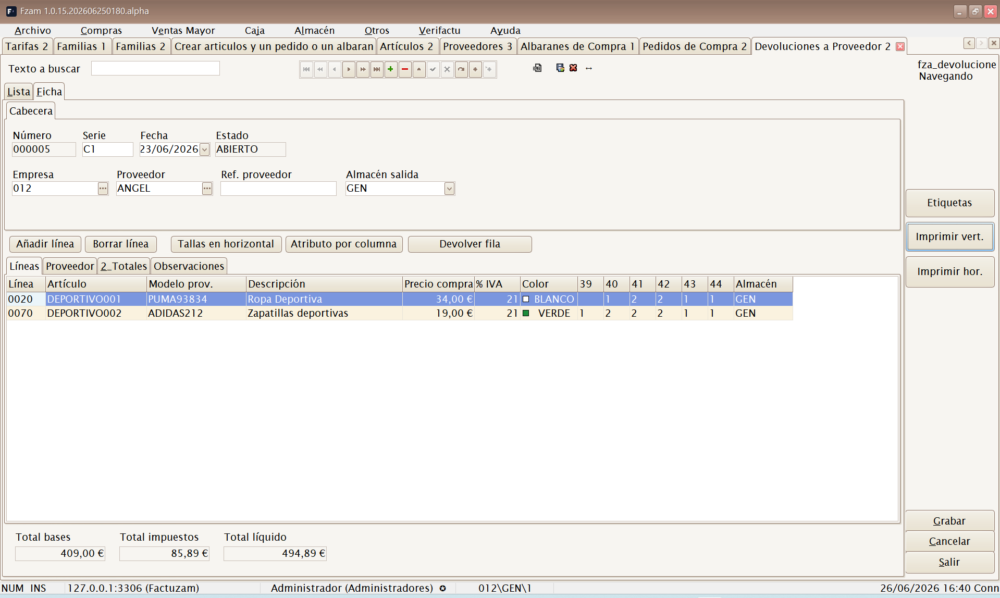

*(Sin atajo de menú; se abre desde el menú.)*

---

## Crear borradores de albaranes...

Utilidad para convertir uno o varios **albaranes de compra** en un
**borrador de compra**. Filtra por empresa y proveedor, muestra los
albaranes pendientes y permite agrupar varios en el mismo borrador.

El formulario trabaja en dos modos:

| Modo | Resultado |
|------|-----------|
| **Crear borrador nuevo** | Genera un documento nuevo para los albaranes seleccionados. |
| **Incorporar a un borrador existente** | Añade los albaranes seleccionados a un borrador abierto del mismo proveedor y empresa. |

Pulsa **Cargar** para listar los albaranes candidatos y **Crear
borradores** para materializarlos. Al terminar se abre el borrador/factura
de compra resultante para revisar líneas, totales y efectos.

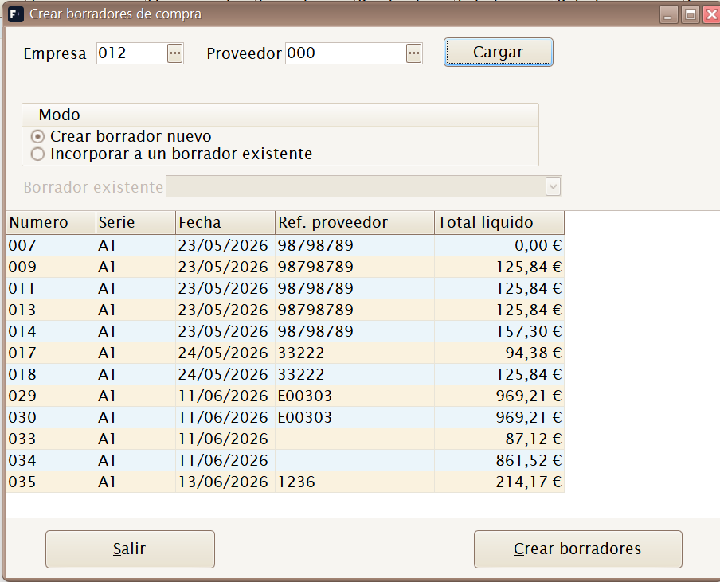

---

## Borradores

**Atajo de menú:** `[Shift]+[Ctrl]+[Alt]+[F]`

Mantenimiento de **Borradores de Compra**. Es el documento de proveedor
que se registra para control de gasto, IVA soportado y vencimientos de
pago. En la base de datos se guarda como **factura de compra**; el menú
mantiene la etiqueta Borradores para el trabajo previo de revisión.

Se crea manualmente o a partir de albaranes de compra. Cuando viene de
albaranes, conserva la referencia al documento de origen y marca esos
albaranes como facturados para evitar duplicidades.

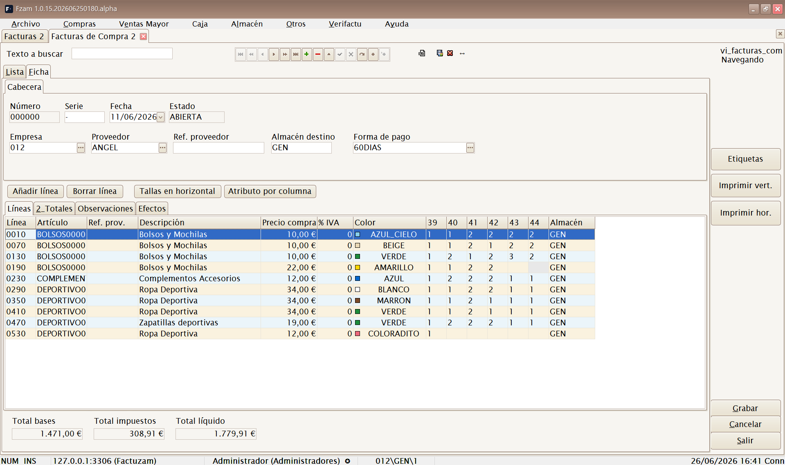

La ficha incluye:

- **Cabecera** — proveedor, empresa, fecha, referencia/documento externo, forma de pago y datos fiscales.
- **Líneas** — artículos procedentes de los albaranes o introducidos a mano.
- **Efectos** — vencimientos generados desde la forma de pago.

El botón **Generar efectos** reparte el total líquido en vencimientos y
pregunta qué **banco de la empresa** se usará como cuenta de cargo. Si el
proveedor tiene banco para pagos por defecto, aparece preseleccionado.

Estados relacionados:

| Estado | Significado |
|--------|-------------|
| **ABIERTO** | Documento editable, pendiente de cerrar o revisar. |
| **CERRADO** | Documento validado para el circuito de pagos. |
| **FACTURADO** | Albarán de compra ya incorporado a un borrador/factura de proveedor. |

---

## Efectos de pago

**Atajo de menú:** `[Ctrl]+[Alt]+[C]`

Cartera de vencimientos de proveedor. Cada efecto representa una fecha de
pago pendiente, pagada, remesada o conciliada. Desde aquí puedes revisar
vencimientos, registrar pagos y fusionar impagados en un efecto resumen.

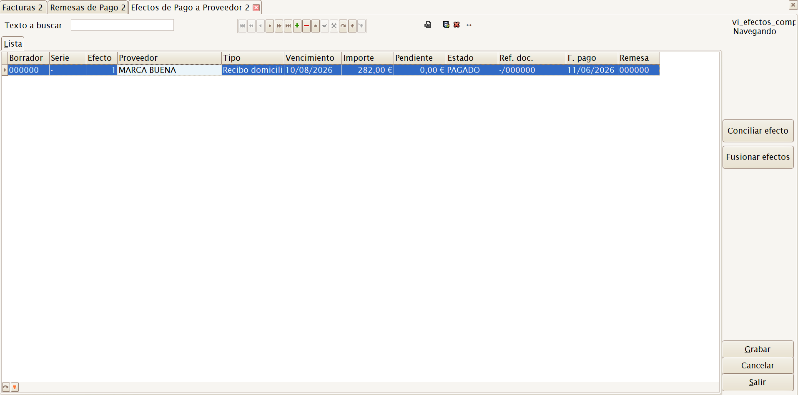

Estados habituales:

| Estado | Significado |
|--------|-------------|
| **PENDIENTE** | Vencimiento vivo, todavía no pagado. |
| **PAGADO** | Pagado total o parcialmente. |
| **REMESADO** | Incluido en una remesa de pago. |
| **CONCILIADO** | Fusionado o regularizado con otro efecto. |

---

## Remesas de pago

Agrupa efectos de pago para preparar una orden de pago bancaria. La remesa
recoge su banco de cargo, fecha de cargo, número de efectos e importe total.

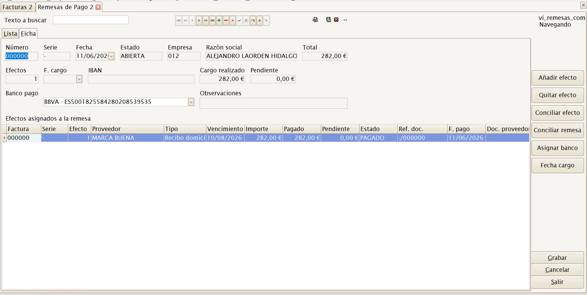

Acciones principales:

- **Añadir efecto** — abre la selección de efectos pendientes.
- **Quitar efecto** — retira el efecto seleccionado de la remesa.
- **Pagar efecto** — registra el pago de un efecto concreto.
- **Pagar remesa** — marca como pagados los efectos de la remesa.
- **Asignar banco** — fija o cambia el banco de cargo de la empresa.

---

## Cargar efectos en remesa...

Acceso directo al selector de efectos pendientes para incorporarlos a una
remesa de pago. Se usa cuando ya existe una remesa abierta y quieres
alimentarla con vencimientos filtrados por proveedor, vencimiento o estado.

---

## Listados ▸ Listado de documentos proveedor

Listado de documentos de proveedor para revisar pedidos, albaranes,
devoluciones, borradores y vencimientos dentro de un rango de fechas o por
proveedor.

La vista preliminar agrupa los documentos por tipo y proveedor, presenta
líneas, base, IVA, recargo de equivalencia y total, e incluye subtotales por
proveedor, por tipo de documento y un total general.

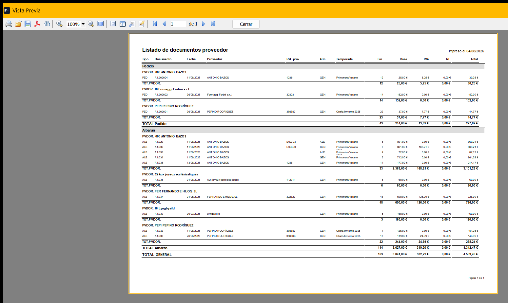

---

## Listados ▸ Listado de efectos de pago

Listado de la **cartera de pagos a proveedor**: los efectos (vencimientos)
de compra con sus importes y situación. Permite filtrar por:

- **Fechas** (por fecha de vencimiento o fecha de emisión del efecto).
- **Almacén** y **proveedor**.
- **Número de efecto** (desde/hasta).
- **Banco/remesa** en que está cargado el efecto.
- **Tipo de efecto** y **situación** (pendiente, remesado, pagado…).

Puede sacarse en detalle o **solo totales** (con los agrupados que se
marquen), y se previsualiza, imprime o exporta como el resto de listados.
Es el complemento de impresión de las pantallas
[Efectos de pago](#efectos-de-pago) y [Remesas de pago](#remesas-de-pago).

---

[◀ Menú Archivo](02-menu-archivo.md) · [Índice](README.md) · [Siguiente ▶ Menú Ventas Mayor](04-menu-ventas-mayor.md)
