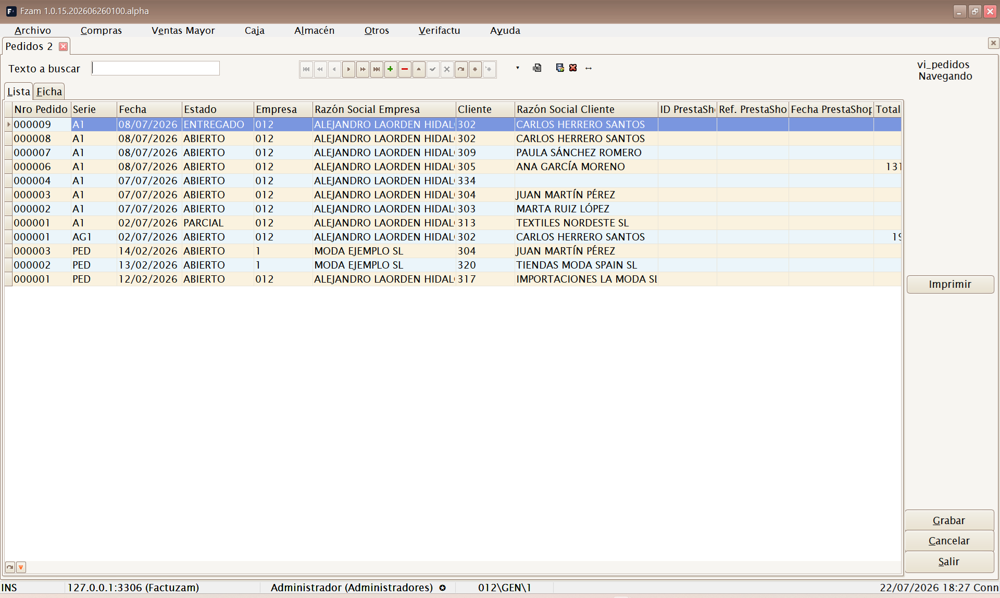
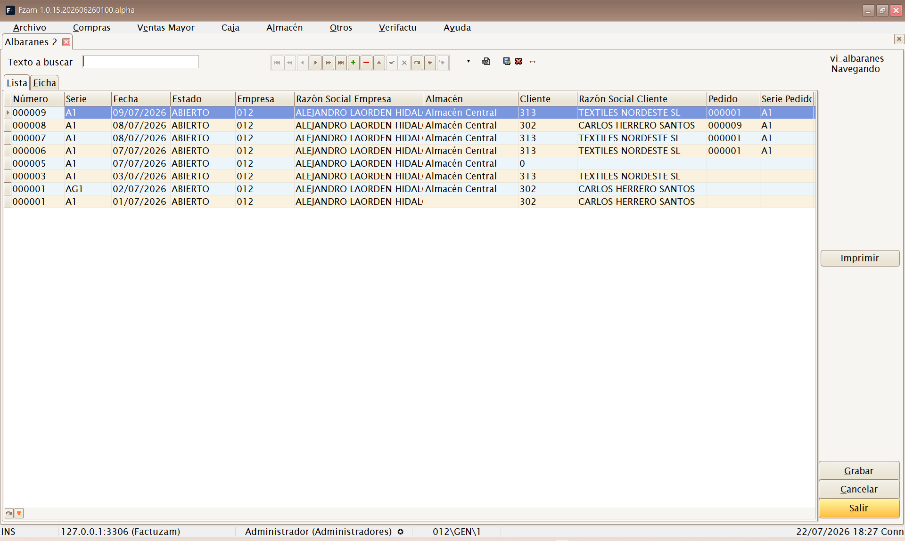
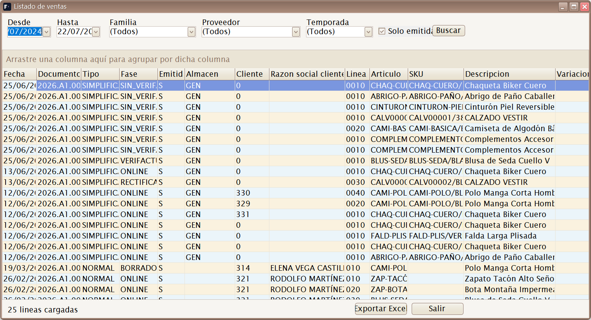

# 04 · Menú Ventas Mayor

[◀ Volver al índice](README.md)

El menú **Ventas Mayor** gestiona la **venta al por mayor** (B2B): ventas a
otros comercios o clientes con factura nominativa, a diferencia de la venta
al detalle en tienda, que se hace desde el módulo
[Caja](05-menu-caja.md).

Estructura del menú:

```
Ventas Mayor
├── Facturas
├── Formas de pago
├── Pedidos
├── Albaranes
└── Listados
    └── Ventas
```

> Flujo habitual de venta a mayor:
> **Pedido** del cliente → **Albarán** de salida (sale el stock) →
> **Factura** (documento fiscal). Se puede facturar albarán a albarán o
> agrupar varios albaranes en una sola factura.

---

## Facturas


*▢ Captura pendiente — Factura de venta: cabecera, líneas y totales.*

**Atajo de menú:** `[Ctrl]+[Alt]+[F]`

Mantenimiento de **Facturas de Venta (Venta Mayor)**. Es el documento
fiscal de venta. Cada factura lleva:

- **Cabecera**: cliente, fecha, **serie** y número (según los contadores de
  la empresa), forma de pago, vencimientos.
- **Líneas**: artículos/SKU, cantidades, precio (tomado de la **tarifa**
  del cliente), descuentos.
- **Totales e impuestos**: base, IVA por tipo, recargo de equivalencia y
  retenciones según la configuración fiscal del **cliente** y la
  **empresa**.

Las facturas se firman y comunican a **Verifactu (AEAT)** según la
configuración de certificado de la empresa (ver
[Empresas](02-menu-archivo.md#empresas)).

> Una factura puede crearse manualmente o **a partir de albaranes**
> pendientes de facturar (incluso agrupando varios albaranes de un cliente
> en un rango de fechas).

---

## Formas de pago

**Atajo de menú:** `[Ctrl]+[Alt]+[G]`

Acceso al catálogo de **formas de pago** (el mismo descrito en
[Compras ▸ Formas de pago](03-menu-compras.md#formas-de-pago)), aquí
enfocado a su uso en ventas: condiciones de cobro, vencimientos y forma de
pago por defecto que se propone a los clientes.

---

## Pedidos


*▢ Captura pendiente — Pedidos de venta.*

**Atajo de menú:** `[Ctrl]+[Alt]+[P]`

Mantenimiento de **Pedidos de Venta**. Registra lo que un cliente
**encarga** (reserva de género). No mueve stock; sirve de base para generar
el **albarán** de salida cuando se sirve el pedido.

---

## Albaranes


*▢ Captura pendiente — Albaranes de venta.*

**Atajo de menú:** `[Ctrl]+[Alt]+[A]`

Mantenimiento de **Albaranes de Venta**. Registra la **salida real** de
mercancía hacia el cliente: al confirmarlo **resta stock** del almacén. Es
el documento que después se **factura**.

---

## Listados ▸ Ventas


*▢ Captura pendiente — Filtros del listado de ventas.*

**Atajo de menú:** `[Ctrl]+[Alt]+[V]`

Abre el **generador de listados de ventas**. Mediante un cuadro de
**filtros** (rango de fechas, cliente, artículo, familia, serie…) genera un
informe de las ventas realizadas, que se puede **previsualizar, imprimir o
exportar**.

Útil para análisis comercial: qué se ha vendido, a quién y en qué periodo.

---

[◀ Menú Compras](03-menu-compras.md) · [Índice](README.md) · [Siguiente ▶ Menú Caja](05-menu-caja.md)
