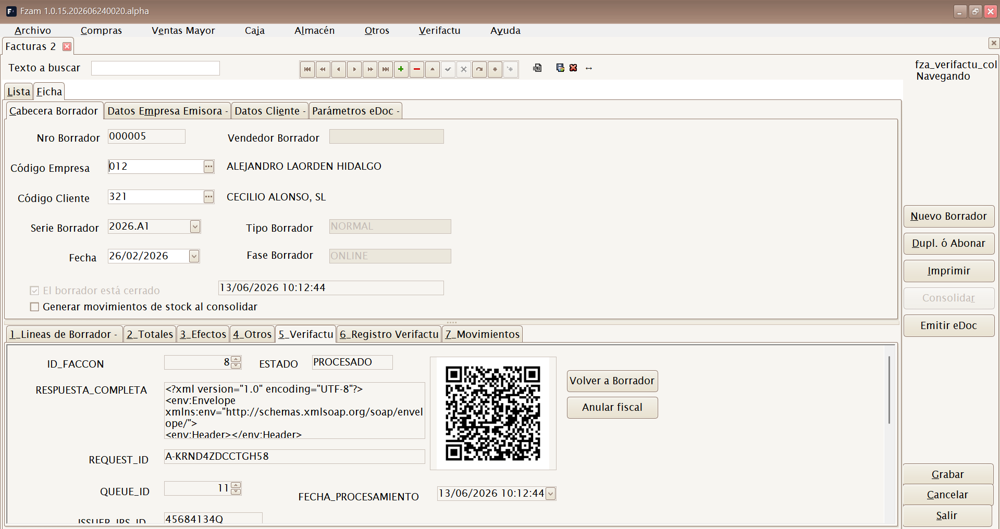
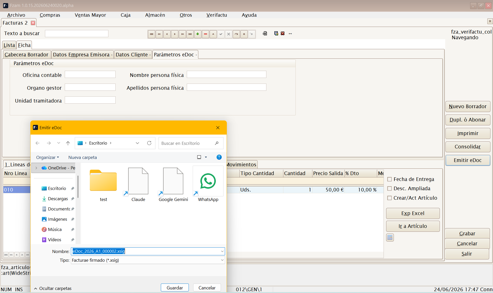
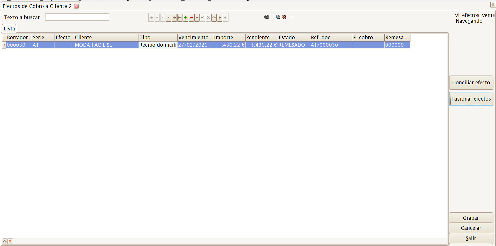
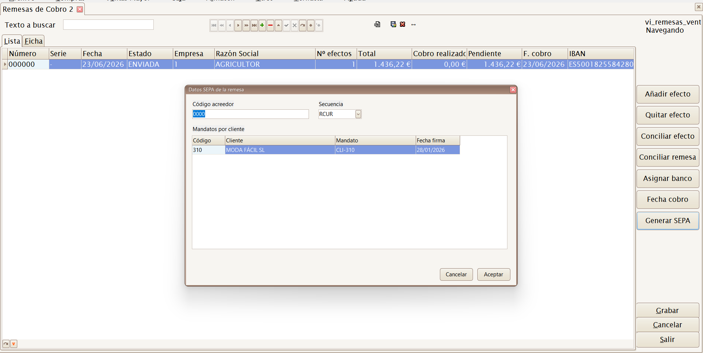
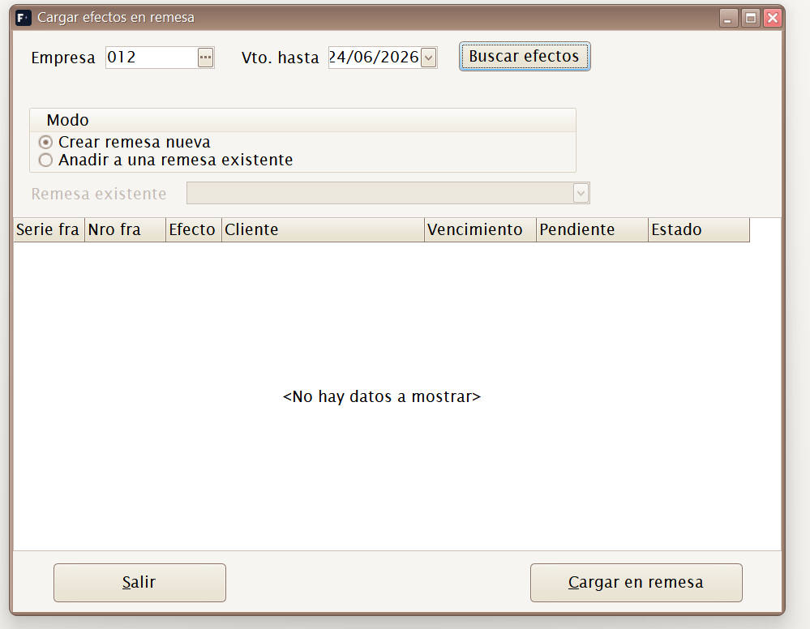
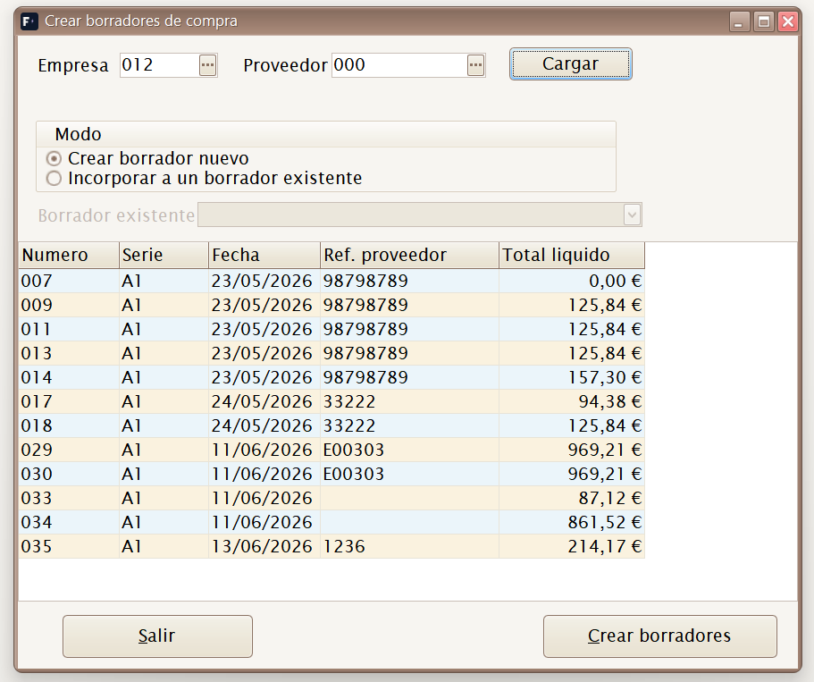

# 04 · Menú Ventas Mayor

[◀ Volver al índice](README.md)

El menú **Ventas Mayor** gestiona la **venta al por mayor** (B2B): ventas a
otros comercios o clientes con factura nominativa, a diferencia de la venta
al detalle en tienda, que se hace desde el módulo
[Caja](05-menu-caja.md).

Estructura del menú:

```
Ventas Mayor
├── Borradores
├── Efectos de cobro
├── Remesas de cobro
├── Cargar efectos en remesa...
├── Pedidos
├── Albaranes
└── Listados
    └── Ventas
```

> Flujo habitual de venta a mayor:
> **Pedido** del cliente → **Albarán** de salida (sale el stock) →
> **Borrador** de factura → **Consolidar** (registro fiscal). Se puede
> facturar albarán a albarán o agrupar varios albaranes en un solo
> borrador antes de emitirlo.

---

## Borradores



**Atajo de menú:** `[Ctrl]+[Alt]+[F]`

Mantenimiento de **Borradores de Venta Mayor**. Mientras el documento está
en fase **BORRADOR** se puede editar; al pulsar **Consolidar** se emite el
registro fiscal según el modo configurado en Verifactu.

Cada borrador lleva:

- **Cabecera**: cliente, fecha, **serie** y número, forma de pago y vencimientos.
- **Líneas**: artículos/SKU, cantidades, precio tomado de la **tarifa** del cliente y descuentos.
- **Totales e impuestos**: base, IVA por tipo, recargo de equivalencia y retenciones según cliente y empresa.
- **Efectos**: vencimientos de cobro generados desde la forma de pago, con importe, vencimiento, estado y banco asociado.

Los borradores se firman o comunican a **Verifactu (AEAT)** según la
configuración de certificado de la empresa (ver
[Empresas](02-menu-archivo.md#empresas)).

> Un borrador puede crearse manualmente o **a partir de albaranes**
> pendientes de facturar, incluso agrupando varios albaranes de un cliente
> en un rango de fechas.

Al consolidar, el documento deja de ser editable. Las correcciones
posteriores se hacen con **Anular**, **Rectificar** o **Subsanar**, según
el caso fiscal. La pestaña Verifactu muestra QR, URL de cotejo, estado y
registro asociado.

### Efectos y eDoc en el borrador

El botón **Generar efectos** reparte el total líquido en vencimientos según
la forma de pago. En facturas normales la pestaña 3 muestra **Efectos** de
cobro; en simplificadas mantiene el circuito de recibos.

Desde la pestaña de efectos se puede marcar un vencimiento como
**Cobrado** o **Devuelto**. Para gestionar muchos vencimientos juntos, usa
las opciones de menú **Efectos de cobro**, **Remesas de cobro** y
**Cargar efectos en remesa...**.

La pestaña **Parámetros eDoc** guarda la foto de emisión para Facturae:
DIR3 de oficina contable, órgano gestor y unidad tramitadora, además de
nombre y apellidos cuando el receptor es persona física. Se propone desde
la ficha del cliente y puede corregirse para esa factura concreta.

El botón **Emitir eDoc** genera un fichero Facturae firmado (`.xsig`) y
guarda el XML firmado en la factura. Solo se emite desde facturas normales
ya consolidadas, con certificado de empresa configurado y datos fiscales
completos.



---

## Efectos de cobro

Mantenimiento de vencimientos de cliente. Cada efecto representa un cobro
pendiente, cobrado, remesado o conciliado, generado desde un borrador de
venta mayor.



Acciones principales:

- **Conciliar efecto** — registra un cobro total o parcial, con fecha, importe, tipo y referencia.
- **Fusionar efectos** — agrupa efectos pendientes cuando se necesita regularizar varios vencimientos en uno.

Estados habituales:

| Estado | Significado |
|--------|-------------|
| **PENDIENTE** | Vencimiento vivo, todavía no cobrado. |
| **COBRADO** | Cobrado total o parcialmente. |
| **REMESADO** | Incluido en una remesa de cobro. |
| **CONCILIADO** | Fusionado o regularizado con otro efecto. |

---

## Remesas de cobro

Agrupa efectos de cliente para gestionar cobros bancarios. La remesa
recoge empresa, banco de cobro, fecha, número de efectos, total, cobro
realizado y pendiente.



Acciones principales:

- **Añadir efecto** — abre la selección de efectos pendientes.
- **Quitar efecto** — retira el efecto seleccionado de la remesa.
- **Conciliar efecto** — registra el cobro de un efecto concreto.
- **Conciliar remesa** — registra el cobro de todos los efectos de la remesa.
- **Asignar banco** — fija o cambia el banco de cobro de la empresa.
- **Fecha cobro** — actualiza la fecha de cobro de la remesa.
- **Generar SEPA** — crea el fichero bancario cuando la remesa tiene los datos SEPA necesarios.

---

## Cargar efectos en remesa...

Acceso directo al selector de efectos pendientes para crear una remesa
nueva o alimentar una remesa existente.



Filtra por empresa y vencimiento máximo. Marca los efectos que quieras
incluir y pulsa **Cargar en remesa**.

---

## Pedidos


**Atajo de menú:** `[Ctrl]+[Alt]+[P]`

Mantenimiento de **Pedidos de Venta**. Registra lo que un cliente
**encarga** (reserva de género). No mueve stock; sirve de base para generar
el **albarán** de salida cuando se sirve el pedido.

---

## Albaranes


**Atajo de menú:** `[Ctrl]+[Alt]+[A]`

Mantenimiento de **Albaranes de Venta**. Registra la **salida real** de
mercancía hacia el cliente: al confirmarlo **resta stock** del almacén. Es
el documento que después se **factura**.

Desde los albaranes se pueden crear borradores por rango de fechas. El
selector permite marcar varios albaranes pendientes y generar un borrador
agrupado para el mismo cliente.



---

## Listados ▸ Ventas


**Atajo de menú:** `[Ctrl]+[Alt]+[V]`

Abre el **generador de listados de ventas**. Mediante un cuadro de
**filtros** (rango de fechas, cliente, artículo, familia, serie…) genera un
informe de las ventas realizadas, que se puede **previsualizar, imprimir o
exportar**.

Útil para análisis comercial: qué se ha vendido, a quién y en qué periodo.

---

[◀ Menú Compras](03-menu-compras.md) · [Índice](README.md) · [Siguiente ▶ Menú Caja](05-menu-caja.md)
