# 05 · Menú TPV

[◀ Volver al índice](README.md)

El menú **TPV** es el punto de venta para la venta al detalle en
tienda: cobrar a clientes de mostrador, emitir tickets/facturas
simplificadas, gestionar el efectivo de la caja y cuadrarla (arqueo).

Estructura del menú:

```
TPV
├── Menú de Caja
├── Listados
│   └── Listado de operaciones de venta
├── Parámetros de Caja
├── Formas de Pago Caja
├── Depósitos de Clientes
├── Histórico de Pagos de Caja
├── Histórico de Vales
├── Histórico de Operaciones
├── Histórico de Arqueos
└── Borradores Simplificados
```

## Cómo se trabaja una jornada de caja

Una jornada normal de tienda sigue este orden:

1. Entrar en **TPV ▸ Menú de Caja** y seleccionar la empresa, el almacén y
   la caja física del puesto.
2. Revisar la **Fecha de Caja**. Si se está registrando una jornada atrasada,
   cambiarla antes de hacer ventas.
3. Registrar la **Entrada de Cambio (F6)** si se mete efectivo inicial o un
   refuerzo de monedas/billetes.
4. Vender desde **Ventas (F5)**, cobrar con **F12** y emitir el ticket o el
   borrador que corresponda.
5. Registrar gastos, retiradas, traspasos y devoluciones durante el día.
6. Al cierre, abrir **Arqueo (F11)**, contar efectivo y otras formas de pago,
   grabar el arqueo e imprimir el justificante.

La caja separa tres cosas que conviene no mezclar:

| Concepto | Qué es | Dónde se revisa |
|----------|--------|-----------------|
| **Operación de caja** | Registro de lo que ha ocurrido en el TPV: venta, devolución, gasto, entrada, traspaso o arqueo. | Buscar / Modificar e Histórico de Operaciones. |
| **Pago de caja** | Movimiento económico asociado a una operación: efectivo, tarjeta, vale, divisa, cripto o crédito. | Fase de cobro e Histórico de Pagos. |
| **Documento fiscal** | Ticket/borrador simplificado o borrador normal que justifica la venta. | Borradores Simplificados y Facturas/Borradores de venta. |

> Para evitar descuadres, una operación de venta no se considera terminada
> hasta que la fase de cobro se valida. Volver con **Esc** desde cobro deja el
> ticket abierto y no graba nada.

---

## Listados

### Listado de operaciones de venta

**Ruta:** *TPV ▸ Listados ▸ Listado de operaciones de venta*

Genera un informe A4 horizontal con el detalle de las ventas del TPV. El
formulario propone desde el 1 de enero del año actual hasta hoy y muestra la
empresa, el almacén y la caja activos de la sesión.

Cuando el usuario no está limitado por
`appRestringirEmpAlmCaja`, aparece la pestaña
**Empresas / almacenes / cajas**. El TPV activo se marca inicialmente y se
pueden marcar otras ubicaciones para acumularlas en el mismo informe. Los
usuarios restringidos no ven esta pestaña y solo consultan su ubicación.

El informe incluye artículo, color (con un recuadro del color básico definido
en Etiquetas), talla, proveedor, modelo, descripción, cantidad, bruto,
descuento, neto del artículo, ingresos, vendedor, formas de pago y documento.
Los resultados se ordenan por fecha y operación, con
totales por caja y por fecha.

> Este acceso depende del permiso de menú del perfil. Si **TPV ▸ Listados**
> no aparece, el administrador debe habilitarlo en el perfil; como consulta
> en pantalla puede usarse el
> [Histórico de Operaciones](#historico-de-operaciones), aunque no sustituye
> al informe A4.

---

## Menú de Caja

**Atajo de menú:** `[F5]`

Es la **pantalla principal del TPV**, diseñada para trabajar con **teclado**
y rapidez en el mostrador. Muestra la **Empresa**, la **caja activa**
(empresa/almacén/caja) y la **Fecha de Caja** de la jornada, junto con el
reloj.

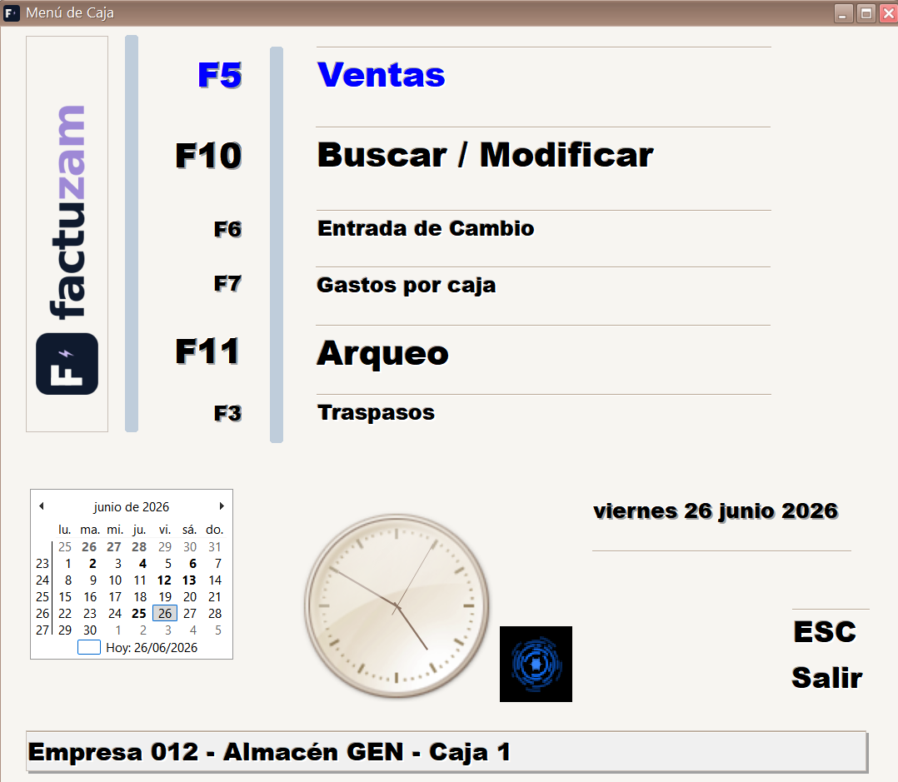

Funciones y sus teclas rápidas:

| Tecla | Función | Descripción |
|-------|---------|-------------|
| **F3** | **Traspasos** | Traspaso de **mercancía** entre almacenes/tiendas (ver detalle más abajo). |
| **F5** | **Ventas** | Pantalla de venta/cobro (ver detalle más abajo). |
| **F6** | **Entrada de Cambio** | Registra el efectivo inicial o un refuerzo de cambio que entra en el cajón. |
| **F7** | **Gastos por caja** | Registra pagos, gastos y retiradas de efectivo desde la caja. |
| **F10** | **Buscar / Modificar** | Localiza operaciones de la caja para consultarlas o modificarlas (ver detalle más abajo). |
| **F11** | **Arqueo** | Cierre y cuadre de caja (ver detalle más abajo). |
| — | **Fecha de Caja** | Fija/cambia la fecha de trabajo de la jornada. |
| **Esc** | **Salir** | Cierra el TPV y vuelve a la ventana principal. |

> El TPV está pensado para que un dependiente pueda vender, cobrar y cerrar
> caja sin usar el resto de menús. Antes de operar debe haber una **caja
> seleccionada** (empresa + almacén + caja).

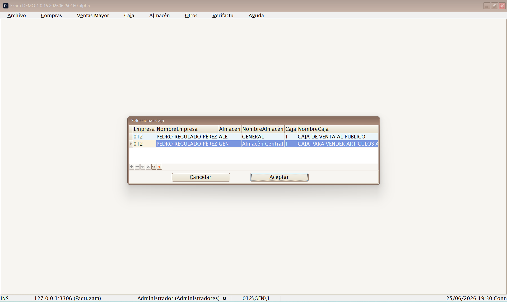

El calendario del menú marca los días con ventas y permite cambiar la fecha
de trabajo. La fecha elegida se arrastra a ventas, traspasos, entradas,
gastos y arqueos.

---

### Ventas (F5) — la pantalla de venta

Es la pantalla donde se hace el ticket. Arriba se indica el **Empleado**
(vendedor) y, opcionalmente, el **Cliente**; debajo, la rejilla de
**líneas de venta** y el **Total** en grande.

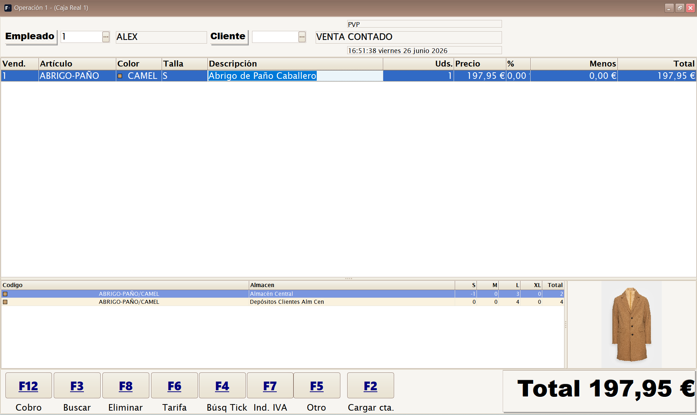

**Cómo se añaden líneas:**

- Pasando el **lector de código de barras** por el artículo (la pantalla
  está optimizada para ráfagas de lector).
- Buscando el artículo manualmente con **Buscar (F3)**.

Cada línea muestra: **Vend.** (vendedor de la línea), **Artículo**,
**Descripción**, **Color/Talla** cuando procede, **Uds.**, **Precio**,
**%** (descuento), **Menos** (importe descontado) y **Total**. Si el
artículo tiene foto, se muestra en el panel lateral de stock/foto.

**Flujo normal de venta:**

1. Indica el **Empleado**. Si el empleado está parametrizado por defecto, la
   pantalla lo propone automáticamente.
2. Indica el **Cliente** si no es una venta de contado. Para tickets de
   mostrador se puede dejar como **VENTA CONTADO**.
3. Escanea artículos o búscalos con **F3**. En artículos con talla/color, el
   TPV completa o pide el SKU que corresponda.
4. Revisa cantidades, descuentos y precio de línea si el usuario tiene permiso
   para cambiarlos.
5. Pulsa **F12 Cobro** cuando el total sea correcto.

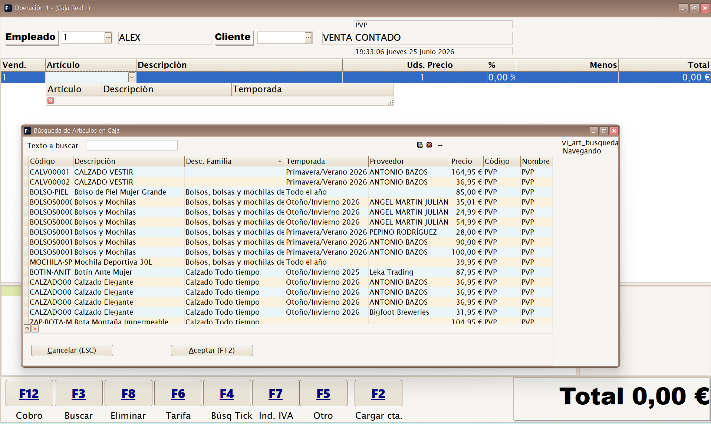

**Cliente, cuenta y depósitos:**

Si se asigna un cliente, la cabecera de la venta toma sus datos fiscales,
tarifa y condiciones. Cuando el cliente tiene depósitos o prendas apartadas,
**F2 Cargar cta.** trae su **cuenta de cliente** a la venta. Al pulsarlo, el
ticket carga:

- Una línea por cada **prenda apartada pendiente** (con su cantidad
  pendiente y el precio al que se apartó), marcada para **Cobrar**.
- Una línea negativa **«Abono a cuenta»** por cada **anticipo** ya
  entregado, que descuenta del total lo que el cliente ya pagó.

La vista cambia al **modo cuenta de cliente**: aparece la columna **Fecha**
(cuándo se apartó cada prenda) y se ocultan las columnas **%** y **Menos**.
Mientras tanto se puede seguir escaneando prendas nuevas con normalidad.

Las líneas que vienen de depósito tienen reglas propias:

- No se pueden **eliminar** (F8) ni sustituir por otra búsqueda (F3).
- Solo se permite **cambiar el signo de la cantidad**: en **negativo** la
  prenda queda marcada para **cancelar el depósito** (no se cobra la prenda
  y el anticipo entregado se recupera como saldo a favor en el cobro); de
  vuelta a positivo, se vuelve a marcar para **cobrar**.
- Con líneas de depósito en el ticket **no se admite descuento global** en
  la fase de cobro.

> Con el parámetro **Cargar depósitos automáticamente**
> (`vgerAutoLoadDepositos`) la cuenta se carga sola al seleccionar el
> cliente, sin pulsar F2 (ver [Parámetros de Caja](#parametros-de-caja)).

**Varias ventas a la vez:**

Con **F5 Otro** se aparca el ticket actual y se abre otra operación. Es útil
cuando un cliente sigue mirando o falta confirmar una prenda y hay que atender
a otra persona. Se pueden mantener hasta **5 operaciones simultáneas**. Antes
de cerrar el menú de caja, el programa avisa si queda alguna operación abierta.

**Teclas rápidas de la pantalla de Ventas:**

| Tecla | Función | Descripción |
|-------|---------|-------------|
| **F12** | **Cobro** | Pasa a la **fase de cobro** del ticket (ver abajo). |
| **F3** | **Buscar** | Busca artículos para añadirlos sin lector. |
| **F4** | **Búsq Tick** | Busca un ticket anterior (p. ej. para una devolución). |
| **F5** | **Otro** | Cambia a **otra operación en paralelo**: se pueden mantener hasta **5 tickets abiertos a la vez** (clientes simultáneos). |
| **F6** | **Tarifa** | Cambia la tarifa de precios aplicada. |
| **F7** | **Ind. IVA** | Cambia el indicador de IVA de la operación. |
| **F8** | **Eliminar** | Elimina la línea seleccionada. |
| **F2** | **Cargar cta.** | Carga los **depósitos/a cuenta** del cliente para aplicarlos. |
| **Ctrl+U** | **Consulta stock** | Consulta el stock del artículo de la línea en foco. |
| **Ctrl+E** | **Búsqueda de datos** | Abre la [búsqueda avanzada de artículos y SKU](01-conceptos-comunes.md#busqueda-de-datos-de-articulos-ctrle). |
| **Ctrl+A** | **Artículos** | Abre la consulta de artículos. |
| **Esc** | **Salir** | Abandona la operación. |

> El botón **Búsq Tick (F4)** se usa para localizar tickets anteriores, por
> ejemplo cuando hay que preparar una devolución o revisar una venta ya hecha.

---

### Fase de cobro (F12 desde Ventas)

Tras pulsar **Cobro (F12)** se entra en la **Fase de cobro**, donde se
liquida el ticket:

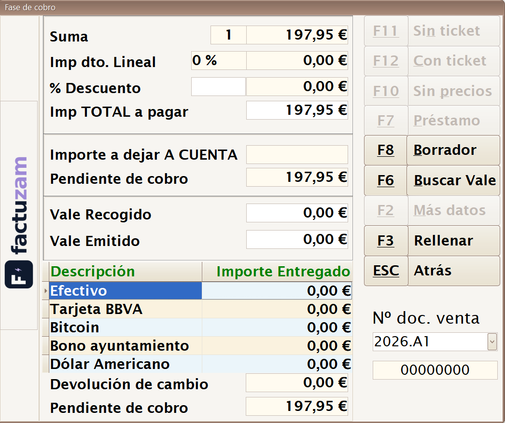

**Zona de importes:**

- **Imp. TOTAL a pagar**, con posibilidad de aplicar un **% Descuento** o
  un **descuento lineal** al total.
- **Pendiente de cobro** — lo que falta por cubrir con formas de pago.
- **Importe a dejar A CUENTA** — parte que queda como depósito del cliente.
- **Vale Emitido / Vale Recogido** — vales generados (devoluciones) o
  canjeados en esta operación.
- **Devolución de cambio** — cambio a devolver al cliente.

**Cobro parcial y depósitos (a cuenta):** si el cliente entrega **menos**
del total, la diferencia queda **a cuenta** y el programa reparte el dinero
entregado en este orden:

1. Primero a las **prendas de depósito ya existentes** cargadas con F2: la
   que no quede pagada del todo **aumenta su anticipo** con lo entregado.
2. Después a las **prendas nuevas** del ticket: la que no llegue a cubrirse
   se convierte en un **depósito nuevo** con lo entregado como anticipo (o
   con anticipo 0 si ya no queda dinero: la prenda queda simplemente
   **apartada**).

Los abonos por devolución del propio ticket y los anticipos de depósitos
**cancelados** cuentan como dinero disponible en ese reparto. Todo queda
registrado en [Depósitos de Clientes](#depositos-de-clientes).

**Rejilla de pagos:** se reparte el total entre una o varias **formas de
pago** (efectivo, tarjeta, vale…), indicando el **Importe Entregado** de
cada una. La aplicación calcula el cambio.

**Botones / teclas de la fase de cobro:**

| Tecla | Función | Descripción |
|-------|---------|-------------|
| **F12** | **Con ticket** | Cierra la venta **imprimiendo el ticket**. |
| **F11** | **Sin ticket** | Cierra la venta sin imprimir ticket térmico. |
| **F10** | **Sin precios** | Imprime ticket regalo sin precios y conserva el justificante fiscal. |
| **F8** | **Borrador** | Emite borrador normal/factura A4 a nombre del cliente. |
| **F7** | **Préstamo** | Deja el importe pendiente a cuenta del cliente si tiene crédito permitido. |
| **F6** | **Buscar Vale** | Localiza un **vale** emitido para canjearlo como pago. |
| **F3** | **Rellenar** | Rellena automáticamente el importe pendiente en la forma de pago seleccionada. |
| **F2** | **Más datos** | Datos adicionales de la operación. |
| **Esc** | **Atrás** | Vuelve a la pantalla de venta sin cerrar el cobro. |

> El **Nº de documento de venta** generado se muestra al cerrar. Las ventas
> de caja generan **borradores simplificados** que se consolidan según el
> modo fiscal configurado (consultables en
> [Borradores Simplificados](#borradores-simplificados)).

### Formas de pago, cambio y referencias

La rejilla de pagos muestra las formas activas configuradas en
**Formas de Pago Caja**. Se puede cubrir el total con una sola forma o repartir
el importe entre varias, por ejemplo efectivo + tarjeta o vale + efectivo.

**Rellenar (F3)** escribe el pendiente en la forma seleccionada. En efectivo,
si el importe entregado supera el pendiente, la pantalla calcula la
**Devolución de cambio**. En formas que no devuelven cambio, el importe debe
cuadrar con el pendiente o con la parte que se quiera cobrar.

Cuando una forma de pago pide referencia, usa divisa o cripto, se abre una
pantalla auxiliar:

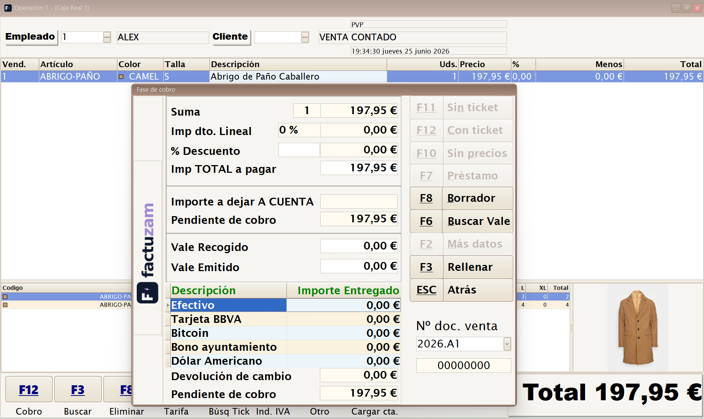

| Caso | Qué se pide |
|------|-------------|
| **Referencia** | Número de autorización, bono, localizador o dato que identifique el pago. |
| **Divisa** | Código de divisa, cotización e importe equivalente. |
| **Cripto** | Red blockchain y hash de la transacción. |

### Vales en caja

Un **vale emitido** es saldo que se entrega al cliente, normalmente por una
devolución o por el sobrante de otro vale. Un **vale recogido** es un vale que
el cliente usa como forma de pago.

Con **Buscar Vale (F6)** se abre la selección de vales pendientes:

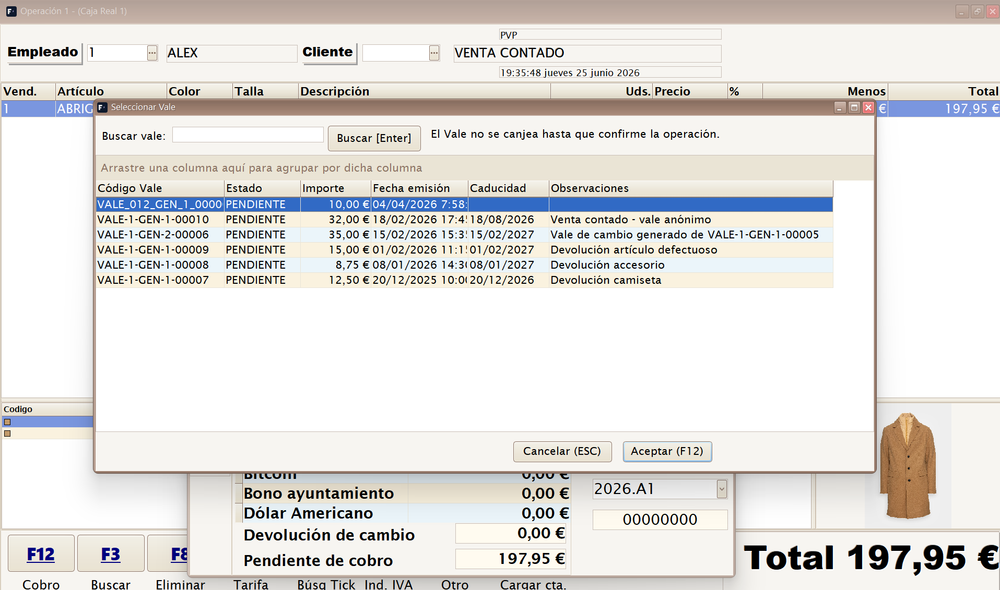

La pantalla muestra **Código Vale**, **Estado**, **Importe**, **Fecha de
emisión**, **Caducidad** y **Observaciones**. Si la configuración exige PIN,
también se solicita antes de aceptar. El vale no se canjea definitivamente
hasta confirmar el cobro.

Si el vale que se recoge es mayor que el pendiente de la venta, la diferencia
se registra como **Vale Emitido** para que el cliente no pierda saldo.

### Préstamo (F7) o venta a crédito

El botón **Préstamo (F7)** no es una forma de pago. Sirve para cerrar una
venta dejando el importe pendiente en la cuenta del cliente. En la práctica,
la mercancía sale de la tienda y el cliente queda con deuda o crédito pendiente.

Para usarlo deben cumplirse estas condiciones:

| Condición | Motivo |
|-----------|--------|
| **Cliente asignado** | No se puede dejar deuda a una venta de contado. |
| **Cliente con crédito permitido** | La ficha del cliente debe permitir cuenta o deuda. |
| **Límite suficiente** | Si hay límite de crédito, el pendiente no puede superarlo. |
| **Importe pendiente** | Solo tiene sentido si queda algo sin cubrir por pagos. |

En el arqueo, estas operaciones aparecen separadas como **Ventas Préstamos** y
también afectan a **Pendiente cobro**. Cuando el cliente pague más adelante, el
movimiento quedará como cobro de cliente.

### Qué ticket o documento se genera

| Botón | Resultado |
|-------|-----------|
| **Con ticket (F12)** | Graba la operación, genera el borrador simplificado y manda el ticket a la impresora de caja. |
| **Sin ticket (F11)** | Graba igual, pero no imprime ticket térmico. Puede abrir cajón si la forma de pago lo permite. |
| **Sin precios (F10)** | Imprime un ticket regalo sin precios; el documento fiscal completo queda registrado. |
| **Borrador (F8)** | Genera un borrador normal/A4 con serie y fecha, exige cliente con NIF válido. |

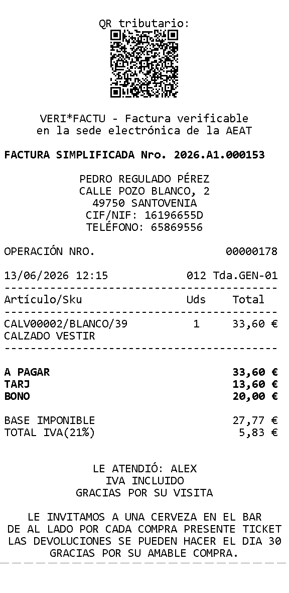

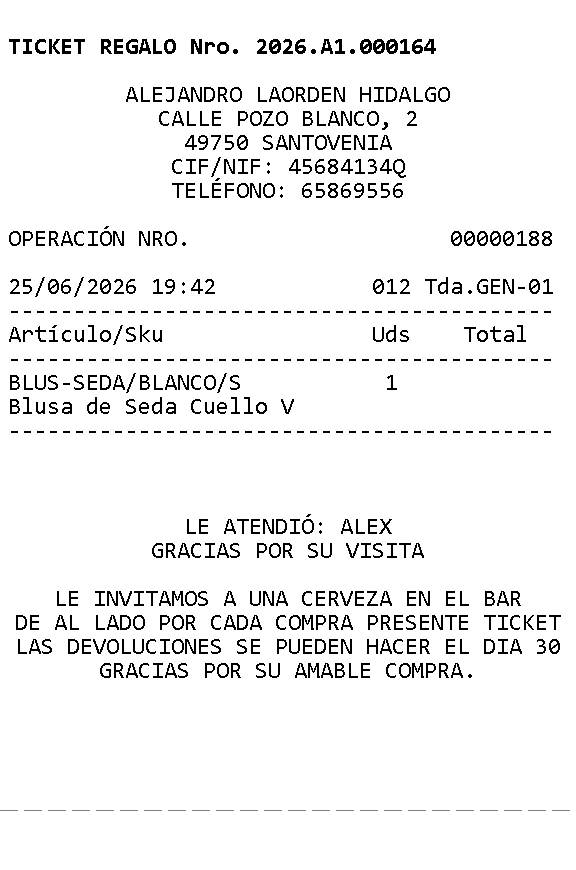

> Si el botón **Borrador (F8)** está bloqueado o avisa, revisa que la venta
> tenga cliente, NIF/CIF/NIE válido y datos fiscales suficientes.

---

### Traspasos (F3)

Gestiona los **traspasos de mercancía entre almacenes** (entre tiendas, o
tienda ↔ almacén central). El stock sale del almacén origen y entra en el
destino.

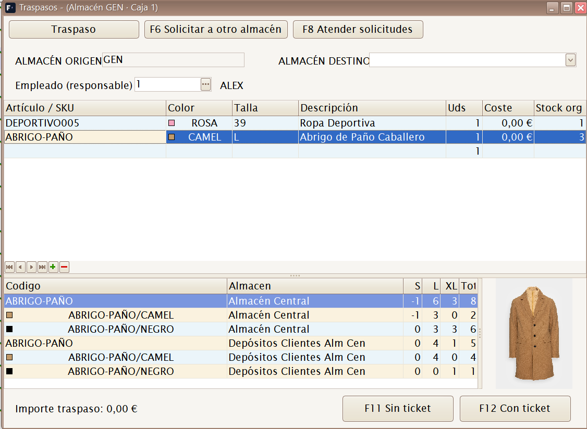

| Elemento | Descripción |
|----------|-------------|
| **Almacén origen / Almacén destino** | De dónde sale y a dónde va la mercancía. |
| **Empleado (responsable)** | Quién realiza el traspaso. |
| **Líneas de artículos** | Se añaden con el lector o búsqueda, igual que en Ventas. |
| **Importe traspaso** | Valoración de la mercancía traspasada. |

**Modos de trabajo:**

- **F6 — Solicitar a otro almacén:** crea una **solicitud** de género a
  otra tienda/almacén (pendiente de que la atiendan).
- **F8 — Atender solicitudes:** muestra las solicitudes recibidas para
  **prepararlas y enviarlas**.

**Cierre:** **F12 Con ticket** (imprime justificante del traspaso) o
**F11 Sin ticket**.

### Traspaso directo

Usa este modo cuando el género sale físicamente del almacén actual y se envía
a otro almacén en ese momento.

1. Revisa el **Almacén origen**. Normalmente coincide con el almacén de la
   caja activa.
2. Selecciona el **Almacén destino**.
3. Indica el **Empleado responsable**.
4. Escanea o busca las prendas que salen.
5. Cierra con **F12 Con ticket** si quieres justificante para la bolsa o caja
   enviada, o con **F11 Sin ticket** si no hace falta imprimir.

El traspaso no es una venta y no genera cobro. Sí genera trazabilidad de stock:
la mercancía deja de estar disponible en el origen y pasa al destino.

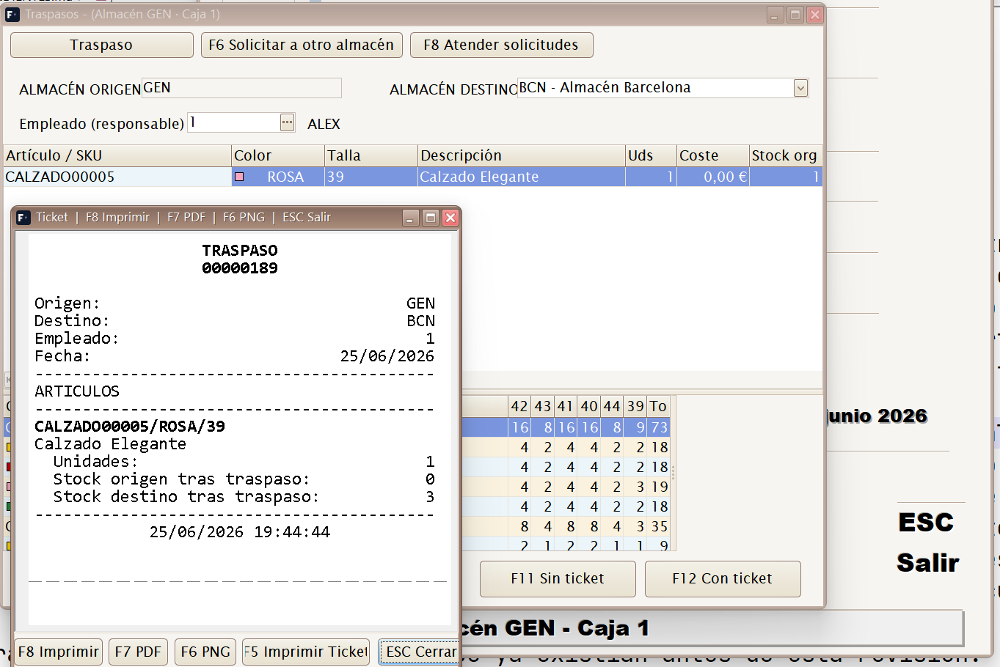

### Solicitar a otro almacén (F6)

Se usa cuando una tienda necesita género que está en otra tienda o en almacén
central, pero todavía no se está enviando físicamente.

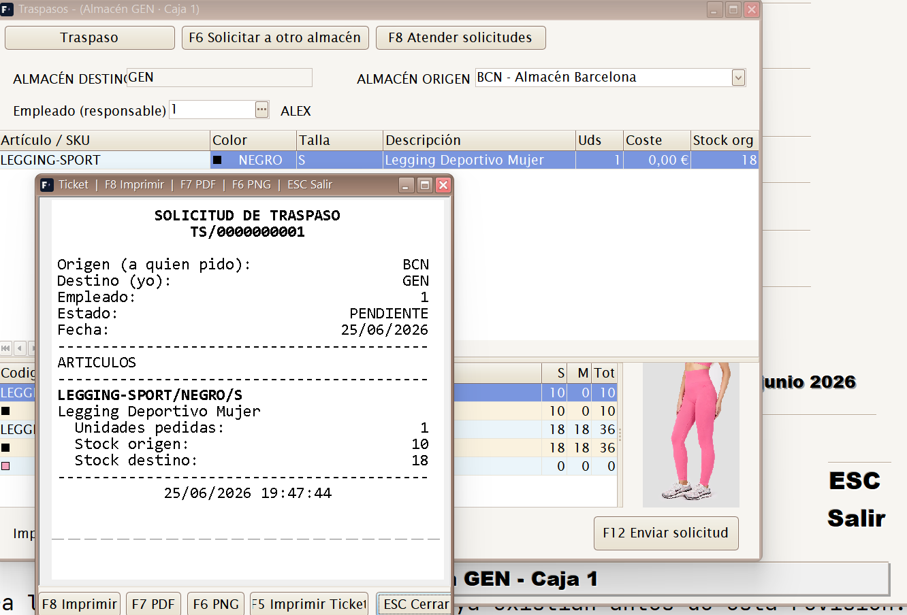

El flujo recomendado es:

1. Cambiar al modo **F6 Solicitar a otro almacén**.
2. Seleccionar el almacén al que se solicita la mercancía.
3. Añadir artículos y tallas igual que en una venta.
4. Guardar la solicitud para que el almacén origen pueda prepararla.

Hasta que se atiende, esta solicitud no debe tratarse como mercancía ya
recibida. Sirve para organizar trabajo entre tiendas y evitar llamadas o notas
manuales.

### Atender solicitudes (F8)

Se usa en el almacén que recibe peticiones de otras tiendas. Permite revisar
qué han solicitado, preparar las líneas y cerrar el envío.

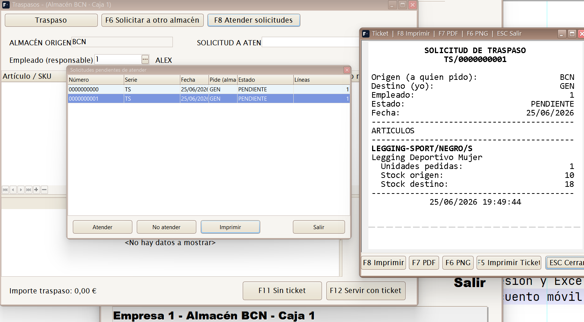

Cuando se atiende una solicitud, conviene imprimir el ticket de traspaso y
meterlo con la mercancía. Así la tienda destino puede cotejar lo recibido con
el justificante.

> Un traspaso mal cerrado afecta directamente al stock. Si hay dudas entre
> traspaso directo y solicitud, usa solicitud hasta que la mercancía salga de
> verdad del almacén origen.

---

### Entrada de Cambio (F6)

Registra el **efectivo de cambio** que se introduce en el cajón al empezar
la jornada (o un refuerzo de cambio a mitad de día). Este importe se tiene
en cuenta en el arqueo como entrada de efectivo.

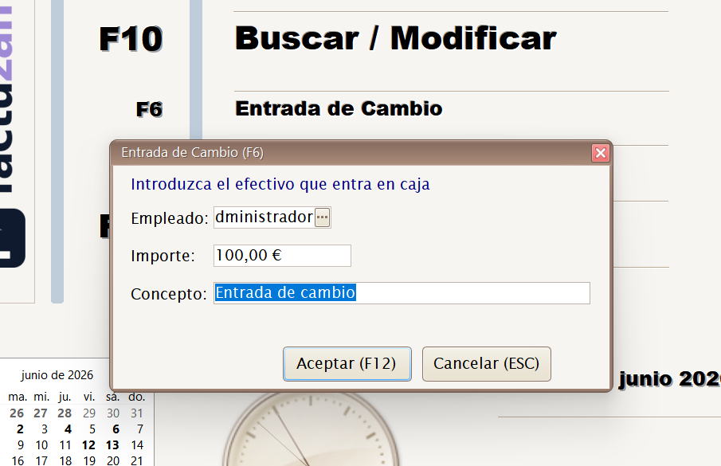

Campos principales:

| Campo | Uso |
|-------|-----|
| **Empleado** | Persona que registra o entrega el cambio. |
| **Importe** | Cantidad de efectivo que entra en la caja. |
| **Concepto** | Explicación breve: cambio inicial, refuerzo, monedas, etc. |

Se acepta con **F12** y se cancela con **Esc**. En el arqueo aparece como
**Efectivo entradas**, por lo que aumenta el efectivo esperado en caja.

---

### Gastos por caja (F7)

Registra **pagos en efectivo** hechos desde el cajón (mensajería, compras
menores…). Restan efectivo en el arqueo y quedan en el histórico de pagos.

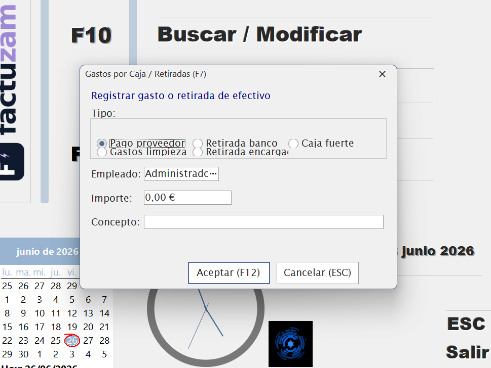

La pantalla permite clasificar la salida:

| Tipo | Cuándo usarlo |
|------|---------------|
| **Pago proveedor** | Pago puntual a un proveedor desde el cajón. |
| **Gastos limpieza** | Gastos menores pagados en efectivo. |
| **Retirada banco** | Dinero que se saca para ingresarlo en banco. |
| **Retirada encargado** | Entrega de efectivo al responsable. |
| **Caja fuerte** | Retirada para dejar efectivo fuera del cajón. |

Además pide **Empleado**, **Importe** y **Concepto**. Se acepta con **F12**.
Estas salidas restan en **Efectivo salidas** y quedan auditadas en históricos.

---

### Buscar / Modificar (F10)

Abre la pantalla **«Buscar operaciones»** para localizar cualquier
operación de la caja y revisarla o corregirla.

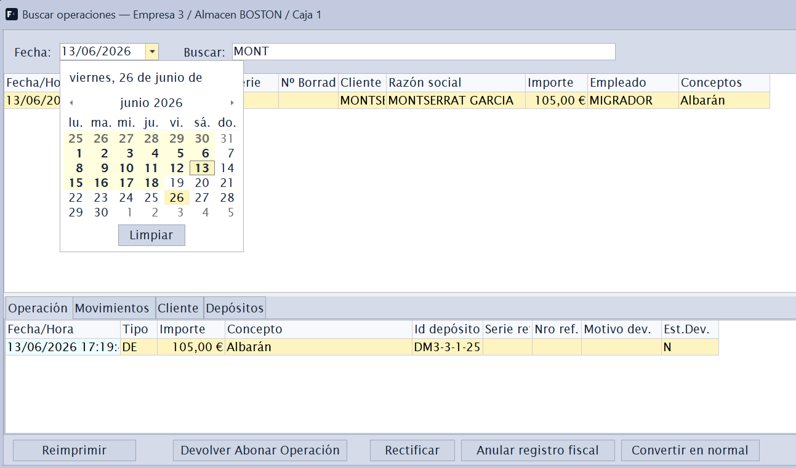

**Filtros:** **Fecha** de caja y campo **Buscar** (texto libre: cliente,
importe, nº de documento…).

**Rejilla de resultados:** Fecha/Hora, **Nº Operación**, **Tipos** (venta,
devolución, gasto, traspaso…), **Serie** y **Nº Factura**, **Cliente** y
Razón social, **Importe**, **Empleado** y **Conceptos**.

**Detalle de la operación seleccionada**, en dos pestañas:

- **Operación** — tipo, importe, concepto, id de depósito, documento de
  referencia (serie/nº), y en devoluciones el **motivo** y su estado.
- **Pagos** — desglose por forma de pago: línea, código, forma de pago,
  **Entregado**, **Cambio** y **Neto**.

Según la operación también pueden aparecer pestañas de **Vales**,
**Movimientos**, **Cliente**, **Depósitos** y **Factura**. Esta pantalla es la
forma más rápida de reconstruir qué pasó con un ticket: qué se vendió, cómo se
cobró, si hubo vale, si movió stock y qué documento fiscal quedó asociado.

Acciones habituales:

| Acción | Uso |
|--------|-----|
| **Reimprimir** | Saca el duplicado por la impresora de tickets configurada en parámetros. |
| **Previsualizar** | Abre la vista previa del ticket, desde la que se puede elegir otra impresora. |
| **e-mail** | Envía por correo la documentación de la operación seleccionada. |
| **Rectificar** | Abre una nueva operación para corregir el ticket por diferencias o mediante una rectificativa sustitutiva. |
| **Anular registro fiscal** | Solicita la anulación fiscal de un documento consolidado. |
| **Convertir en normal** | Convierte una factura simplificada en factura normal nominativa. |
| **F5** | Recarga la consulta del día. |
| **Esc** | Cierra la búsqueda y vuelve al menú de caja. |

> Requiere tener una **caja seleccionada** (empresa/almacén/caja); si no,
> la aplicación pide seleccionarla antes de buscar.

#### Rectificar un ticket: por diferencias o sustitutiva

Una venta ya consolidada no se modifica directamente. Para corregirla:

1. Entra en **Menú de Caja ▸ Buscar / Modificar (F10)**.
2. Localiza la operación y comprueba el ticket en las pestañas de detalle.
3. Pulsa **Rectificar**.
4. Elige **Por diferencias** o **Sustitutiva**.
5. Revisa la nueva operación que abre Factuzam, corrige sus líneas y
   finaliza el cobro con `[F12]`.

| Modalidad | Cómo se presenta | Cuándo usarla | Efecto en ventas y stock |
|-----------|------------------|----------------|--------------------------|
| **Por diferencias** | Carga las líneas originales en **negativo**. Puedes dejar solo las cantidades o conceptos que deban corregirse. | Devolución total/parcial, descuento omitido o diferencia concreta. | Conserva la venta original y añade la corrección. Las cantidades negativas compensan importes y movimientos de stock. |
| **Sustitutiva** | Carga el contenido en **positivo** para dejar la versión completa y correcta. | Cuando conviene reemplazar íntegramente el ticket por otro corregido. | La original queda sustituida y deja de computar como venta activa; la nueva aporta los importes y movimientos corregidos. |

Al cerrar la operación, Factuzam usa una **serie rectificativa**, enlaza el
nuevo documento con el original y lo registra o encola según el modo fiscal.
No se puede volver a rectificar un documento que ya es rectificativo.

> **Convertir en normal** es un flujo distinto: se utiliza cuando el cliente
> pide una factura nominativa de su ticket, no para corregir importes. Para
> las diferencias fiscales entre estas acciones, consulta
> [Acciones fiscales sobre una factura emitida](11-verifactu.md#5-acciones-fiscales-sobre-una-factura-emitida).

---

### Arqueo (F11)

El **arqueo** es el cierre y cuadre de la caja: calcula lo que **debería
haber** en el cajón y lo compara con lo que se cuenta físicamente.

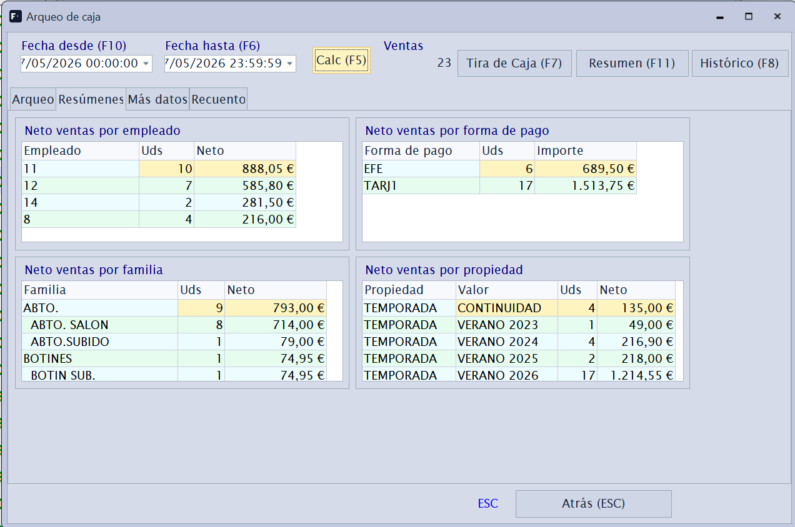

**Periodo:** se arquea entre **Fecha desde (F10)** y **Fecha hasta (F6)**
(normalmente la jornada en curso).

**El desglose en cascada** muestra cómo se llega al saldo:

```
Líneas artículos      + Bruto − Descuento                = Bruto
Operaciones           Ventas Normales + Ventas Préstamos
                      − Devoluciones                     = Total Ventas
Cobros                − Vales recogidos + Vales emitidos
                      + Cobros clientes − Pendiente cobro = Ingresos caja
Efectivo              + Efectivo entradas − Efectivo salidas
                      + Efectivo anterior                = Efectivo en caja
                      + Otros (tarjetas, bonos, divisa, cripto)
                                                         = Saldo a recontar
```

**Pestaña «Resúmenes»:** neto de ventas **por empleado** (unidades y neto)
y **por forma de pago** (unidades e importe) — útil para comisiones y para
cuadrar el datáfono.

**Botones:**

| Tecla | Función |
|-------|---------|
| **F5** | **Recalcular** el arqueo tras cambiar fechas. |
| **F11** | **Resumen** / imprimir el arqueo calculado. |
| **F7** | **Tira de Caja** con detalle de tickets y movimientos. |
| **F8** | **Histórico** de arqueos anteriores. |
| **F2** | **Grabar Arqueo y emitir justificante** desde la pestaña Recuento. |

El botón **Resumen (F11)** emite el ticket de arqueo con el periodo, las
operaciones, los totales de venta y cobro y los resúmenes por sección,
temporada, empleado, forma de pago y serie.

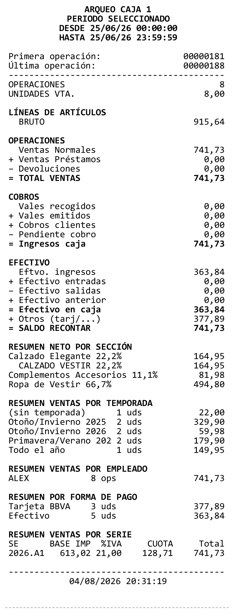

> Haz el arqueo **al cierre de cada jornada**. El «Efectivo anterior» enlaza
> con el arqueo previo, de modo que los descuadres no se arrastran sin ser
> detectados.

### Recuento del arqueo

La pestaña **Recuento** presenta una sola línea por forma de pago. El efectivo
se introduce como un importe total, sin contar billetes y monedas por
denominación.

| Zona | Qué se introduce |
|------|------------------|
| **Efectivo** | Importe total contado en el cajón. |
| **Otras formas de pago** | Importe recontado de tarjeta, bono, divisa, cripto u otras formas no efectivo. |
| **Retirada** | Importe retirado a banco, encargado o caja fuerte. |
| **Dejo para mañana** | Efectivo que queda como cambio para la siguiente jornada. |
| **Observaciones** | Aclaraciones sobre diferencias o incidencias. |
| **Vendedor** | Empleado responsable del cierre. |

La pantalla calcula **Total sistema**, **Total recontado** y **Diferencia**.
Si la diferencia no es cero, conviene explicar el motivo en observaciones antes
de grabar.

Con **Permitir Arqueo de Tarjetas** desactivado, la línea de efectivo muestra
la propuesta del sistema y el usuario confirma el total en **Recontado**. Con
el parámetro activado no se muestran las propuestas ni las diferencias de
efectivo o tarjetas; el recuento se introduce sin esos totalizadores.

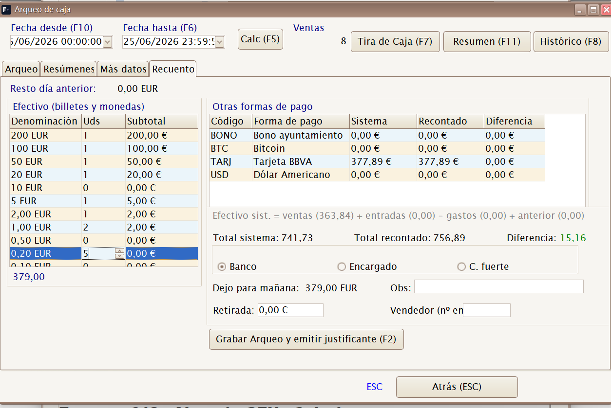

### Tira de Caja (F7)

La **Tira de Caja** imprime o exporta un detalle de lo ocurrido en el rango del
arqueo. Permite seleccionar series de facturas simplificadas y decidir si se
incluyen traspasos salientes, ingresos por caja, gastos por caja y ventas a
crédito.

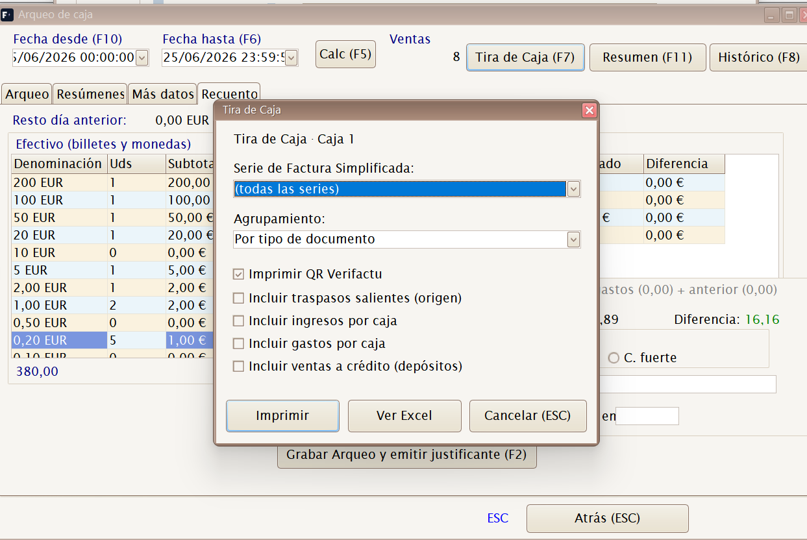

**Imprimir** genera la tira en formato de ticket, con el detalle de cada
documento, su forma de pago y los totales del periodo.

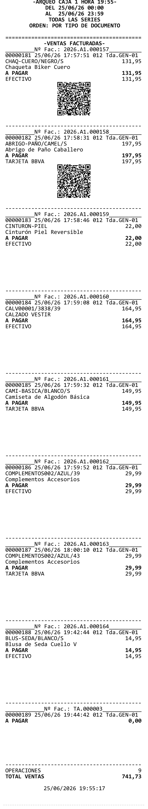

**Ver Excel** abre una previsualización tabular con cada documento y línea,
SKU, descripción, cantidad, importe y subtotales. Desde esa vista se puede
guardar el Excel si se necesita adjuntarlo o trabajarlo fuera de Factuzam.

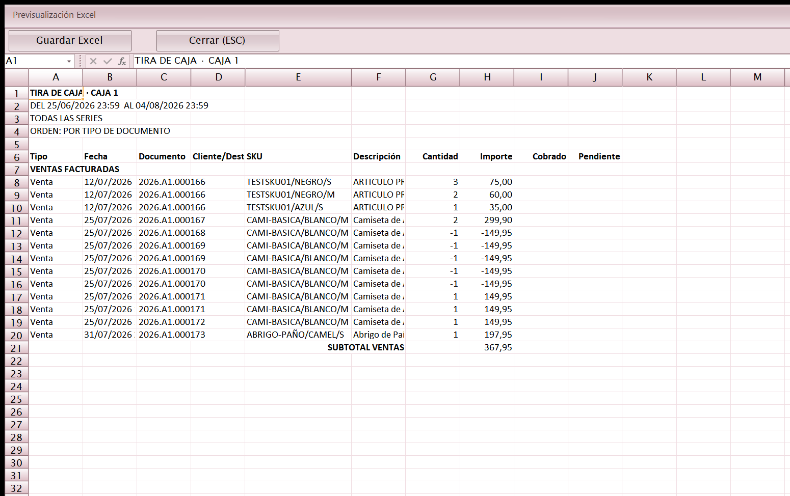

Úsala cuando el responsable quiera revisar el detalle antes del cierre o
adjuntar una relación de movimientos al arqueo.

Desde **Histórico (F8)** puedes reimprimir duplicados del ticket de arqueo
o del justificante de cierre ya grabado.

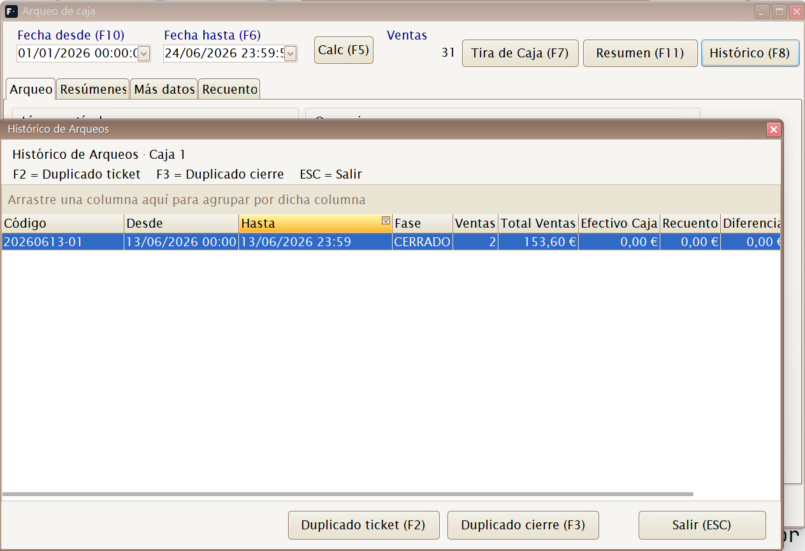

---

## Parámetros de Caja

**Atajo de menú:** `[Ctrl]+[F5]`

Configuración del comportamiento del TPV: selector de caja, tarifa por
defecto, empleado, validación de artículos, vales, lector de códigos,
impresora, permisos operativos y resumen del arqueo. Normalmente lo
configura el responsable al instalar la tienda.

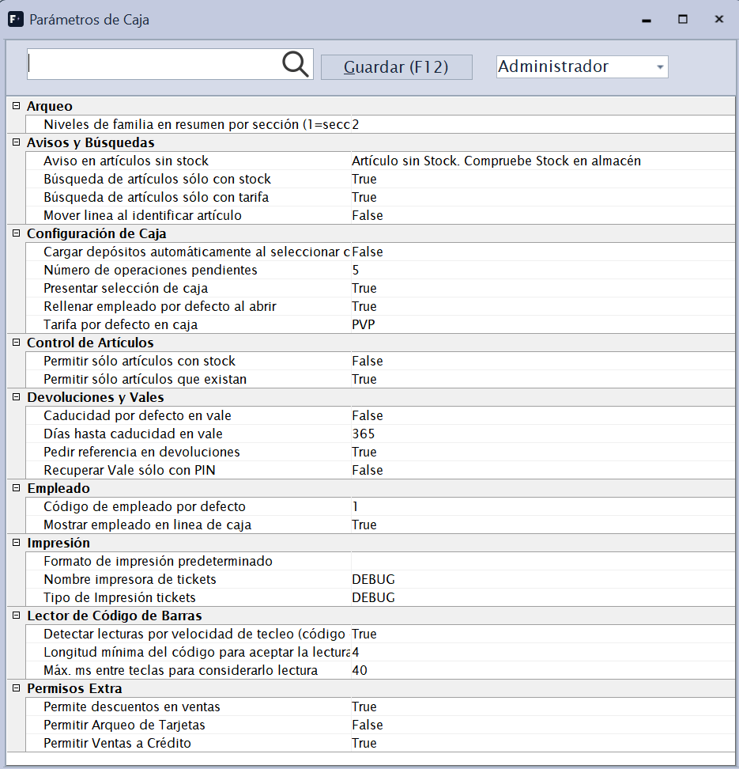

La parte superior tiene tres controles importantes:

| Control | Uso |
|---------|-----|
| **Buscar** | Filtra la lista de parámetros por texto. Sirve para localizar rápido impresora, stock, vale, descuento, etc. |
| **Guardar (F12)** | Graba solo los valores modificados del perfil elegido. |
| **Usuario / Grupo / Todos** | Permite cargar parámetros propios del usuario, del grupo o generales. Un usuario normal edita los suyos y los de su grupo; **Todos** queda en consulta salvo permisos de administrador. |

Los parámetros se leen con prioridad de usuario, grupo y valores por defecto.
Cuando se guarda un cambio para el usuario o grupo actual, la caja recarga la
configuración en memoria.

### Control de Artículos

| Parámetro | Defecto | Qué controla |
|-----------|---------|--------------|
| **Permitir sólo artículos que existan** (`vgerChkExistOnly`) | `True` | Antes de vender un SKU comprueba que exista en `fza_articulos_skus` y que esté activo. Si no existe o está inactivo, la caja bloquea la línea y avisa al usuario. |
| **Permitir sólo artículos con stock** (`vgerChkStockOnly`) | `False` | Si está activo, la caja no deja vender un SKU sin stock disponible. Si está desactivado, puede venderse, pero puede mostrarse el aviso configurado en **Aviso en artículos sin stock**. |

Uso recomendado:

| Situación | Configuración recomendada |
|-----------|--------------------------|
| Tienda con stock controlado por SKU | Existencia `True`, stock `True`. |
| Tienda en arranque o con servicios sin stock | Existencia `True`, stock `False`. |
| Carga inicial con artículos todavía incompletos | Revisar antes de desactivar existencia, porque permite errores de código. |

### Configuración de Caja

| Parámetro | Defecto | Qué controla |
|-----------|---------|--------------|
| **Presentar selección de caja** (`vgerShowCajaSelection`) | `False` | Al entrar en Caja muestra el selector de empresa, almacén y caja. Si está desactivado, se usan los valores activos del entorno (`oEmpresa`, `oAlmacen`, `oCaja`). Doble clic sobre la cabecera de empresa vuelve a abrir el selector cuando está permitido. |
| **Rellenar empleado por defecto al abrir** (`vgerFillEmpleadoDefecto`) | `False` | Al crear una venta o un traspaso rellena el empleado si no había empleado anterior. Usa el valor de **Código de empleado por defecto**. |
| **Tarifa por defecto en caja** (`vgerDefTarifa`) | `PVP` | Tarifa inicial de una venta de contado. Al seleccionar cliente, puede cambiarse por la tarifa propia del cliente. |
| **Número de operaciones pendientes** (`vgerMaxOpPending`) | `5` | Parámetro preparado para limitar o dimensionar operaciones pendientes. En la versión actual está registrado en la pantalla, pero no se ha localizado uso operativo directo en la caja. |
| **Cargar depósitos automáticamente al seleccionar cliente** (`vgerAutoLoadDepositos`) | `False` | Si el cliente permite deuda y tiene depósitos, la caja carga sus depósitos pendientes al seleccionarlo. Si está desactivado, el usuario debe cargarlos con **Cargar cta. (F2)** desde la pantalla de Ventas. |

Ejemplo práctico: en una tienda con varias cajas físicas conviene activar
**Presentar selección de caja** para evitar que un usuario facture desde la
caja equivocada. En una tienda con un único TPV puede dejarse desactivado.

### Devoluciones y Vales

| Parámetro | Defecto | Qué controla |
|-----------|---------|--------------|
| **Pedir referencia en devoluciones** (`vgerReqRefDevolucion`) | `False` | Parámetro preparado para exigir una referencia en devoluciones. En la versión actual está definido, pero no se ha localizado uso operativo directo en la fase de cobro. |
| **Recuperar Vale sólo con PIN** (`vgerRecuperaValePIN`) | `False` | Al buscar un vale, muestra el campo PIN. Si el vale tiene PIN de seguridad, obliga a introducirlo para canjearlo. También filtra la búsqueda por PIN cuando se rellena. |
| **Caducidad por defecto en vale** (`vgerCaducidadDefVale`) | `False` | Al seleccionar vales para canjear, oculta los caducados cuando está activo. Un vale sin fecha de caducidad sigue siendo válido. |
| **Días hasta caducidad en vale** (`vgerDiasCaducidadVale`) | `365` | Parámetro preparado para calcular caducidad al emitir vales. En la versión actual está registrado, pero la emisión de vales no usa directamente este valor. |

Funcionamiento de vales en cobro:

| Caso | Comportamiento |
|------|----------------|
| El vale cubre parte de la venta | Se registra como forma de pago `VALE` con referencia al código del vale. |
| El vale es mayor que lo pendiente | Se canjea el vale completo y se emite automáticamente un vale nuevo por el exceso. |
| El vale no existe, está recogido o está anulado | La validación de cobro bloquea el cierre. |
| Caducidad activa | La búsqueda solo enseña vales pendientes no caducados. |

### Avisos y Búsquedas

| Parámetro | Defecto | Qué controla |
|-----------|---------|--------------|
| **Aviso en artículos sin stock** (`vgerAvisoStockWarning`) | `Artículo sin stock. Compruebe stock en almacén.` | Texto que se muestra cuando se detecta falta de stock y no se bloquea la venta por **Permitir sólo artículos con stock**. Si se deja vacío, no se muestra aviso informativo. |
| **Búsqueda de artículos sólo con stock** (`vgerBusqArtStockOnly`) | `False` | Parámetro preparado para filtrar búsquedas por stock. En la versión actual la búsqueda de artículos de caja filtra por tarifa y vigencia, pero no aplica esta clave directamente. |
| **Búsqueda de artículos sólo con tarifa** (`vgerBusqArtTarifaOnly`) | `False` | Parámetro preparado para filtrar búsquedas solo con tarifa. En la versión actual la búsqueda permite artículos de la tarifa activa o sin tarifa asociada. |
| **Mover línea al identificar artículo** (`vgerMoverLineaIdentif`) | `False` | Decide el salto de foco al identificar un artículo. Si está activo, la caja guarda la línea y abre una nueva línea en **Artículo**. Si está desactivado, deja el foco en la descripción o en atributos para completar la línea. |

Este bloque afecta sobre todo al ritmo de venta:

| Forma de trabajar | Ajuste útil |
|-------------------|-------------|
| Venta rápida con lector y SKU completos | Activar **Mover línea al identificar artículo**. |
| Venta con artículos que requieren atributos manuales | Desactivar **Mover línea al identificar artículo**. |
| Se permite vender sin stock, pero se quiere advertir | Stock `False` y aviso de stock con texto. |

### Lector de Código de Barras

| Parámetro | Defecto | Qué controla |
|-----------|---------|--------------|
| **Detectar lecturas por velocidad de tecleo (código + CR)** (`vgerScanVelActivo`) | `True` | Activa el detector que diferencia una lectura de escáner de una entrada manual por teclado. |
| **Máx. ms entre teclas para considerarlo lectura** (`vgerScanVelMs`) | `40` | Umbral de velocidad entre caracteres. Si el escáner escribe más lento que este valor, puede interpretarse como tecleo normal. |
| **Longitud mínima del código para aceptar la lectura** (`vgerScanMinLong`) | `4` | Evita tratar textos muy cortos como códigos escaneados. |

Si el lector no dispara la búsqueda automática, revisa primero
**Detectar lecturas por velocidad de tecleo** y sube ligeramente el umbral de
milisegundos. Si se producen falsas lecturas al teclear, baja el umbral o sube
la longitud mínima.

### Impresión

| Parámetro | Defecto | Qué controla |
|-----------|---------|--------------|
| **Nombre impresora de tickets** (`vgerDefPrinter`) | vacío | Impresora térmica usada por los tickets y por la apertura de cajón. La lista permite elegir entre impresoras instaladas. Si no hay impresora válida o queda en `DEBUG`, la apertura de cajón no se ejecuta y se avisa al usuario. |
| **Tipo de Impresión tickets** (`vgerTipoImpresion`) | `ESC POS` | Modo de impresión disponible en el selector: `ESC POS`, `ESC POS NOQR`, `EDITOR` o `DEBUG`. En la versión actual se almacena como parámetro, pero la generación principal de tickets usa la impresora asignada. |
| **Formato de impresión predeterminado** (`vgerFormatoImpPredet`) | vacío | Parámetro reservado para indicar un formato predeterminado. En la versión actual está registrado, pero no se ha localizado uso operativo directo en caja. |

Notas de soporte:

| Valor | Cuándo usarlo |
|-------|---------------|
| `ESC POS` | Ticket térmico normal con comandos de impresora. |
| `ESC POS NOQR` | Variante prevista para tickets sin QR cuando el formato lo soporte. |
| `EDITOR` | Modo de edición o pruebas de formato. |
| `DEBUG` | Pruebas sin impresora real. No sirve para abrir cajón. |

### Empleado

| Parámetro | Defecto | Qué controla |
|-----------|---------|--------------|
| **Código de empleado por defecto** (`vgerCodEmpleadoDefecto`) | vacío | Código que se rellena al abrir venta o traspaso si **Rellenar empleado por defecto al abrir** está activo. |
| **Mostrar empleado en linea de caja** (`vgerShowEmpleadoLinea`) | `True` | Muestra u oculta la columna de empleado en la línea de venta. Si se oculta, la línea sigue pudiendo llevar el vendedor asignado por cabecera o por defecto. |

En tiendas con comisiones por vendedor conviene dejar visible la columna de
empleado. En tiendas de autoservicio con un solo cajero puede ocultarse para
ganar espacio en la rejilla.

### Permisos Extra

| Parámetro | Defecto | Qué controla |
|-----------|---------|--------------|
| **Permitir Arqueo de Tarjetas** (`vgerArqueoTarjetas`) | `False` | Con `False`, muestra las propuestas del sistema, incluido el efectivo total en una sola línea. Con `True`, oculta las propuestas y diferencias de efectivo y tarjetas para introducir el recuento sin totalizadores. |
| **Permitir Ventas a Crédito** (`vgerVentasCredito`) | `True` | Habilita el botón **Préstamo (F7)** en la fase de cobro, siempre que haya cliente, el cliente permita deuda y quede importe pendiente para dejar en cuenta. |
| **Permite descuentos en ventas** (`vgerDescuentos`) | `True` | Permite editar descuentos de línea, descuento global, total y precio unitario. Si está desactivado, esas vías quedan bloqueadas para evitar descuentos indirectos. |

La venta a crédito no depende solo del parámetro: también exige cliente
identificado, permiso de deuda en la ficha del cliente y validación de límite
de crédito.

### Arqueo

| Parámetro | Defecto | Qué controla |
|-----------|---------|--------------|
| **Niveles de familia en resumen por sección** (`vgerArqueoNivelesFamilia`) | `2` | Define cuántos niveles de la ruta de familias aparecen en el resumen por sección del arqueo y en el ticket de arqueo. `1` muestra solo la sección raíz; `2` sección y familia; `3` añade subfamilia. El sistema sanea el valor al rango `1..9`. |

Usa pocos niveles si el arqueo debe ser rápido y legible. Sube los niveles
cuando se necesite analizar la venta por familias más concretas.

> Cambiar parámetros durante la jornada puede alterar el comportamiento de las
> nuevas operaciones y tickets, pero no modifica operaciones ya grabadas. Para
> evitar confusiones, cambia impresora, caja, stock o descuentos antes de abrir
> la jornada o después de cerrar el arqueo.

---

## Formas de Pago Caja

**Atajo de menú:** `[Shift]+[Ctrl]+[Q]`

Define las **formas de pago admitidas en el TPV** y cómo se comporta cada
una en el cobro y en el arqueo.

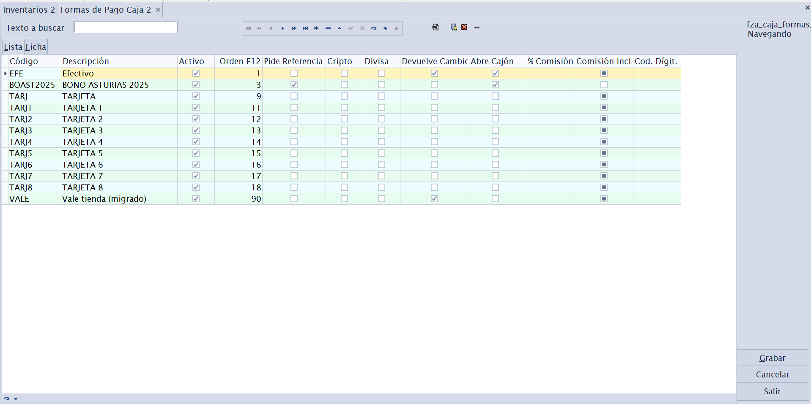

Campos de cada forma de pago:

| Campo | Descripción |
|-------|-------------|
| **Código / Descripción / Activo** | Identificación de la forma de pago. |
| **Orden F12** | Posición en la pantalla de cobro (la primera es la que se propone al pulsar F12). |
| **Pide Referencia** | Al cobrar exige una referencia (nº de bono, autorización de tarjeta…). |
| **Devuelve Cambio** | Permite dar cambio (típico del efectivo; una tarjeta no lo permite). |
| **Abre Cajón** | Abre el cajón portamonedas al cobrar. |
| **% Comisión / Comisión Incl.** | Comisión de la forma de pago (p. ej. TPV bancario) y si está incluida. |
| **Divisa** | Es una moneda extranjera (USD, GBP…). |
| **Cripto / Red y Hash Blockchain** | Es una criptomoneda; registra la red y el hash de la transacción. |

> En el arqueo, las formas que no son efectivo se agrupan en
> **«Otros (tarjetas, bonos, divisa, cripto)»** para el recuento.

Configuración recomendada:

| Forma | Recomendación |
|-------|---------------|
| **Efectivo** | Activar **Devuelve Cambio** y **Abre Cajón**. |
| **Tarjeta** | Activar **Pide Referencia** si se quiere guardar autorización; no debe devolver cambio. |
| **Vale** | Usar la gestión propia de vales desde **Buscar Vale (F6)**. |
| **Divisa** | Marcar **Divisa** para pedir cotización e importe equivalente. |
| **Cripto** | Marcar **Cripto** y definir red/hash para trazabilidad. |

---

## Depósitos de Clientes

**Atajo de menú:** `[Ctrl]+[D]`

Gestiona los **depósitos/anticipos** de clientes: prendas apartadas y
dinero entregado a cuenta (señales, reservas) que luego se aplica a una
venta (tecla **F2 Cargar cta.** en el TPV). Lleva el saldo disponible por
cliente.

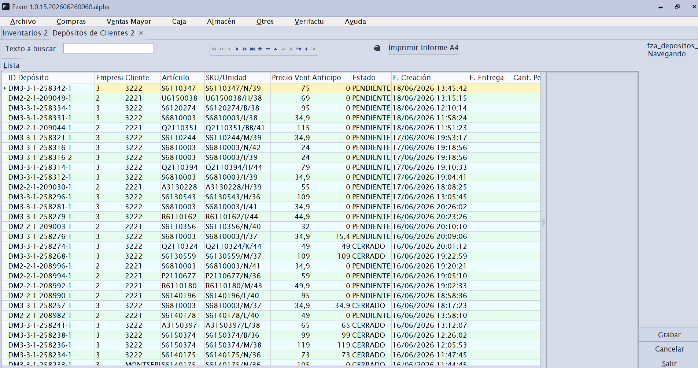

Columnas principales:

| Campo | Qué indica |
|-------|------------|
| **ID Depósito** | Identificador interno del depósito. |
| **Cliente** | Cliente propietario de la señal o prenda apartada. |
| **Artículo / SKU** | Prenda reservada, con talla/color si procede. |
| **Precio Venta** | Precio total previsto para la entrega. |
| **Anticipo** | Importe ya pagado por el cliente. |
| **Estado** | **PENDIENTE** mientras la prenda sigue apartada; al entregarse o cancelarse, el depósito queda **CERRADO**. |
| **Cant. Pendiente** | Unidades que quedan pendientes de entregar o regularizar. |

Los depósitos **no se teclean aquí**: nacen y se cierran solos desde el
TPV, y esta pantalla es su consulta y auditoría:

| Momento | Qué ocurre con el depósito |
|---------|---------------------------|
| **Cobro parcial en caja** | La prenda no cubierta del todo se convierte en depósito **PENDIENTE**, con lo entregado como **anticipo** (o anticipo 0 si solo se aparta). |
| **F2 Cargar cta. + cobro** | La prenda apartada se cobra (descontando su anticipo) y el depósito pasa a **CERRADO**. Si se entrega menos, el **anticipo aumenta** y sigue PENDIENTE. |
| **F2 + cantidad en negativo** | El depósito se **cancela**: la prenda no se cobra y el anticipo se recupera como saldo a favor en ese cobro. |

Desde caja se trabaja con la cuenta del cliente de dos formas:

| Acción | Efecto |
|--------|--------|
| **Cargar cta. (F2)** | Lleva los depósitos del cliente al ticket para cobrarlos, aumentar el anticipo o cancelarlos. |
| **Préstamo (F7)** | Deja pendiente de cobro en cuenta si el cliente tiene crédito permitido. |

> Depósito y préstamo no son lo mismo. El depósito es dinero/prenda ya
> registrada a cuenta. El préstamo es una venta que se cierra dejando deuda.

---

## Histórico de Pagos de Caja

**Atajo de menú:** `[Shift]+[Ctrl]+[J]`

Consulta de todos los **cobros y pagos** registrados en la caja, con sus
formas de pago e importes. Permite filtrar por fechas y revisar el detalle
del efectivo movido.

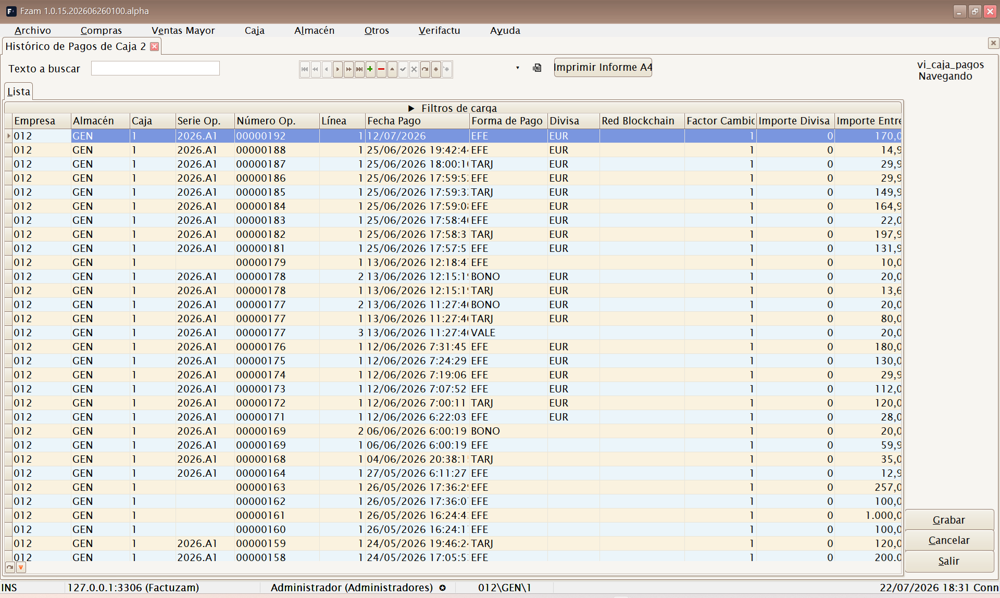

Incluye empresa, almacén, caja, serie y número de operación, línea, fecha,
forma de pago, divisa, referencia, importe entregado, cambio y observaciones.
Es la pantalla adecuada para comprobar por qué el datáfono o el efectivo no
cuadran con el arqueo.

---

## Histórico de Vales

**Atajo de menú:** `[Shift]+[Ctrl]+[V]`

Consulta de los **vales** emitidos (por devoluciones de cliente sin
reembolso en efectivo) y su estado (pendiente, canjeado, caducado).

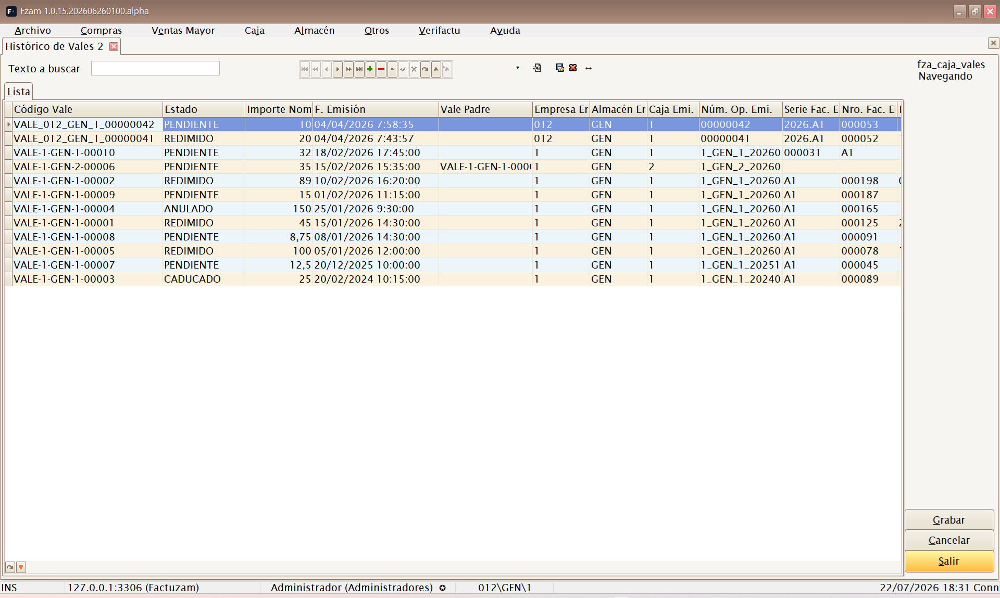

Muestra el código del vale, estado, importe nominal, fecha de emisión,
caducidad, PIN si existe, operación de emisión y operación de redención. Sirve
para saber si un vale está pendiente, si ya se usó y en qué caja se canjeó.

---

## Histórico de Operaciones

**Atajo de menú:** `[Shift]+[Ctrl]+[O]`

Consulta del **registro completo de operaciones** del TPV: ventas,
devoluciones, entradas de cambio, gastos, traspasos… con su trazabilidad.
Es la vista de auditoría de la actividad de caja.

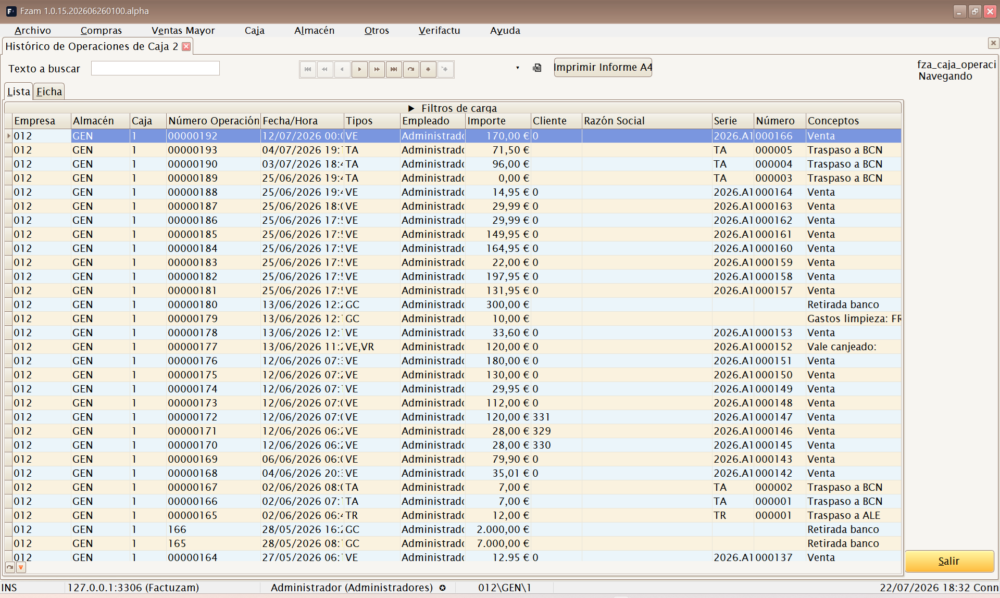

No es la pantalla de venta diaria, sino una consulta administrativa. Permite
revisar por años y almacenes, localizar operaciones por cliente, número,
importe o concepto, e ir al borrador simplificado asociado cuando exista.

---

## Histórico de Arqueos

**Atajo de menú:** `[Shift]+[Ctrl]+[A]`

Consulta de los **arqueos** (cierres de caja) realizados: efectivo contado,
descuadres, fecha, usuario. Permite revisar el cuadre de cada jornada.
También accesible desde el propio arqueo con **F8**.

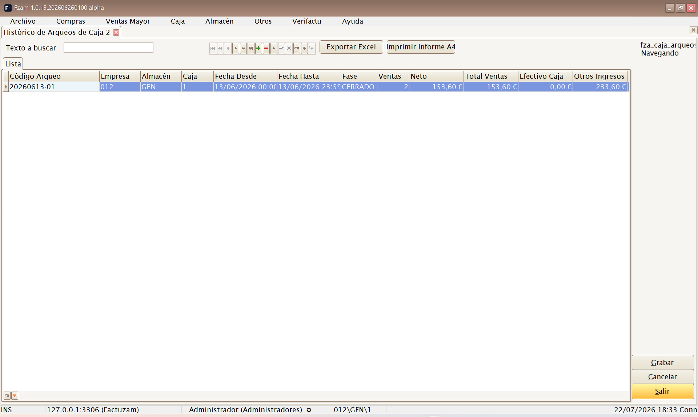

Incluye el botón **Imprimir Informe A4**, que genera un informe horizontal
por empresa, almacén, caja y rango de fechas. El formato se puede editar y
guardar desde el diseñador de informes.

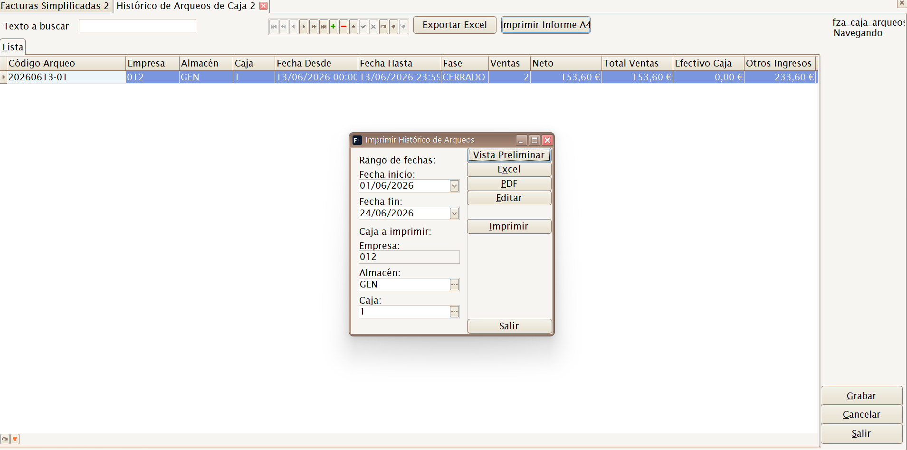

En el histórico del propio TPV se pueden sacar dos duplicados:

| Botón | Documento |
|-------|-----------|
| **Duplicado ticket (F2)** | Reimprime el resumen del arqueo. |
| **Duplicado cierre (F3)** | Reimprime el justificante de cierre grabado. |

---

## Borradores Simplificados

**Atajo de menú:** `[Shift]+[Ctrl]+[F]`

Mantenimiento de los **Borradores Simplificados (tickets)** generados en
caja. Permite consultarlos, reimprimirlos y, cuando proceda, **convertir un
ticket en borrador normal** a nombre del cliente. Como el resto de
documentos de venta, se consolidan según el modo fiscal configurado.

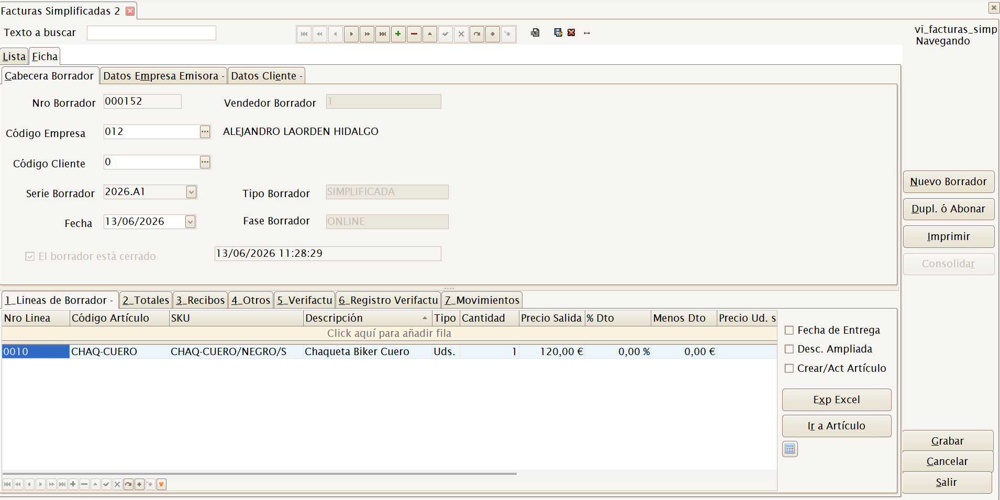

Usos habituales:

| Acción | Cuándo usarla |
|--------|---------------|
| **Consultar ticket** | Revisar líneas, IVA, importes y cliente de una venta de caja. |
| **Reimprimir** | Sacar duplicado del ticket si el cliente lo solicita. |
| **Convertir a borrador normal** | Cuando el cliente necesita documento nominativo después de la venta. |
| **Revisar estado fiscal** | Comprobar si el ticket está pendiente, consolidado o relacionado con Verifactu. |

> Si el cliente pide factura nominativa en el momento de cobrar, lo correcto
> es usar **Borrador (F8)** en la fase de cobro. La conversión posterior queda
> para casos en los que el ticket ya se cerró.

---

[◀ Menú Ventas Mayor](04-menu-ventas-mayor.md) · [Índice](README.md) · [Siguiente ▶ Menú Almacén](06-menu-almacen.md)
