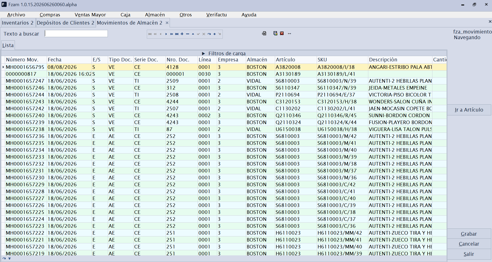
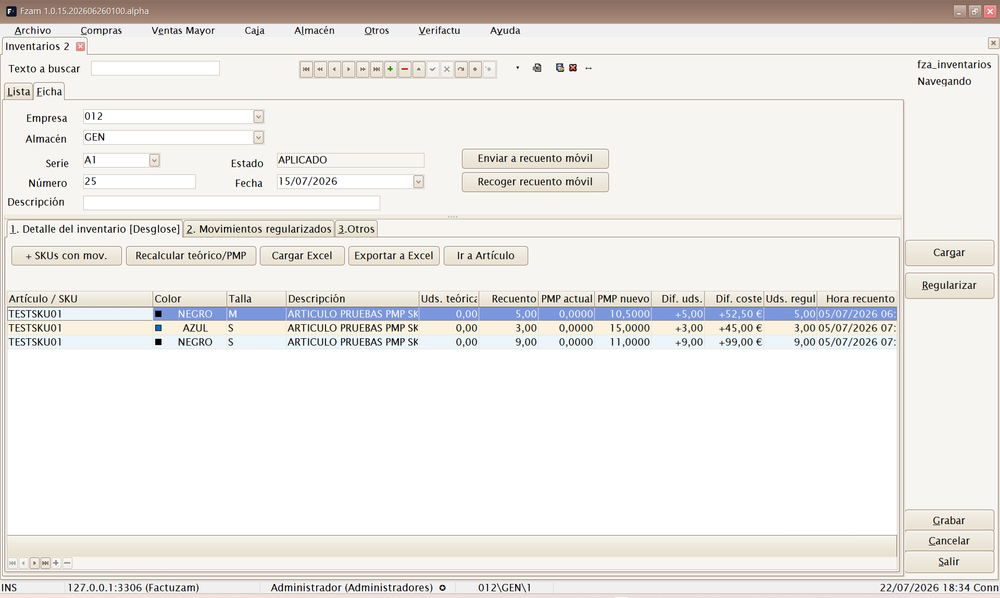
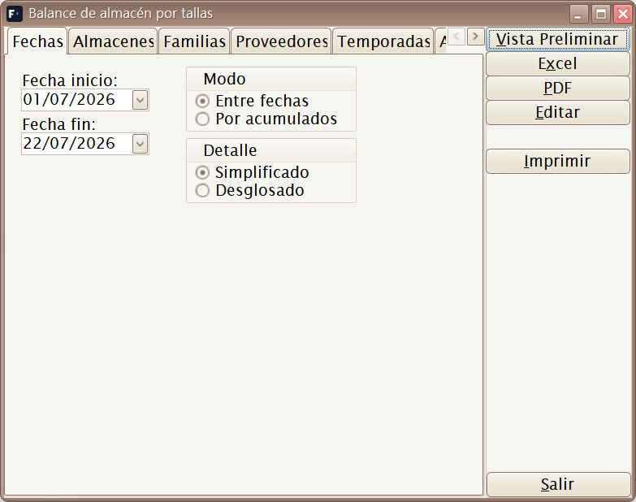

# 06 · Menú Almacén

[◀ Volver al índice](README.md)

El menú **Almacén** controla las **existencias (stock)**: los movimientos
que entran y salen, los recuentos físicos (inventarios) y los informes para
analizar el stock.

Estructura del menú:

```
Almacén
├── Movimientos de almacén
├── Inventarios
└── Informes
    ├── Balance de Almacén Horizontal
    ├── Balance de Almacén sin tallas
    └── Movimientos de ventas por artículos y fechas
```

> El stock se lleva **por SKU y por almacén**. Cada documento que mueve
> mercancía (albarán de compra/venta, devolución, inventario, traspaso)
> genera **movimientos de almacén**, que son el origen de verdad de las
> existencias.

---

## Movimientos de almacén


*▢ Captura pendiente — Movimientos de almacén.*

**Atajo de menú:** `[Ctrl]+[M]`

Consulta y mantenimiento de los **movimientos de stock**: cada entrada o
salida de un SKU en un almacén, con su fecha, cantidad, motivo y documento
de origen.

Sirve para:

- **Auditar** por qué el stock de un artículo es el que es (trazar
  entradas y salidas).
- Registrar **ajustes y traspasos** manuales entre almacenes.

> Salvo ajustes puntuales, los movimientos no se crean a mano: los generan
> automáticamente los albaranes, devoluciones, ventas de caja e
> inventarios.

---

## Inventarios


*▢ Captura pendiente — Inventario con su detalle de recuento.*

**Atajo de menú:** `[Ctrl]+[Alt]+[I]`

Mantenimiento de **Inventarios** (recuentos físicos). Permite contar el
stock real y **regularizar** las diferencias frente a lo que dice el
sistema.

Sub-pestañas:

- **Detalle del inventario** — líneas con el recuento por artículo/SKU
  (cantidad contada frente a cantidad teórica).
- **Movimientos regularizados** — los movimientos de ajuste que el
  inventario genera al confirmarse para cuadrar el stock teórico con el
  real.
- **Otros** — datos de cabecera (almacén, fecha, estado).

> Al **confirmar** un inventario, el sistema ajusta el stock automáticamente
> creando los movimientos de regularización necesarios. Revisa bien el
> recuento antes de confirmar.

---

## Informes

### Balance de Almacén Horizontal


*▢ Captura pendiente — Filtros e informe del balance con tallas.*

Informe de existencias **con desglose por tallas** en columnas
(horizontal). Muestra el stock de cada artículo repartido por sus
variantes/tallas, ideal para artículos de moda. Se filtra (almacén,
familia, fechas…), se previsualiza y se imprime/exporta.

### Balance de Almacén sin tallas

Informe de existencias **agregado por artículo**, sin abrir el detalle de
tallas. Vista resumida del stock cuando no interesa el desglose por
variante.

### Movimientos de ventas por artículos y fechas

Informe de **ventas por artículo** en un rango de fechas: qué artículos se
han vendido, en qué cantidad y periodo. Útil para análisis de rotación y
reposición.

---

[◀ Menú Caja](05-menu-caja.md) · [Índice](README.md) · [Siguiente ▶ Menú Otros](07-menu-otros.md)
