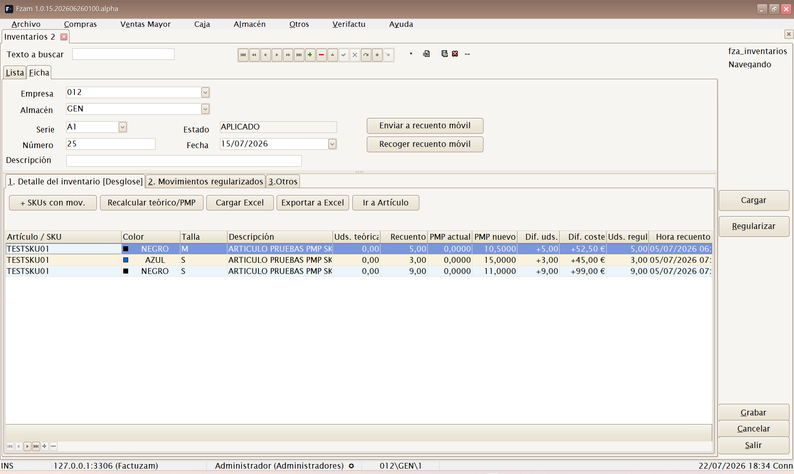
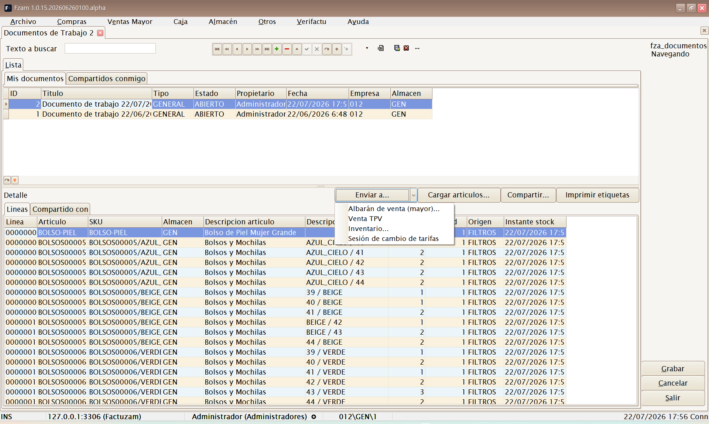
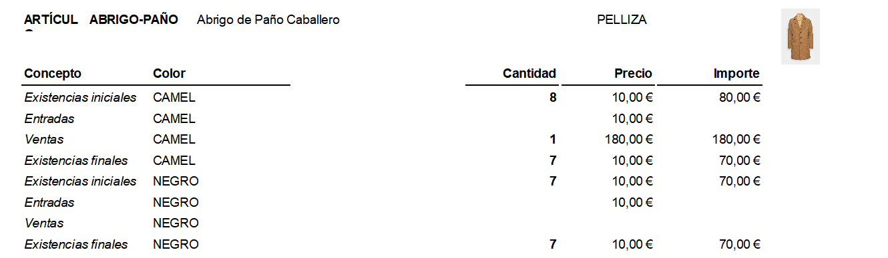
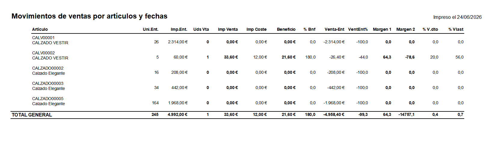

# 06 · Menú Almacén

[◀ Volver al índice](README.md)

El menú **Almacén** controla las **existencias (stock)**: los movimientos
que entran y salen, los recuentos físicos (inventarios) y los informes para
analizar el stock.

Estructura del menú:

```
Almacén
├── Movimientos de almacén
├── Inventarios
├── Documentos de Trabajo
└── Informes
    ├── Balance de Almacén Horizontal
    ├── Balance de Almacén sin tallas
    └── Movimientos de ventas por artículos y fechas
```

> El stock se lleva **por SKU y por almacén**. Cada documento que mueve
> mercancía (albarán de compra/venta, devolución, inventario, traspaso)
> genera **movimientos de almacén**, que son el origen de verdad de las
> existencias.

---

## Movimientos de almacén


**Atajo de menú:** `[Ctrl]+[M]`

Consulta y mantenimiento de los **movimientos de stock**: cada entrada o
salida de un SKU en un almacén, con su fecha, cantidad, motivo y documento
de origen.

Sirve para:

- **Auditar** por qué el stock de un artículo es el que es (trazar
  entradas y salidas).
- Registrar **ajustes y traspasos** manuales entre almacenes.

> Salvo ajustes puntuales, los movimientos no se crean a mano: los generan
> automáticamente los albaranes, devoluciones, ventas de caja e
> inventarios.

---

## Inventarios


**Atajo de menú:** `[Ctrl]+[Alt]+[I]`

Mantenimiento de **Inventarios** (recuentos físicos). Permite contar el
stock real y **regularizar** las diferencias frente a lo que dice el
sistema.

Sub-pestañas:

- **Detalle del inventario** — líneas con el recuento por artículo/SKU
  (cantidad contada frente a cantidad teórica).
- **Movimientos regularizados** — los movimientos de ajuste que el
  inventario genera al confirmarse para cuadrar el stock teórico con el
  real.
- **Otros** — datos de cabecera (almacén, fecha, estado).

> Al **confirmar** un inventario, el sistema ajusta el stock automáticamente
> creando los movimientos de regularización necesarios. Revisa bien el
> recuento antes de confirmar.

### Recuento móvil

Además de cargar el recuento desde Excel, el inventario puede enviarse a
una app móvil de recuento mediante un servidor puente:

| Botón | Uso |
|-------|-----|
| **Enviar a recuento móvil** | Publica el inventario como plantilla para los terminales de almacén. |
| **Recoger recuento móvil** | Trae las lecturas escaneadas, rellena las cantidades físicas y deja el inventario listo para revisar. |



El recuento móvil no regulariza stock por sí solo. Primero se recogen las
lecturas, se revisan las diferencias en Factuzam y después se aplica el
inventario con el flujo normal.

---

## Documentos de Trabajo


*Documento de Trabajo con líneas cargadas por filtros y el menú Enviar a... desplegado.*

**Atajo de menú:** `[Ctrl]+[W]`

Un **Documento de Trabajo** es una **lista de trabajo de artículos/SKUs**:
un borrador personal donde vas apuntando referencias con cantidades (con
una foto del stock en ese momento) para después **convertirla en un
documento real** o imprimir etiquetas. Piensa en él como un "carrito"
interno reutilizable: preparar una reposición, un recuento parcial, una
selección para cambiar precios, un pedido que aún no sabes cómo acabará…

La pantalla tiene dos pestañas de ámbito:

- **Mis documentos** — los documentos de los que eres **propietario**.
  Solo aquí puedes crear, editar y borrar.
- **Compartidos conmigo** — documentos de otros usuarios compartidos
  contigo o con tu grupo. Se abren en **solo lectura**.

### Cabecera y líneas

La cabecera guarda **Título**, **Tipo** (por defecto `GENERAL`), **Estado**
(por defecto `ABIERTO`), propietario, fecha, **Empresa** y **Almacén** (el
almacén de referencia para el stock). Las líneas recogen:

| Columna | Qué indica |
|---------|------------|
| **Artículo / SKU** | Referencia apuntada, con su descripción. |
| **Almacén** | Almacén de la línea (por defecto el de la cabecera). |
| **Stock** | Existencias del SKU **en el momento de apuntarlo** (ver *Instante stock*). No se recalcula solo. |
| **Cantidad** | Unidades de trabajo de la línea (al leer un código, entra 1 por defecto). |
| **Origen** | De dónde salió la línea: entrada manual, carga por filtros, consulta de stock… |

Las líneas se teclean igual que en Inventarios: con `[F1]` se alterna el
modo de entrada **Desglose** (artículo + atributos) → **SKU** (lectura
directa de código) → **Tallas horizontal** (rejilla de tallas en columnas).

### Botones de la pantalla

| Botón | Uso |
|-------|-----|
| **Cargar artículos...** | **Carga masiva por filtros** (la misma pantalla de filtros que usan Inventarios y las sesiones de tarifas): familias en árbol, proveedores, propiedades/temporadas y almacenes, con opciones de solo activos, solo con stock y excluir lo ya cargado. |
| **Compartir...** | Comparte el documento con un **usuario** o un **grupo** (permiso de lectura). Los destinatarios lo ven en su pestaña *Compartidos conmigo*. Solo el propietario puede compartir. |
| **Imprimir etiquetas** | Abre la impresión de **etiquetas de artículo** con los SKUs del documento (elige tarifa y almacenes como en la impresión de etiquetas normal). |
| **Enviar a...** | Convierte el documento en un documento real (ver abajo). |

### Enviar a...

El botón **Enviar a...** despliega los destinos posibles. El documento debe
estar grabado y tener líneas; el Documento de Trabajo **no se consume**: se
puede reutilizar o enviar a varios destinos.

| Destino | Qué crea |
|---------|----------|
| **Albarán de venta (mayor)...** | Un **albarán de venta ABIERTO** con las líneas y cantidades del documento (número del contador oficial o el que indiques). Los precios entran a 0: asigna cliente, tarifa y precios en el Mto de albaranes. |
| **Venta TPV** | Vuelca los SKUs con sus cantidades en la **venta de caja en curso**. Requiere tener abierta *Caja ▸ Ventas*; los precios los resuelve el TPV con su tarifa. |
| **Inventario...** | Un **inventario ABIERTO** donde la cantidad del documento entra como **cantidad física** y el stock apuntado como teórica. Después usa *Recalcular teórico/PMP* en Inventarios antes de aplicar. |
| **Sesión de cambio de tarifas** | Una **sesión de cambios de tarifa en BORRADOR** con un artículo por línea. Abre *Tarifas ▸ Cambios* para elegir tarifas origen/destino, regla de cálculo y aplicar. |

> **Añadir líneas desde otras pantallas:** además de teclear o cargar por
> filtros, puedes apuntar referencias sin salir de donde estás con el menú
> contextual **Agregar a Documento de Trabajo...** disponible en la
> **Consulta de stock** (`[Ctrl]+[U]`) y en la
> [Búsqueda de datos de artículos](01-conceptos-comunes.md#busqueda-de-datos-de-articulos-ctrle)
> (`[Ctrl]+[E]`).

---

## Informes

### Balance de Almacén Horizontal


Informe de existencias **con desglose por tallas** en columnas
(horizontal). Muestra el stock de cada artículo repartido por sus
variantes/tallas, ideal para artículos de moda. Se filtra (almacén,
familia, fechas…), se previsualiza y se imprime/exporta.

El filtro permite trabajar por:

- **Modo**: entre fechas o por acumulados.
- **Bandas**: existencias iniciales, entradas, ventas, existencias finales
  y, en modo desglosado, subtipos de movimiento.
- **Almacenes, familias, proveedores, temporadas y artículos**.
- **Agrupaciones** reordenables por almacén, proveedor, familia o temporada.

La pestaña **Familias** se muestra como árbol. Marcar una familia incluye
también sus subfamilias.

### Balance de Almacén sin tallas

Informe de existencias **agregado por artículo**, sin abrir el detalle de
tallas. Vista resumida del stock cuando no interesa el desglose por
variante.



Incluye artículos con o sin tallaje y usa el mismo sistema de filtros,
bandas, agrupaciones y exportación a Excel que el balance horizontal.

### Movimientos de ventas por artículos y fechas

Informe de **ventas por artículo** en un rango de fechas: qué artículos se
han vendido, en qué cantidad y periodo. Útil para análisis de rotación y
reposición.



Además del periodo de ventas, puede filtrar por **Inicio compras** para
analizar solo artículos cuya primera compra sea posterior a una fecha. El
informe calcula ventas, coste, beneficio y dos márgenes: margen sobre lo
vendido y margen considerando toda la compra como gasto.

Columnas del informe:

| Columna | Qué indica |
|---------|------------|
| **Artículo** | Código y descripción del artículo. Si se agrupa por almacén, un mismo artículo puede aparecer en varios bloques de almacén. |
| **Uni.Ent.** | Unidades compradas o entradas del artículo. Se toman de los movimientos de entrada de compra/albarán de entrada. |
| **Imp.Ent.** | Importe de coste de esas entradas. Es el valor comprado, no el precio de venta. |
| **Uds Vta** | Unidades vendidas dentro del periodo **Desde / Hasta** indicado en el filtro. |
| **Imp Venta** | Importe real vendido en el periodo, con los descuentos ya aplicados y según las líneas de factura. |
| **Imp Coste** | Coste estimado de las unidades vendidas. Se calcula multiplicando las unidades vendidas por el coste del artículo. |
| **Beneficio** | Diferencia entre venta y coste de lo vendido: **Imp Venta - Imp Coste**. |
| **% Bnf** | Beneficio sobre coste: **Beneficio / Imp Coste x 100**. Mide cuánto se gana respecto a lo que costó lo vendido. |
| **Venta-Ent** | Diferencia entre lo vendido y todo lo comprado: **Imp Venta - Imp.Ent.**. Sirve para ver si la venta del periodo cubre la compra completa. |
| **VentEnt%** | Porcentaje de **Venta-Ent** sobre el importe comprado: **Venta-Ent / Imp.Ent. x 100**. |
| **Margen 1** | Margen de lo vendido: **Beneficio / Imp Venta x 100**. Es el margen comercial normal sobre la venta realizada. |
| **Margen 2** | Margen contando toda la compra como gasto: **Venta-Ent / Imp Venta x 100**. Penaliza el stock que queda sin vender. |
| **% V.dto** | Porcentaje de unidades vendidas respecto a las unidades entradas: **Uds Vta / Uni.Ent. x 100**. |
| **% Vlast** | Relación entre importe vendido e importe comprado: **Imp Venta / Imp.Ent. x 100**. |

En los totales por grupo y en el total general, las unidades e importes se
suman. Los porcentajes y márgenes se recalculan a partir de esas sumas; no
se suman ni se promedian los porcentajes de cada artículo.

---

[◀ Menú Caja](05-menu-caja.md) · [Índice](README.md) · [Siguiente ▶ Menú Otros](07-menu-otros.md)
