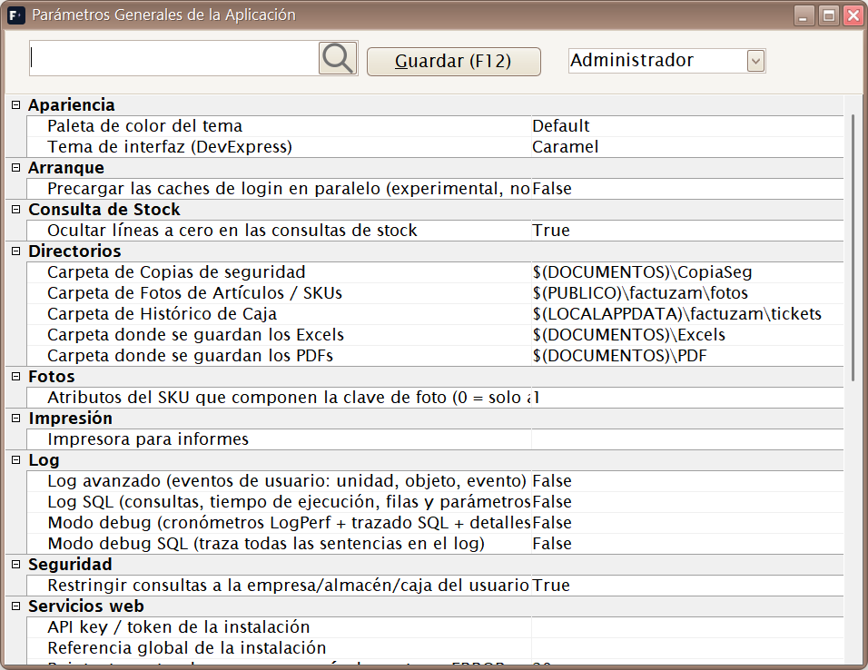
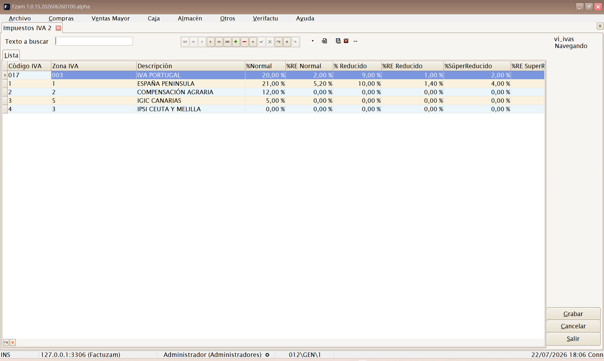
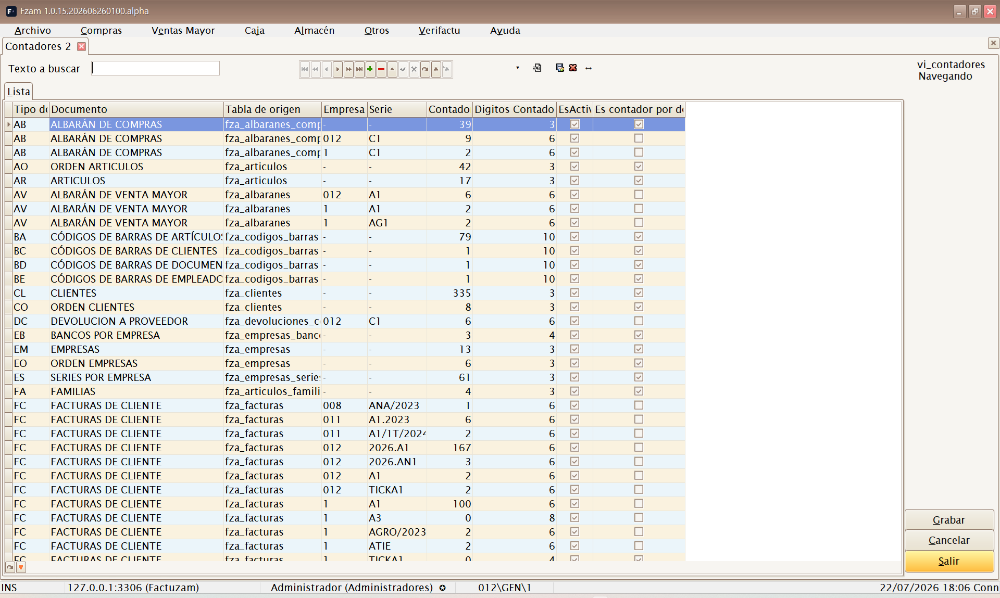
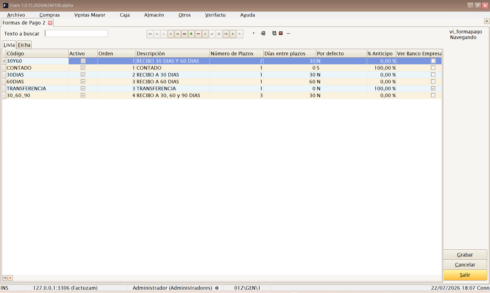
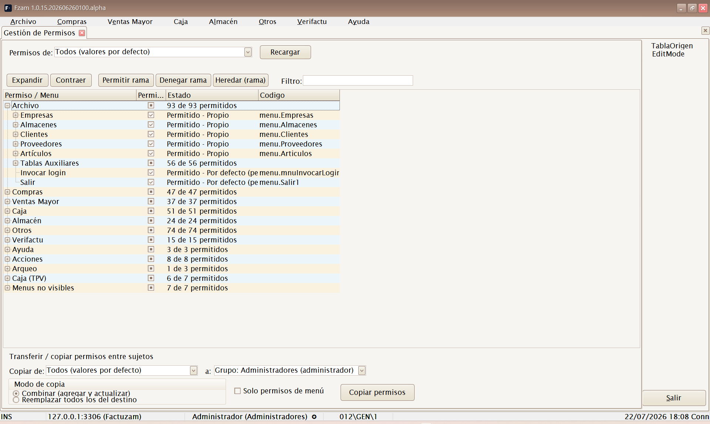
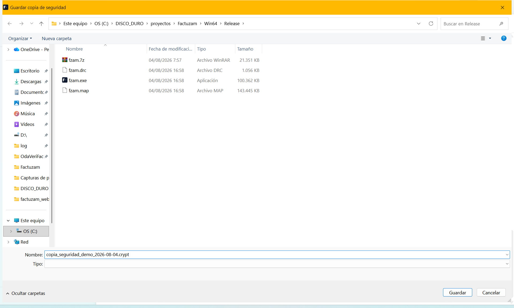
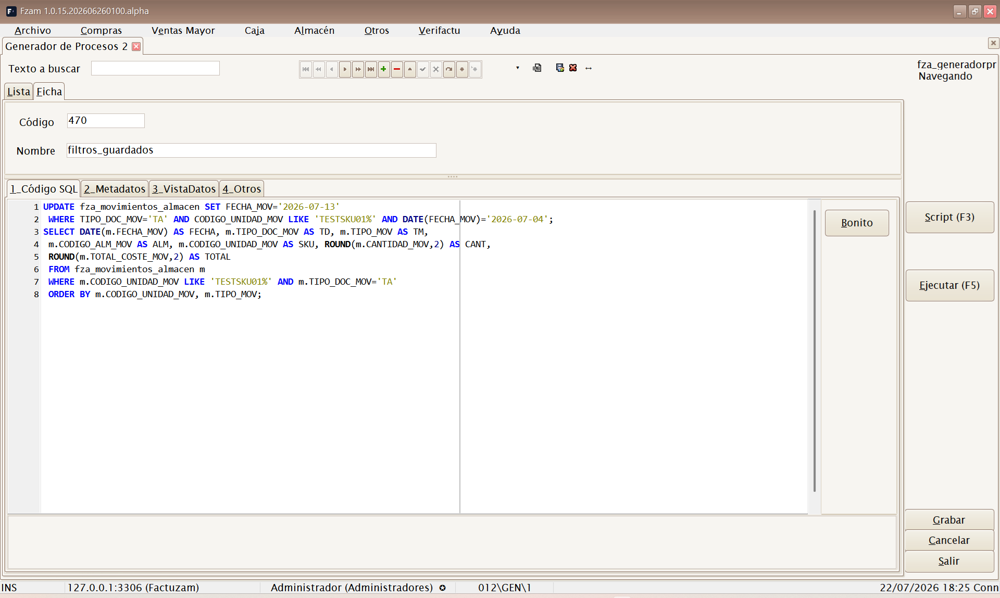
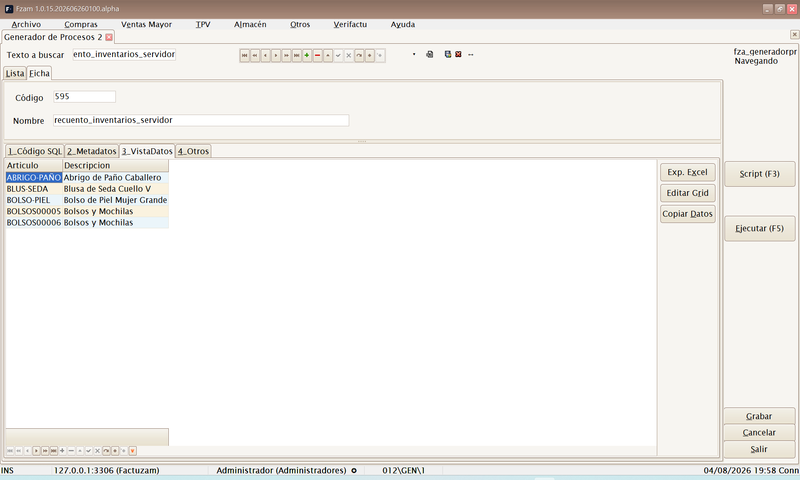

# 07 · Menú Otros

[◀ Volver al índice](README.md)

El menú **Otros** agrupa la **administración y configuración** de la
aplicación: parámetros globales, impuestos, contadores de numeración,
formas de pago de documentos, seguridad (usuarios y permisos),
copias de seguridad y herramientas
avanzadas. Son opciones que usa principalmente el **administrador**.

Estructura del menú:

```
Otros
├── Parámetros del entorno
├── Grupos de IVA
├── Impuesto IVA
├── Contadores
├── Formas de pago documentos
├── Usuarios, Grupos y Perfiles
│   ├── Usuarios
│   ├── Empleados
│   ├── Grupos
│   ├── Perfiles
│   ├── Permisos
│   └── Permisos (tabla)
├── Hacer Copia de Seguridad
├── Recuperar Copia de Seguridad
└── Generador de Procesos
```

---

## Parámetros del entorno


*▢ Captura pendiente — Parámetros Generales de la Aplicación.*

**Atajo de menú:** `[Ctrl]+[F10]`

Pantalla de **Parámetros Generales de la Aplicación**. Centraliza la
configuración global de Factuzam: comportamiento por defecto, rutas,
opciones de impresión y de documentos, valores predeterminados de la
empresa de trabajo, etc.

Categorías habituales:

| Categoría | Uso |
|-----------|-----|
| **Directorios / Fotos** | Carpeta local o compartida de fotos (`appDirFotos`) y credenciales de descarga desde el servidor. |
| **Recuentos** | URL, clave y carpeta de cliente del servidor de recuento móvil. |
| **Verifactu** | Modo fiscal, entorno, datos del SIF, ciclo de cola, URLs y parámetros de firma/reloj. |
| **Caja** | Valores por defecto del TPV y comportamiento de arqueo. |

> Son ajustes que afectan a **toda la instalación**. Cámbialos con
> conocimiento de causa; ante la duda, consulta con quien implantó la
> aplicación.

---

## Grupos de IVA

**Atajo de menú:** `[Ctrl]+[O]`

Define **agrupaciones de tipos de IVA** (zonas/regímenes de IVA). Sirve para
asociar a empresas, clientes y artículos el conjunto de tipos impositivos
que les corresponde (p. ej. IVA peninsular frente a otros regímenes).

---

## Impuesto IVA


*▢ Captura pendiente — Tipos de IVA y recargo de equivalencia.*

**Atajo de menú:** `[Ctrl]+[I]`

Mantiene los **tipos de IVA** concretos y sus porcentajes (general,
reducido, superreducido…), junto con el **recargo de equivalencia**
asociado a cada uno. Es la base del cálculo de impuestos en compras y
ventas.

> Los porcentajes de IVA los fija la normativa. No los cambies salvo que
> cambie la ley; un tipo mal configurado afecta a toda la facturación.

---

## Contadores


*▢ Captura pendiente — Contadores de numeración por serie.*

**Atajo de menú:** `[Ctrl]+[R]`

Gestiona los **contadores de numeración** de los documentos (facturas,
albaranes, pedidos…) por **serie** y empresa. Cada documento toma su número
correlativo del contador correspondiente.

> Los números de factura deben ser **correlativos y sin huecos** por
> exigencia legal. No retrocedas ni reutilices contadores de facturación.

---

## Formas de pago documentos

Catálogo de **formas de pago** aplicables a los documentos de compra y
venta mayor (contado, transferencia, giro a X días, etc.). Define
vencimientos y comportamiento de cobro/pago para facturas, pedidos y
albaranes.

Sub-pestañas: **Más Datos**, **Ventas** (uso en ventas) y **Otros**.


*▢ Captura pendiente — Catálogo de formas de pago.*

**Atajo de menú:** `[Shift]+[Ctrl]+[G]`

> No es el mismo mantenimiento que **Formas de Pago Caja**, que configura
> los botones y tipos de pago del TPV.

---

## Usuarios, Grupos y Perfiles

Submenú de **seguridad**. Define quién entra a la aplicación y qué puede
hacer.

### Usuarios

**Atajo de menú:** `[Ctrl]+[H]`

Alta y mantenimiento de los **usuarios** que acceden a Factuzam (los que
introducen credenciales en el [login](00-acceso-y-primeros-pasos.md)).
Incluye su contraseña, estado y el **perfil/grupo** que determina sus
permisos.

### Empleados

*(Sin atajo de menú; se abre desde el menú.)*

Ficha de **empleados** del negocio (datos de personal). Puede vincularse a
usuarios y a operaciones de caja para saber **quién** realiza cada venta.

### Grupos

**Atajo de menú:** `[Ctrl]+[J]`

**Grupos de usuarios** para asignar permisos en bloque (p. ej. *Cajeros*,
*Administración*, *Encargados*). Un usuario hereda los permisos de su grupo.

### Perfiles

**Atajo de menú:** `[Ctrl]+[W]`

**Perfiles de configuración** que personalizan la apariencia y el
comportamiento de las pantallas (columnas visibles, captions, opciones)
para un usuario o grupo.

### Permisos


*▢ Captura pendiente — Gestión de Permisos en árbol.*

**Atajo de menú:** `[Ctrl]+[Q]`

Pantalla de **Gestión de Permisos** en forma de **árbol**: activa o
desactiva, por grupo/usuario, el acceso a cada **menú y acción** de la
aplicación. Es la forma recomendada de configurar la seguridad de forma
visual.

El árbol replica el menú real de la aplicación y permite trabajar por:

- **Todos**, grupo o usuario.
- Permitir, denegar o heredar una rama completa.
- Copiar permisos de un sujeto a otro, combinando o reemplazando.
- Gestionar permisos de menú y permisos de pantalla: consultar, insertar,
  modificar, borrar, exportar a Excel e imprimir.

> Los cambios de permisos se aplican en el próximo login del usuario
> afectado.

### Permisos (tabla)

*(Sin atajo de menú; se abre desde el menú.)*

La misma información de permisos presentada en **formato tabla** (rejilla),
para edición masiva o revisión rápida de muchos permisos a la vez.

---

## Hacer Copia de Seguridad


*▢ Captura pendiente — Diálogo de copia de seguridad.*

**Atajo de menú:** `[Ctrl]+[Y]`

Lanza una **copia de seguridad** de la base de datos. Genera un fichero de
respaldo con todos los datos (clientes, artículos, documentos, stock…).

> Realiza copias **con regularidad** y guárdalas en un lugar seguro y
> externo al equipo. Es tu única red de seguridad ante un fallo de disco o
> un borrado accidental.

---

## Recuperar Copia de Seguridad

**Atajo de menú:** `[Ctrl]+[Z]`

Permite **restaurar** la base de datos a partir de un fichero de copia o
**ejecutar un script** de mantenimiento sobre la base de datos.

> ⚠️ **Operación delicada.** Restaurar una copia **sobrescribe los datos
> actuales**. Asegúrate de elegir el fichero correcto y de que nadie esté
> trabajando. Ante la duda, haz primero una copia del estado actual.

---

## Generador de Procesos


*▢ Captura pendiente — Generador de Procesos con la pestaña Código SQL.*

**Atajo de menú:** `[Ctrl]+[G]`

Herramienta **avanzada** para administradores: permite escribir, guardar y
ejecutar **procesos SQL** sobre la base de datos — desde un **listado a
medida** que no exista en los menús hasta una **corrección masiva** de
datos o la llamada a un procedimiento almacenado.

Cada proceso se guarda como un registro más (con **Código** y **Nombre de
proceso**), de modo que los listados habituales quedan en una **biblioteca
reutilizable**: se localizan en la Lista, se abren y se vuelven a ejecutar.

### Las pestañas de la pantalla

| Pestaña | Contenido |
|---------|-----------|
| **1_Código SQL** | Editor SQL con coloreado de sintaxis donde se escribe el proceso. El botón **Bonito** reformatea/indenta la sentencia. |
| **2_Metadatos** | Árbol con los objetos de la base de datos (tablas, vistas y procedimientos) para apoyarse al escribir. Con sub-pestañas **Estructura Metadato** (DDL del objeto) y **Vista Contenido** (datos del objeto). |
| **3_VistaDatos** | Rejilla con el **resultado** de la última ejecución. |
| **4_Otros** | Auditoría del proceso (quién y cuándo lo creó/modificó). |

**Botones principales:** **Ejecutar (F5)** y **Script (F3)** (carga un
fichero `.sql`/`.txt` del disco como proceso nuevo, tomando su nombre del
fichero). El menú contextual del editor ofrece además *Seleccionar Todo*,
*Ejecutar*, *Comentar* y *Abrir Script*.

### Cómo sacar un listado

1. Pulsa **Insertar registro** y da **Código** y **Nombre** al proceso
   (p. ej. `L001 — Ventas por familia`).
2. En **1_Código SQL** escribe la consulta `SELECT …`. Ayudas:
   - En **2_Metadatos**, el árbol muestra todas las tablas y vistas;
     **doble clic** sobre una tabla/vista enseña su contenido en *Vista
     Contenido*, y con el foco en el árbol **`[Ctrl]+[A]`** envía la
     estructura del objeto al editor.
   - **Bonito** reformatea el SQL para hacerlo legible.
3. Pulsa **Ejecutar (F5)**:
   - Si hay **texto seleccionado** en el editor, se ejecuta **solo la selección**; si no, se ejecuta todo el contenido.
   - El resultado se abre en **3_VistaDatos**, con el número de registros
     y el tiempo de ejecución en el panel de resultados.
4. Trabaja el resultado en la rejilla (ordenar, agrupar, filtrar) y
   sácalo con **Exp. Excel** (exporta a Excel) o **Copiar Datos**
   (al portapapeles).
5. Pulsa **Grabar** para conservar el proceso y repetir el listado cuando
   haga falta.


*▢ Captura pendiente — Pestaña VistaDatos con un resultado y el botón Exp. Excel.*

> El botón **Editar Grid** habilita la edición directa del resultado sobre
> la base de datos. Es útil para correcciones puntuales, pero **modifica
> datos reales**: úsalo con la misma cautela que un UPDATE.

### Cómo ejecutar un proceso (comandos y procedimientos)

- **Comandos** (`UPDATE`, `INSERT`, `DELETE`…): se escriben igual y se
  lanzan con **Ejecutar (F5)**. En lugar de rejilla, el panel de
  resultados muestra las **filas afectadas** y el tiempo.
- **Procedimientos almacenados**: en el árbol de **2_Metadatos**, haz
  **doble clic** sobre el procedimiento: la aplicación genera en el editor
  la plantilla `CALL procedimiento(…)` con sus **parámetros comentados**
  (nombre y tipo de cada uno). Sustituye los comentarios por los valores y
  pulsa **Ejecutar (F5)**. Si el procedimiento devuelve filas, se muestran
  en **VistaDatos**; si no, se informa como comando.
- **Varias sentencias a la vez**: si el editor contiene varias sentencias
  separadas por `;`, cada una se ejecuta en su **propia pestaña de
  resultado** (una rejilla por consulta, un registro de filas afectadas
  por comando).
- **Ejecutar por partes**: selecciona una sentencia concreta y pulsa F5
  para lanzar **solo esa parte** — la forma más segura de probar un
  proceso largo paso a paso.

> Pensado para usuarios técnicos. Una sentencia mal escrita puede modificar
> o borrar datos: **haz copia de seguridad antes de un proceso masivo**,
> prueba primero con un `SELECT` que muestre las filas que vas a tocar, y
> ejecuta por selección antes que el script completo.

---

[◀ Menú Almacén](06-menu-almacen.md) · [Índice](README.md) · [Siguiente ▶ Menú Ayuda](08-menu-ayuda.md)
