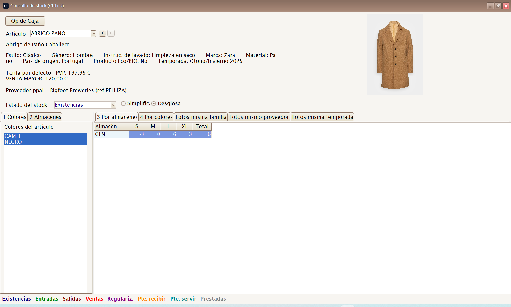
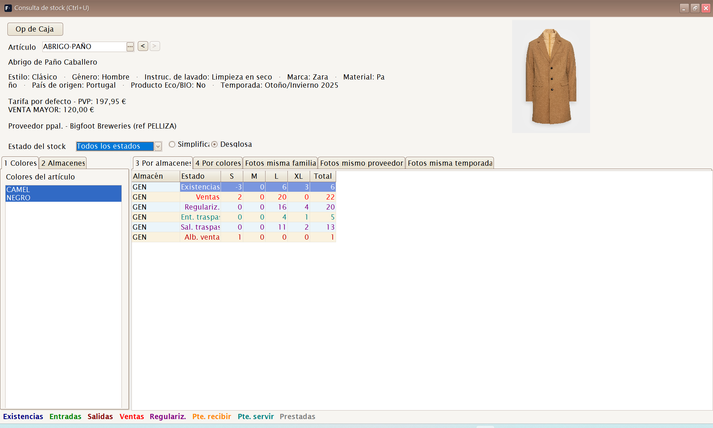
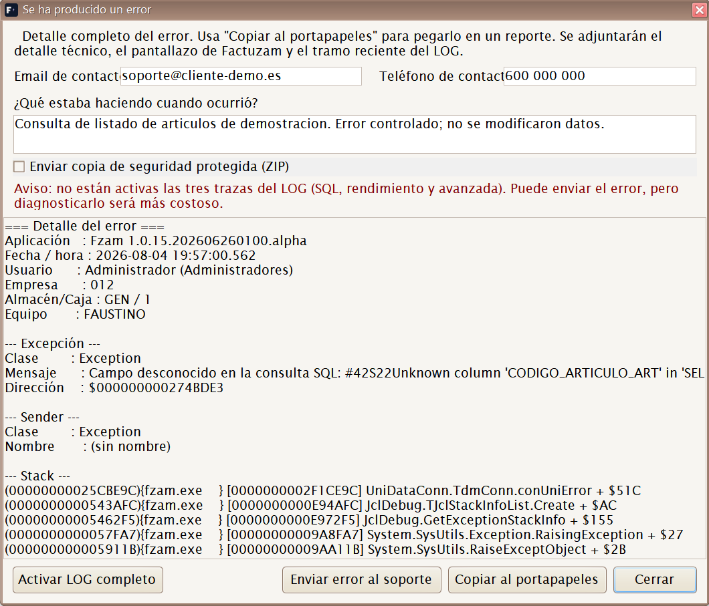
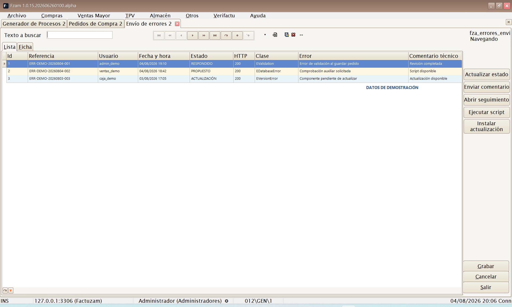
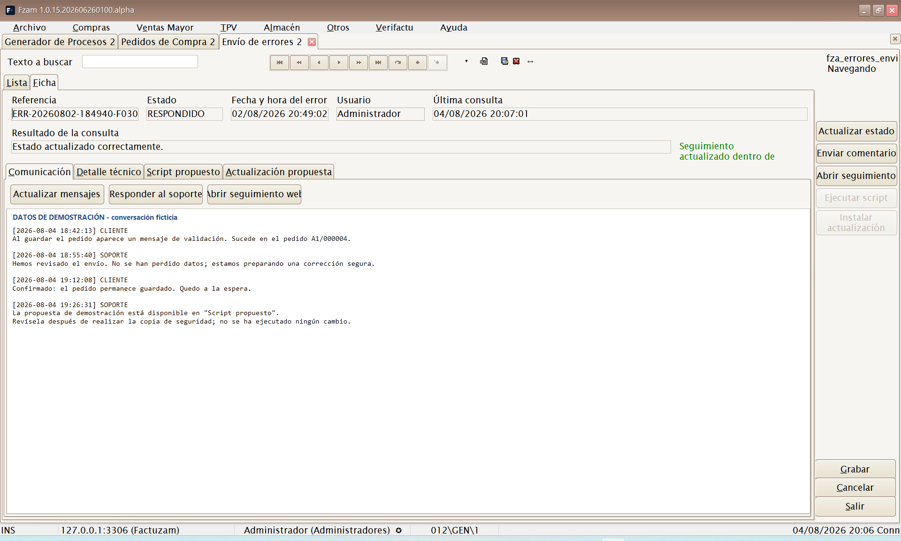
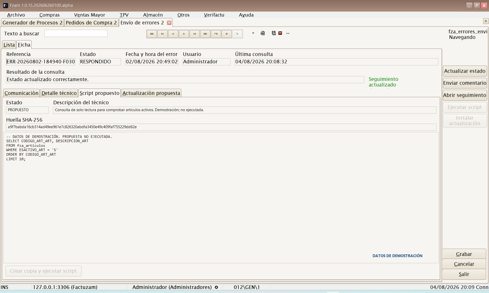
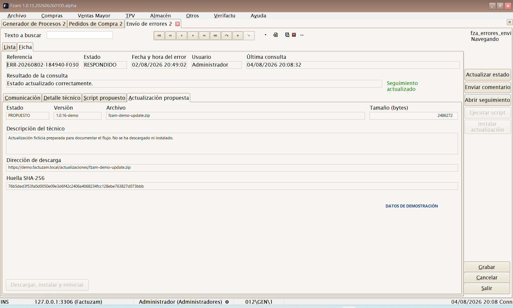
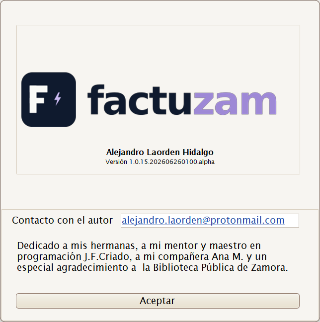

# 08 · Menú Ayuda

[◀ Volver al índice](README.md)

El menú **Ayuda** reúne las consultas transversales de artículos y stock,
la documentación, el soporte y la información de versión.

Estructura del menú:

```
Ayuda
├── Consulta de stocks
├── Consulta de artículos similares
├── Manual web
├── Foro de soporte
├── Envío de errores
└── Acerca de
```

---

## Consulta de stocks

**Atajo global:** `[Ctrl]+[U]`

Abre la consulta de existencias de **Factuzam** desde cualquier pantalla.
Si el foco está sobre un artículo o una línea de documento, la consulta se
abre ya situada en ese artículo/SKU. La ventana permanece encima mientras
trabajas y se cierra con `[Esc]`.



### Localizar el artículo

- Escribe un código de artículo, SKU, descripción o referencia reconocida y
  pulsa `[Intro]`. Si hay varias coincidencias, Factuzam abre un selector.
- Usa el botón `...` para buscar por código, descripción, familia, temporada,
  proveedor, referencia del proveedor o PVP.
- También puedes leer un **código de barras**; la consulta identifica el SKU
  y mantiene un historial para volver a los artículos consultados.

La cabecera muestra la descripción, la foto, propiedades, tarifas y
proveedores del artículo. El último precio de compra solo aparece si el
perfil permite ver costes. Al seleccionar un color se actualizan sus
propiedades efectivas y su foto.

### Elegir qué cantidad consultar

El selector **Estado del stock** cambia la magnitud que aparece en la
rejilla. Hay dos niveles de detalle:

| Modo | Estados principales |
|------|---------------------|
| **Simplificado** | Existencias, Entradas, Salidas, Pendiente de servir, Pendiente de recibir y Todos los estados. |
| **Desglosado** | Existencias y pendientes, más el detalle de compras, traspasos, depósitos, ventas, regularizaciones, albaranes y prendas prestadas. |

La leyenda inferior usa un color por estado y sirve como acceso directo:
al pulsar un nombre, Factuzam selecciona ese estado y cambia a Simplificado
o Desglosado cuando sea necesario. **Todos los estados** presenta una fila
por estado para compararlos a la vez.

### Filtrar y leer la rejilla

1. Marca uno o varios **colores** y **almacenes**. La selección múltiple
   permite comparar tiendas o variantes.
2. Usa **Por almacenes** para obtener una fila por almacén y tallas en
   columnas, o **Por colores** para obtener una fila por color.
3. Consulta las pestañas **Fotos misma familia**, **Fotos mismo proveedor**
   y **Fotos misma temporada** para localizar artículos relacionados
   visualmente. Esas pestañas se cargan al abrirlas para no retrasar la
   consulta principal.



### Acciones desde una celda

- **Botón derecho ▸ Agregar a Documento de Trabajo...** lleva el SKU y la
  cantidad de la celda a un documento nuevo o existente. Debe estar
  seleccionada una celda de **Existencias** y la combinación de almacén,
  color y talla tiene que identificar un único SKU.
- **Op de Caja** abre las operaciones de caja del SKU seleccionado en una
  celda de talla, útil para explicar de dónde procede una salida o venta.

> La consulta es informativa: cambiar de estado, color, almacén o vista no
> modifica el stock. Las existencias solo cambian mediante documentos y
> operaciones de Factuzam.

---

## Consulta de artículos similares

**Atajo global:** `[Ctrl]+[E]`

Abre la búsqueda avanzada de artículos y SKU desde cualquier pantalla.
Permite localizar referencias por talla, color, código de barras, familia,
proveedor, temporada, propiedades y proximidad de color. Consulta el
procedimiento completo en
[Búsqueda de datos de artículos](01-conceptos-comunes.md#busqueda-de-datos-de-articulos-ctrle).

---

## Manual web

Abre en el navegador **este manual de usuario** publicado en la web:

<https://www.veryverifactu.com/manual/index.html>

Es la copia de la documentación desplegada para consulta desde cualquier
puesto. Comprueba la **fecha de generación** que aparece en el pie: una
versión local recién generada no llega a la web hasta que el administrador
publique la carpeta `manual/html` completa. Si falta un capítulo reciente,
consulta el manual incluido con la versión instalada o avisa al soporte.

---

## Proyecto en GitHub y licencia

El código fuente y el historial de desarrollo de Factuzam están publicados
en el **repositorio oficial de GitHub**:

[github.com/alexdelphiAthn/Factuzam](https://github.com/alexdelphiAthn/Factuzam)

El código original de Factuzam se distribuye bajo la **Mozilla Public
License 2.0 (`MPL-2.0`)**, salvo los archivos identificados como código de
terceros o sujetos a otra licencia. Esta licencia permite usar, modificar,
distribuir y vender el programa. Si se distribuye un archivo cubierto que se
ha modificado, el código fuente de ese archivo debe seguir disponible bajo
la MPL 2.0.

Los componentes comerciales y demás materiales de terceros conservan sus
propias licencias. La licencia del código tampoco concede derechos sobre el
nombre, los logotipos o las marcas de Factuzam.

- [Texto de la licencia del proyecto](https://github.com/alexdelphiAthn/Factuzam/blob/main/LICENSE)
- [Alcance y excepciones de licencia](https://github.com/alexdelphiAthn/Factuzam/blob/main/LICENCIAS.md)
- [Información oficial de la MPL 2.0](https://www.mozilla.org/MPL/2.0/)

> Este apartado es un resumen informativo. En caso de duda prevalecen el
> archivo `LICENSE`, el documento `LICENCIAS.md` y los avisos de licencia de
> cada componente.

---

## Foro de soporte

Abre en el navegador el **foro de soporte** de Factuzam:

<https://foro.veryverifactu.com/>

Es el canal para plantear dudas de uso, comunicar incidencias y consultar
respuestas a preguntas de otros usuarios. Al comunicar una incidencia,
indica siempre la **versión** del programa (ver *Acerca de*).

---

## Envío de errores: administración y seguimiento

Factuzam puede comunicar al soporte un error técnico y conservar su
seguimiento dentro de la aplicación. El proceso tiene dos partes: el diálogo
que aparece cuando se produce el error y la pantalla **Ayuda ▸ Envío de
errores**, desde la que se consulta la respuesta del soporte.

### Comunicar un error

Cuando Factuzam detecta una excepción no controlada, muestra el detalle y
prepara las evidencias disponibles.



1. Indica un **email** y un **teléfono** válidos para que soporte pueda
   contactar contigo.
2. Explica en **¿Qué estaba haciendo cuando ocurrió?** la operación, el
   documento afectado y el resultado esperado. Evita incluir contraseñas,
   claves API o datos que no sean necesarios para diagnosticar el problema.
3. Revisa el aviso de evidencias. Normalmente se adjuntan el detalle técnico,
   un pantallazo de la ventana principal y el tramo reciente del LOG.
4. Si aparece el aviso de LOG incompleto, pulsa **Activar LOG completo**,
   cierra el diálogo y repite la operación. Se activan para esa sesión las
   trazas SQL, de rendimiento y avanzada; el siguiente envío contendrá más
   información de diagnóstico.
5. Pulsa **Enviar error al soporte**. Conserva la **referencia** que devuelve
   el servicio, porque identifica la incidencia y su conversación.

**Copiar al portapapeles** permite guardar o comunicar el detalle sin enviar
las evidencias. Si marcas **Enviar copia de seguridad protegida (ZIP)**,
Factuzam solicita y confirma una contraseña, crea la copia y sustituye el LOG
por esa copia protegida en el envío. La contraseña no se envía ni se guarda:
debes comunicarla por otro canal a `info@veryverifactu.com`, indicando la
referencia. Preparar la copia puede tardar varios minutos.

> Antes de enviar, ten en cuenta que el pantallazo, el LOG y, especialmente,
> la copia de seguridad pueden contener datos de la empresa. No marques la
> copia protegida si soporte no la necesita.

### Consultar y administrar los envíos



La pestaña **Lista** muestra primero los envíos más recientes. Es una consulta
de seguimiento: no permite crear, editar ni borrar registros manualmente.
Incluye la referencia, usuario, fecha y hora, estado, resultado HTTP, clase y
mensaje del error, último comentario técnico y estado de las propuestas.

- Un usuario normal solo consulta los errores que ha enviado con su usuario.
- Un administrador consulta los envíos de todos los usuarios de la
  instalación.
- La opción y sus acciones pueden estar limitadas por el perfil de permisos.

Selecciona un envío y abre la pestaña **Ficha**. Al entrar, Factuzam consulta
automáticamente al servicio y actualiza el estado, los mensajes y las
propuestas. La cabecera muestra también cuándo se realizó la última consulta
y su resultado.

### Ficha de seguimiento



La ficha se divide en cuatro pestañas:

| Pestaña | Contenido y uso |
|---------|---------------|
| **Comunicación** | Historial fechado de mensajes del cliente y del equipo técnico. Permite actualizar, responder y abrir el seguimiento web. |
| **Detalle técnico** | Mensaje y detalle completo de la excepción que originó el envío. |
| **Script propuesto** | Descripción, SQL y huella SHA-256 de una corrección preparada por soporte. |
| **Actualización propuesta** | Versión, archivo, tamaño, descripción, dirección HTTPS y huella SHA-256 de un ejecutable propuesto. |

Las acciones de la ficha son:

- **Actualizar mensajes / Actualizar estado** vuelve a consultar el servicio.
- **Responder al soporte / Enviar comentario** añade un mensaje a la
  conversación y sincroniza la ficha.
- **Abrir seguimiento web** abre el enlace externo asociado a la referencia.
- **Crear copia y ejecutar script** solo se habilita cuando hay un script en
  estado `PROPUESTO`. Factuzam muestra su descripción, huella y SQL, pide
  confirmación, crea antes una copia de seguridad, comprueba la huella
  SHA-256 y comunica el resultado al soporte.
- **Descargar, instalar y reiniciar** solo se habilita ante una actualización
  en estado `PROPUESTO`. Antes de sustituir el ejecutable se comprueban HTTPS,
  tamaño, formato, arquitectura y huella SHA-256. Factuzam conserva el
  ejecutable anterior durante el cambio y reinicia la aplicación.





> Revisa siempre la descripción antes de aceptar un script o una
> actualización. Si la propuesta no corresponde a la incidencia, responde al
> soporte y espera una aclaración.

---

## Acerca de



Muestra la **pantalla de presentación** con el logotipo, la información del
producto y, sobre todo, el **número de versión** instalada.

El dato de versión es importante para el **soporte**: cuando comuniques una
incidencia, indica siempre la versión que aparece aquí. Tiene el formato:

```
1.0.15.AAAAMMDDHHMM.alpha
```

donde la parte central refleja la **fecha y hora de la compilación**.

---

[◀ Menú Otros](07-menu-otros.md) · [Índice](README.md) · [Siguiente ▶ Instalación en Windows](09-instalacion-windows.md)
