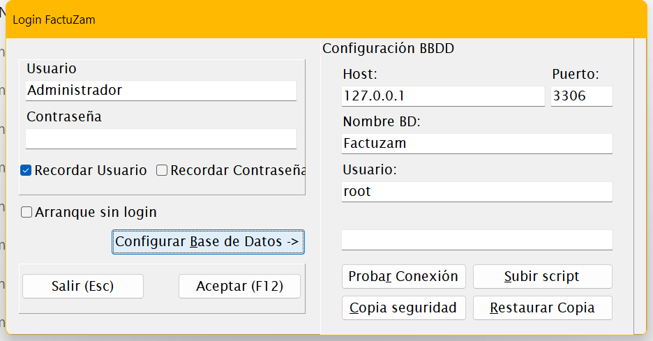
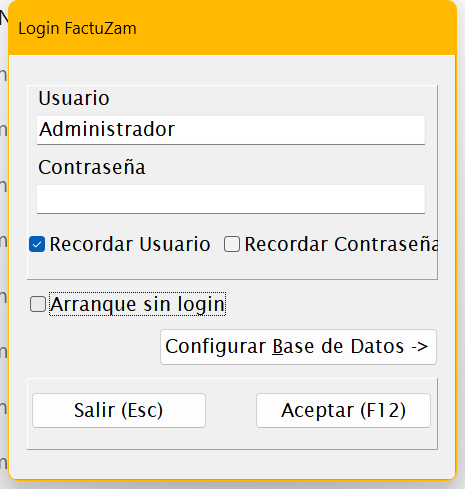

# 09 · Instalación en Windows

[◀ Volver al índice](README.md)

Este capítulo describe cómo instalar Factuzam en un equipo Windows desde
cero: el servidor de base de datos, la base de datos inicial y la
aplicación. Está orientado al **instalador/administrador**; el usuario
final solo necesita el capítulo
[00 · Acceso y primeros pasos](00-acceso-y-primeros-pasos.md).

---

## 1. Requisitos

| Componente | Requisito |
|------------|-----------|
| **Sistema operativo** | Windows 10 / Windows 11 (también Windows Server para el equipo que aloje la base de datos). |
| **Base de datos** | **MariaDB** (compatible MySQL). Puede instalarse en el mismo equipo o en un servidor de la red local. |
| **Aplicación** | `fzam.exe` — es un ejecutable autónomo, **no requiere instalador** ni librerías adicionales. |
| **Red** | Si hay varios puestos, todos deben ver el servidor MariaDB por TCP (puerto `3306` por defecto). |
| **Periféricos (TPV)** | Impresora de tickets y **lector de códigos de barras** (teclado/USB-HID); ambos opcionales fuera de Caja. |

---

## 2. Instalar el servidor MariaDB

1. Descarga MariaDB para Windows desde
   [mariadb.org/download](https://mariadb.org/download/) e instálalo en el
   equipo que hará de **servidor** (en monopuesto, el mismo PC).
2. Durante la instalación:
   - Define la **contraseña de `root`** y guárdala en lugar seguro.
   - Deja el servicio configurado para **arrancar con Windows**.
   - Puerto por defecto: **3306**.
3. Si otros puestos van a conectarse, abre el puerto 3306 en el **firewall
   de Windows** del servidor (solo para la red local).

> Factuzam usa el juego de caracteres **`utf8mb4`** con cotejamiento
> **`utf8mb4_spanish_ci`**; la base de datos se creará así en el paso
> siguiente.

---

## 3. Crear la base de datos inicial

La base de datos modelo se distribuye en el fichero
**`factuzam_original.sql`** (esquema completo + datos de sistema:
países, tipos de IVA, ventanas, usuario inicial…).

**Opción A — desde la propia aplicación (recomendada):**

1. Crea primero la base de datos vacía. Desde una consola del servidor:

   ```sql
   CREATE DATABASE factuzam
     CHARACTER SET utf8mb4
     COLLATE utf8mb4_spanish_ci;
   ```

2. Arranca `fzam.exe` y, en el login, pulsa
   **Configurar Base de Datos ▸** y rellena Host, Puerto, Nombre BD
   (`factuzam`), Usuario y Contraseña.
3. Pulsa el botón **Subir Script**: pide la contraseña de la base de
   datos y un fichero `.sql`; selecciona `factuzam_original.sql` y espera
   a que termine la carga.
4. Pulsa **Probar Conexión** para verificar.


*▢ Captura pendiente — Panel Configuración BBDD con el botón de carga de script.*

**Opción B — por línea de comandos:**

```bat
mysql -h localhost -P 3306 -u root -p ^
      -e "CREATE DATABASE factuzam CHARACTER SET utf8mb4 COLLATE utf8mb4_spanish_ci;"
mysql -h localhost -P 3306 -u root -p factuzam < factuzam_original.sql
```

(También sirve cualquier cliente gráfico: HeidiSQL, DBeaver…)

**Usuario de base de datos dedicado (recomendado):** evita usar `root`
desde los puestos; crea un usuario propio para la aplicación:

```sql
CREATE USER 'fzam'@'%' IDENTIFIED BY 'una_clave_segura';
GRANT ALL PRIVILEGES ON factuzam.* TO 'fzam'@'%';
FLUSH PRIVILEGES;
```

---

## 4. Instalar la aplicación en cada puesto

1. Crea una carpeta, por ejemplo `C:\Factuzam\`, y copia en ella
   **`fzam.exe`**.
2. Crea un acceso directo en el escritorio/menú inicio.
3. Arranca la aplicación y en el login pulsa
   **Configurar Base de Datos ▸**; introduce:

   | Campo | Valor |
   |-------|-------|
   | **Host** | IP o nombre del servidor MariaDB (`localhost` en monopuesto). |
   | **Puerto** | `3306` (salvo que se cambiara). |
   | **Nombre BD** | `factuzam`. |
   | **Usuario / Contraseña** | El usuario de BBDD creado en el paso 3. |

4. Pulsa **Probar Conexión** — debe responder correctamente.

> La configuración se guarda **por usuario de Windows** en
> `%LOCALAPPDATA%\factuzam\` (fichero `.ini`). Cada puesto se configura
> una sola vez.

---

## 5. Primer inicio de sesión

- Usuario inicial: **`Administrador`** (grupo *Administradores*), con la
  contraseña suministrada con la instalación.
- Tras entrar, **cambia la contraseña** del administrador y crea los
  usuarios reales en
  [Otros ▸ Usuarios, Grupos y Perfiles](07-menu-otros.md#usuarios-grupos-y-perfiles).


*▢ Captura pendiente — Primer login como Administrador.*

---

## 6. Lista de comprobación de puesta en marcha

Configura en este orden antes de empezar a trabajar:

1. **Empresa** — datos fiscales, NIF, **series** de facturación y
   **certificado Verifactu** (*Archivo ▸ Empresas*).
2. **Impuesto IVA y Grupos de IVA** — verifica los tipos vigentes
   (*Otros ▸ Impuesto IVA*).
3. **Contadores** — numeración inicial de los documentos por serie
   (*Otros ▸ Contadores*).
4. **Almacenes y Cajas** — al menos un almacén y su caja de venta
   (*Archivo ▸ Almacenes*).
5. **Formas de pago** (general y de caja).
6. **Tablas auxiliares y catálogo** — familias, tallas/atributos,
   tarifas y artículos (*Archivo ▸ Tablas Auxiliares*; o mediante la
   [migración desde el software anterior](10-migracion-legacy.md)).
7. **Usuarios, grupos y permisos** — un usuario por persona, permisos
   por grupo.
8. **Parámetros de Caja** — impresora de tickets y comportamiento del TPV
   (*Caja ▸ Parámetros de Caja*).
9. **Copia de seguridad** — haz una primera copia y deja establecida la
   rutina (*Otros ▸ Hacer Copia de Seguridad*).

---

## 7. Ficheros locales de la aplicación

Cada puesto guarda sus datos locales en `%LOCALAPPDATA%\factuzam\`:

| Carpeta / fichero | Contenido |
|-------------------|-----------|
| `fzam.ini` | Configuración del puesto (conexión, usuario recordado…). |
| `log\` | Ficheros de **log** de la aplicación (útiles para soporte). |
| `tickets\` | Tickets generados por el TPV. |

Estos ficheros son **por usuario de Windows** y no contienen los datos de
negocio (que viven todos en MariaDB).

---

## 8. Actualizaciones

- Actualizar la aplicación consiste en **sustituir `fzam.exe`** por la
  versión nueva (con la aplicación cerrada en todos los puestos).
- Si la versión incluye **cambios de esquema** de base de datos, se
  entregan como scripts SQL **idempotentes** que se aplican una sola vez
  sobre la base de datos (pueden cargarse con el botón **Subir Script**
  del login). Sigue las instrucciones de cada versión.
- Comprueba la versión instalada en *Ayuda ▸ Acerca de*.

> **Antes de actualizar, haz copia de seguridad** de la base de datos.

---

[◀ Menú Ayuda](08-menu-ayuda.md) · [Índice](README.md) · [Siguiente ▶ Migración desde software legacy](10-migracion-legacy.md)
