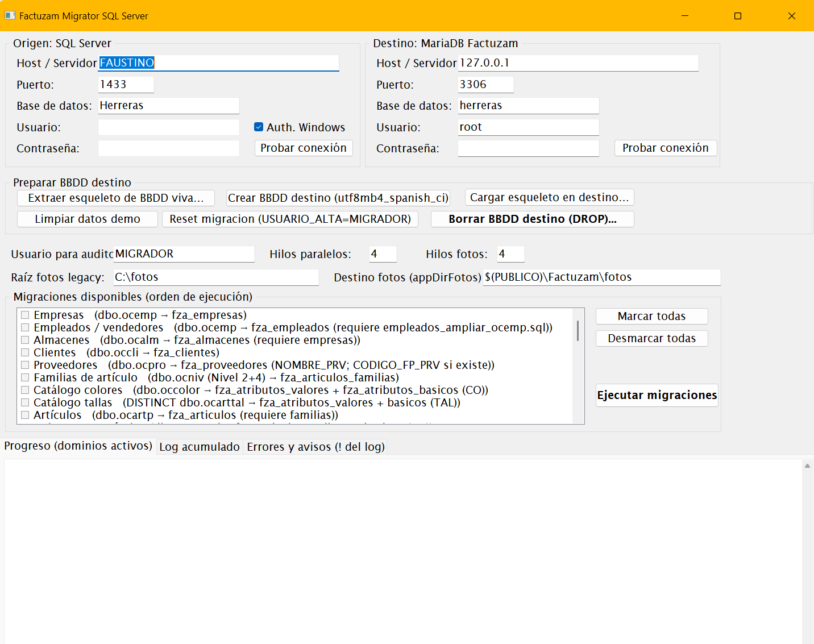
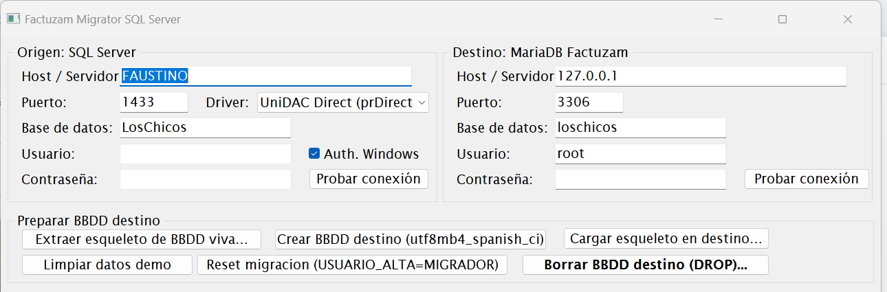
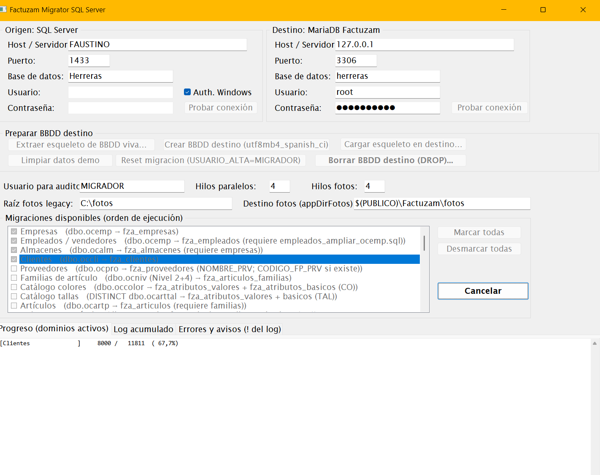

# 10 · Migración desde software legacy

[◀ Volver al índice](README.md)

Factuzam incluye una herramienta independiente, el **Factuzam Migrator**
(`FactuzamMigrator.exe`), que traslada los datos del ERP anterior
(base de datos **SQL Server**) a la base de datos `factuzam`
(**MariaDB**). Este capítulo explica qué migra, cómo preparar la base de
datos destino y cómo ejecutar y verificar la migración.

> Es una operación de **administrador**, que normalmente se hace **una
> sola vez** en la puesta en marcha. Requiere acceso a las dos bases de
> datos (la antigua y la nueva).

---

## 1. Qué es y qué necesita

- Programa **separado** de `fzam.exe`: se ejecuta solo durante la
  migración y no forma parte del trabajo diario.
- Conecta a la vez con:
  - **Origen:** la base de datos SQL Server del software anterior.
  - **Destino:** la base de datos `factuzam` en MariaDB.
- Guarda la configuración de conexiones (sin contraseñas) en
  `%USERPROFILE%\Factuzam\migrator.ini`.

*▢ Captura pendiente — Migrator con los paneles Origen/Destino y la lista de migraciones.*

---

## 2. Qué datos migra

El migrador traslada, **respetando el orden de dependencias**, los
siguientes dominios:

| Dominio | Qué se migra |
|---------|--------------|
| Formas de pago, Grupos de IVA, IVAs | Catálogos base. |
| **Empresas** | Empresas emisoras. |
| **Almacenes** | Almacenes (y sus cajas, series y contadores). |
| **Clientes** | Ficha completa de clientes. |
| **Proveedores** | Ficha completa de proveedores. |
| **Familias** | Secciones y familias de artículos (con su jerarquía). |
| **Colores y tallas** | Catálogos maestros de atributos. |
| **Artículos** | Catálogo de artículos. |
| Colores/tallas por artículo, **tallajes** | Asignaciones de variación por artículo. |
| **SKUs** | Variantes vendibles + **códigos de barras**. |
| **Inventarios** | Inventarios y sus líneas. |
| **Movimientos** | Movimientos de almacén (y reconstruye el **stock actual**). |
| **Ventas (caja)** | Operaciones de caja, pagos y depósitos de cliente. |
| **Facturas** | Facturas y sus líneas. |

La migración corre **en paralelo por oleadas**: los dominios sin
dependencias entre sí se procesan a la vez, y cada oleada espera a que
termine la anterior (catálogos → maestros → variantes → documentos).

---

## 3. Preparar la base de datos destino

El propio Migrator trae una sección **«Preparar BBDD destino»** con tres
botones, pensada para crear la base nueva sin depender de ficheros
externos:

1. **Extraer esqueleto de BBDD viva…** — conecta a una base `factuzam`
   de referencia y genera un `.sql` con toda la estructura (tablas,
   vistas, procedimientos) y los **datos de las tablas de sistema**
   (países, tipos de IVA, ventanas, metadatos…). Las tablas de negocio
   (artículos, clientes, facturas…) van vacías porque las rellenará la
   migración.
2. **Crear BBDD destino** — crea la base de datos indicada en el panel
   Destino con juego de caracteres `utf8mb4` y cotejamiento
   `utf8mb4_spanish_ci`.
3. **Cargar esqueleto en destino…** — vuelca el `.sql` del paso 1 en la
   base recién creada.

*▢ Captura pendiente — Botones de extracción y carga del esqueleto.*

> Alternativa: crear la base destino desde `factuzam_original.sql` como
> en la [instalación](09-instalacion-windows.md#3-crear-la-base-de-datos-inicial).
> En ese caso, asegúrate de aplicar también los **scripts de esquema**
> requeridos por el migrador si tu dump es anterior a ellos (ampliaciones
> de códigos de cliente, nombre de proveedor, jerarquía de familias y
> líneas de inventario).

---

## 4. Ejecutar la migración paso a paso

1. **Copia de seguridad** de ambas bases de datos (origen y destino).
2. Abre `FactuzamMigrator.exe`.
3. Configura el panel **Origen** (SQL Server): host, puerto, base de
   datos, usuario y contraseña. Pulsa **Probar conexión**.
4. Configura el panel **Destino** (MariaDB) igual, y prueba la conexión.
5. **Marca las migraciones** a ejecutar. La lista ya respeta el orden de
   dependencias; para una migración completa, márcalas todas.
6. Pulsa **Ejecutar migraciones**. Durante el proceso:
   - El panel de progreso muestra **una línea por dominio activo** con su
     contador `X / Y (Z %)` en tiempo real.
   - El botón cambia a **Cancelar**: si lo pulsas, termina el dominio en
     curso y se detiene (lo ya migrado queda hecho).
7. Al terminar, revisa el resumen y el **panel de errores**.

*▢ Captura pendiente — Progreso por dominios y log al pie.*

### Re-ejecución segura (idempotencia)

Las migraciones son **idempotentes**: si un registro ya existe en destino
se **salta** (se contabiliza como «saltado») y se continúa. Cada dominio
se ejecuta dentro de una **transacción**: si algo falla, se deshace ese
dominio completo (los demás siguen). Por tanto, ante un fallo puntual se
puede **corregir la causa y volver a ejecutar** sin duplicar datos.

### Log de errores

Cada ejecución deja registro en tres sitios:

- El **log general** de la pantalla (todo el detalle).
- El **panel rojo de errores** (solo errores y avisos).
- Un fichero `migrator_errores_AAAAMMDD_HHMMSS.log` en
  `%USERPROFILE%\Factuzam\`, para revisarlo después (la ruta exacta se
  imprime en el log al iniciar).

---

## 5. Ajustes manuales después de migrar

La primera versión del migrador aplica algunas **heurísticas** que
conviene repasar a mano una vez terminada la migración:

| Dato | Qué hace el migrador | Qué revisar después |
|------|----------------------|---------------------|
| **Tipos de IVA** | El legacy guarda histórico por fechas; se toma el **porcentaje mayor** como IVA normal y se dejan a 0 el reducido/súper/exento. | Completar los porcentajes reducido, superreducido y exento en *Otros ▸ Impuesto IVA*. |
| **Código de almacén** | El legacy indexa por (empresa, almacén); el destino exige código único global. Se genera `E<empresa>-A<almacén>`. | Renombrar códigos si se prefiere otra nomenclatura. |
| **Tipo de IVA por artículo** | El legacy guarda un entero; se migra todo como IVA **Normal** (`N`). | Marcar los artículos con IVA reducido/súper/exento. |
| **Forma de pago del cliente** | Se usa el código de efecto del legacy como código de forma de pago. | Verificar que las formas de pago migradas tienen la descripción y comportamiento deseados. |
| **Familias** | Secciones y familias del legacy van a la misma tabla, conservando la jerarquía sección → familia. | Revisar el árbol de familias resultante. |
| **Conjuntos de tallas por artículo** | Se migran los catálogos y las asignaciones de color/talla, pero **no** el conjunto concreto de tallas de cada artículo. | Asignar el conjunto de atributos a los artículos que lo necesiten (*Archivo ▸ Tablas Auxiliares ▸ Colecciones de Atributos*). |

---

## 6. Verificación final

Antes de dar la migración por buena:

1. **Cuadra los totales**: nº de clientes, proveedores, artículos, SKUs y
   facturas entre origen y destino (el resumen del migrador muestra los
   contadores de insertados/saltados/errores por dominio).
2. **Stock**: compara el stock de una muestra de artículos con el sistema
   antiguo (*Almacén ▸ Informes*). El migrador reconstruye el stock a
   partir de los movimientos.
3. **Documentos**: abre algunas facturas y operaciones de caja migradas y
   comprueba importes e impuestos.
4. **Ventas de prueba**: haz un ticket de prueba en el TPV y una factura
   de prueba en Ventas Mayor.
5. Aplica los **ajustes manuales** de la sección anterior.
6. Haz una **copia de seguridad** de la base ya migrada: es tu punto de
   partida oficial.

> Hasta completar la verificación, conserva el software y la base de
> datos antiguos **en solo lectura** como referencia histórica.

---

[◀ Instalación en Windows](09-instalacion-windows.md) · [Índice](README.md) · [Siguiente ▶ Verifactu (AEAT)](11-verifactu.md)
