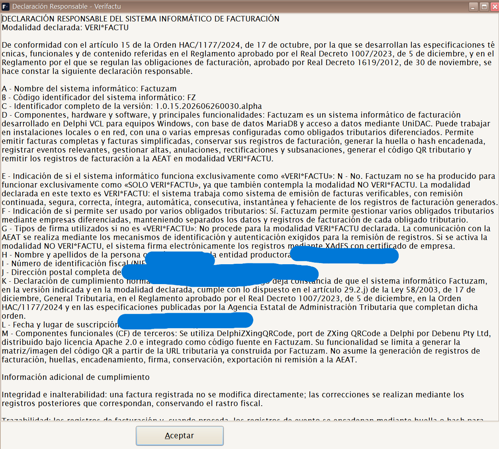
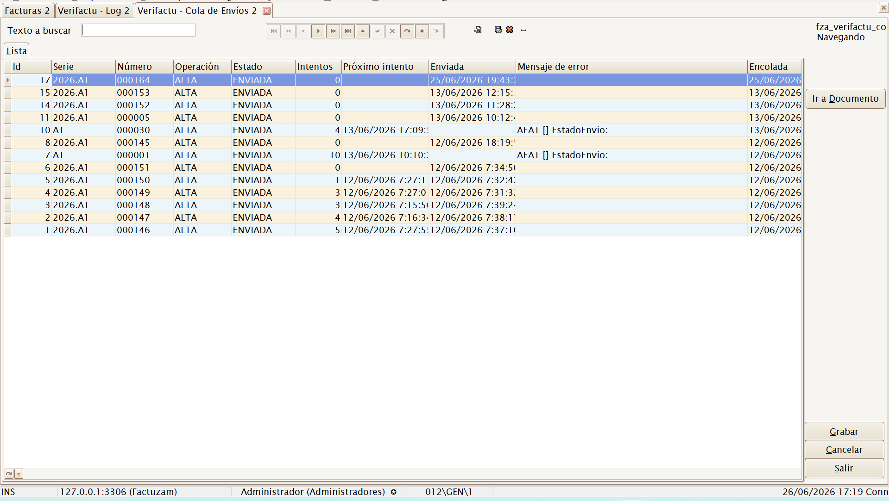
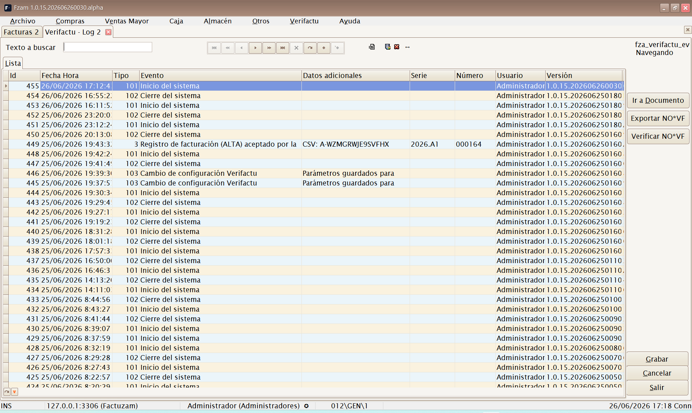
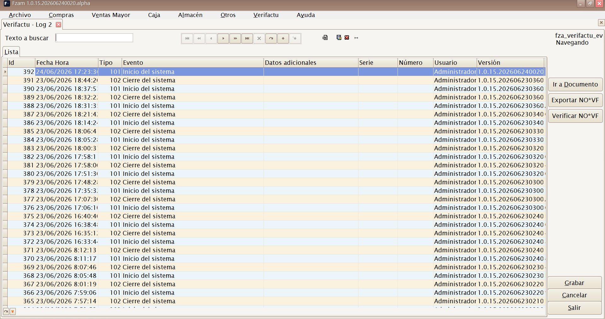
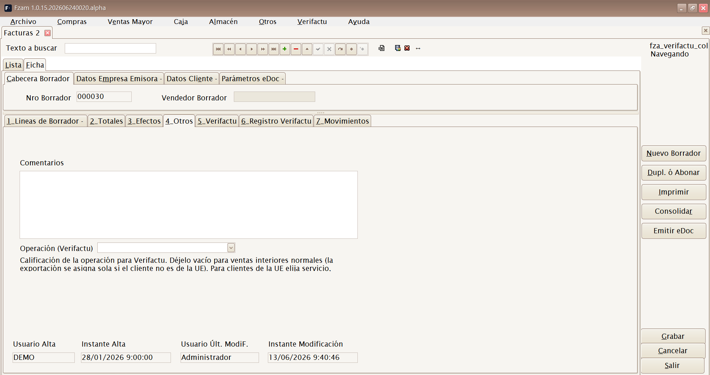
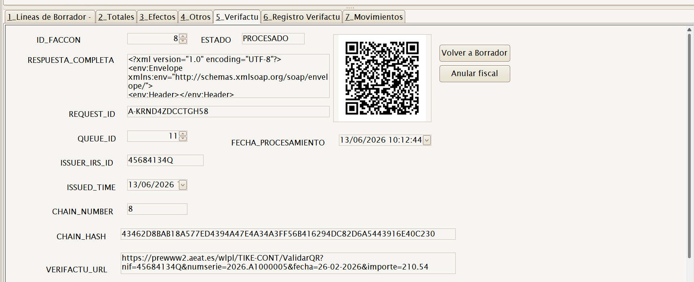
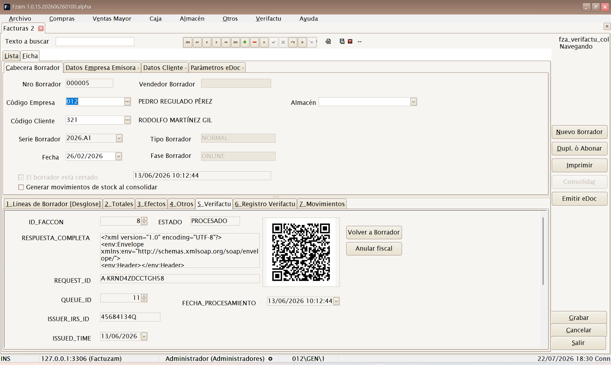

# 11 · Verifactu (AEAT)

[◀ Volver al índice](README.md)

**Verifactu** es el sistema de la Agencia Tributaria (AEAT) para los
sistemas de facturación verificables (SIF) del **RD 1007/2023**. Con
Verifactu activo, cada factura o ticket que emite Factuzam:

- se imprime con un **código QR tributario** y la leyenda `VERI*FACTU -
  Factura verificable en la sede electrónica de la AEAT`;
- se **comunica automáticamente a la AEAT** en segundo plano, encadenada
  con las anteriores mediante una **huella SHA-256** que garantiza que no
  se pueden alterar ni borrar facturas.

Este capítulo explica cómo se configura, cómo trabaja de forma automática y
qué acciones fiscales (anular, rectificar, subsanar…) tienes disponibles.

Factuzam trabaja con tres **modos fiscales**:

| Modo | Uso |
|------|-----|
| **SIN** | Periodo transitorio o demo: no crea registro SIF ni cola AEAT. |
| **VERIFACTU** | Envía los registros a la AEAT mediante la cola. |
| **NO_VERIFACTU** | Registra localmente la cadena y permite exportar XML de eventos y facturación; debe firmarse con certificado. |

> Verifactu es un subsistema **transversal**: afecta a las
> [Facturas de venta](04-menu-ventas-mayor.md), a las
> [Facturas Simplificadas y al TPV de Caja](05-menu-caja.md). Aquí se
> documenta de forma unificada.

---

## 1. Cómo funciona (visión general)

```
   Venta / Factura
        │
        ▼
  Se encola  ──►  fza_verifactu_cola  (estado PENDIENTE)
        │
        ▼
  Hilo de envío en segundo plano (cada X segundos)
        │   reclama filas PENDIENTE → PROCESANDO
        ▼
  Envío a la AEAT (SOAP, certificado de la empresa)
        ├── Aceptado ─► ENVIADA · factura CONSOLIDADA · genera QR y hash
        └── Error    ─► reintento con espera creciente; al agotar, ERROR
```

Puntos clave:

- El **QR del ticket se genera en local** al imprimir; **no espera** a la
  respuesta de la AEAT, así que la venta en caja nunca se ralentiza.
- La comunicación la hace un **proceso en segundo plano** (la «cola»), de
  modo que el cajero sigue trabajando mientras las facturas se envían.
- Cada envío aceptado **encadena su huella** con el de la factura anterior
  del mismo NIF emisor: es la garantía de integridad que exige la AEAT.

---

## 2. Configuración previa (administrador)

Antes de activar Verifactu hay que dejar tres cosas listas:

### 2.1 Certificado de la empresa

En *Archivo ▸ Empresas ▸ Certificado / Verifactu* se indica el **número de
serie del certificado** y su tipo. La aplicación usa ese certificado
(del almacén de certificados de Windows) para **firmar el envío** a la
AEAT. Sin certificado válido, los envíos fallan.

### 2.2 Parámetros de Verifactu

En *Otros ▸ Parámetros del entorno*, categoría **Verifactu**:

| Parámetro | Significado |
|-----------|-------------|
| **Modo fiscal** | `SIN`, `VERIFACTU` o `NO_VERIFACTU`. Solo debe cambiarlo un administrador. |
| **Entorno** | `PRE` (pruebas de la AEAT) o `PRO` (producción real). |
| **NIF del SIF** | NIF del sistema informático de facturación. **Obligatorio**: si está vacío, la AEAT rechaza con el error «[1100] NIF» (ver [diagnóstico](#6-diagnostico-de-problemas-frecuentes)). |
| **Razón social del SIF** | Nombre/razón del productor del sistema. |
| **Id. de instalación** | Identificador de esta instalación. |
| **Segundos de ciclo** | Cada cuánto el proceso de envío revisa la cola (por defecto 60 s). |
| **Máx. intentos** | Reintentos antes de marcar una factura como `ERROR` (por defecto 10). |
| **URLs de QR y de envío** (PRE/PRO) | Direcciones de la AEAT para el cotejo del QR y para el envío; vienen rellenas por defecto. |
| **Firma con certificado** | En modo `NO_VERIFACTU`, firma los registros locales con XAdES usando el certificado de la empresa. |
| **Servidores NTP / margen reloj** | Control de hora fiscal para bloquear registros si el reloj del equipo no es fiable. |

> Cambia primero a **`PRE`** para probar contra el entorno de pruebas de la
> AEAT. En PRE, el NIF del obligado debe estar dado de alta en el censo de
> pruebas y guardar relación con el certificado. Pasa a **`PRO`** solo
> cuando todo funcione.

### 2.3 Activación

Selecciona el **modo fiscal**:

- En **VERIFACTU**, las nuevas ventas y facturas se imprimen con QR y se
  encolan automáticamente.
- En **NO_VERIFACTU**, se registra y firma localmente la cadena. No hay
  cola AEAT, pero se pueden exportar los XML exigidos.
- En **SIN**, el sistema permite trabajar sin cierre SIF durante el
  periodo transitorio o para pruebas.

---

## 3. El menú Verifactu

Con el subsistema instalado aparece el menú principal **Verifactu** con tres
opciones (todas se pueden ocultar por grupo desde
[Permisos](07-menu-otros.md#permisos)):

```
Verifactu
├── Declaración Responsable
├── Cola de Envíos
└── Verifactu Log
```

### Declaración Responsable

Muestra el texto de la **declaración responsable** del sistema de
facturación (art. 13 del RD 1007/2023), compuesto con el nombre del
sistema (`Factuzam`), su identificador, la **versión** instalada y los
datos del productor/instalación configurados en los parámetros. Es el
documento que acredita que el programa cumple la normativa.


*▢ Captura pendiente — Modal de Declaración Responsable.*

### Cola de Envíos

Consulta de la **cola de comunicación** (`fza_verifactu_cola`): muestra cada
factura pendiente o procesada con su **estado**, número de **intentos**,
fecha del **próximo intento** y el **mensaje de error** si lo hubo.

| Estado | Significado |
|--------|-------------|
| **PENDIENTE** | Encolada, esperando a que el proceso la envíe. |
| **PROCESANDO** | El proceso la está enviando en este momento. |
| **ENVIADA** | Aceptada por la AEAT y consolidada. |
| **ERROR** | Agotó los reintentos; requiere revisión. |


*▢ Captura pendiente — Cola de Envíos con estados e intentos.*

> **Reproceso manual:** en esta pantalla puedes editar las columnas
> *Estado*, *Intentos* y *Próximo intento* de una fila. Al grabar, el
> proceso la retomará en el siguiente ciclo. Es la forma de **relanzar** un
> envío que quedó en `ERROR` tras corregir su causa (p. ej. el NIF del SIF
> o el certificado). El resto de columnas son de solo lectura.

### Verifactu Log

Consulta del **registro encadenado de eventos** (`fza_verifactu_eventos`):
la traza completa de altas, anulaciones y respuestas de la AEAT con su
**cadena de huellas SHA-256**. Es la pantalla de auditoría del sistema.
Solo lectura.


*▢ Captura pendiente — Log de eventos con la cadena de hashes.*

En modo **NO_VERIFACTU**, el botón `Exportar NO*VF` genera dos ficheros
XML: registro de eventos y registro de facturación. La exportación solo
empaqueta registros ya generados; no crea la trazabilidad en ese momento.



---

## 4. Verifactu en la ficha de la factura

Al abrir un borrador normal o simplificado dispones de dos pestañas y un
botón específicos:

- **Pestaña Verifactu** — muestra el resultado de la comunicación: el **QR**
  generado, la **URL de cotejo** de la AEAT, la **huella de cadena**
  (`CHAIN_HASH`), el **estado** de la consolidación y los identificadores
  (CSV, id de cola, id de petición). Incluye los botones **Consultar
  Estado** y **Reconsolidar OFFLINE**.
- **Pestaña Registro Verifactu** — el log de eventos de esa factura
  concreta.
- Botón **Consolidar** — fuerza el registro/comunicación de la factura a
  Verifactu (normalmente no hace falta: la cola lo hace sola).

En la pestaña **Otros** se puede indicar el **tipo de operación
Verifactu** cuando no es una venta interior general: servicio
intracomunitario, entrega intracomunitaria, inversión del sujeto pasivo o
exportación. Para clientes extranjeros, la aplicación usa los datos de país
y NIF-IVA/documento para construir el destinatario correcto.




*▢ Captura pendiente — Pestaña Verifactu de la factura (QR, URL, hash, estado).*

> Un borrador **consolidado** (`ESCONSOLIDADA = S`) ya tiene cierre fiscal
> y **no se puede modificar ni borrar**: cualquier corrección se hace con
> una **rectificativa** o una **anulación** (ver abajo). Es el principio de
> inalterabilidad del SIF.

---

## 5. Acciones fiscales sobre una factura emitida

Como una factura registrada no se puede tocar, Verifactu ofrece distintos
caminos según lo que necesites. Están disponibles en la lista de
**Borradores** y en **Buscar operaciones** del TPV de Caja, siempre
sobre un documento **ya consolidado**:

| Necesitas… | Acción | Qué hace |
|------------|--------|----------|
| Anular una venta inexistente o errónea | **Anular (Verifactu)** | Encola un *registro de anulación*. La factura pasa a **CANCELADA**. |
| Corregir importes o conceptos | **Rectificar** | Crea una **factura rectificativa** (importes en negativo) ligada a la original, que queda como *RECTIFICADA*. Se puede rectificar varias veces. |
| El registro se comunicó con errores | **Subsanar (Verifactu)** | Reenvía el registro corregido (*subsanación*), p. ej. tras un «aceptado con errores». |
| Un cliente pide factura nominativa de su ticket | **Facturar ticket (F3)** | Crea una **factura normal** en sustitución de la simplificada, copiando sus líneas, a nombre del cliente. |
| El cliente se identifica en el momento de la venta | **Factura (F8)** en la fase de cobro | Graba la venta directamente como **factura normal** (no ticket); exige cliente con NIF e imprime en A4/PDF. |


*▢ Captura pendiente — Botones Consolidar / Anular / Subsanar / Rectificar / Facturar ticket.*

Cada una de estas operaciones **se vuelve a encolar** y se comunica a la
AEAT en modo `VERIFACTU`, o se registra localmente en modo `NO_VERIFACTU`,
conservando la **trazabilidad** (qué documento rectifica o sustituye a
cuál). La lista muestra además una columna **«Cola Verifactu»** con el
último estado cuando aplica.

> **Anular** ≠ **Rectificar**: anular elimina fiscalmente la factura;
> rectificar la corrige emitiendo otra que la referencia. Para un cambio de
> importes lo correcto suele ser **rectificar**.

---

## 6. Diagnóstico de problemas frecuentes

**Una factura se queda en `ERROR` en la cola.** Abre *Verifactu ▸ Cola de
Envíos* y lee el **mensaje de error** de la fila. Causas habituales:

- **«[1100] NIF»** — falta el **NIF del SIF** en los parámetros, o el NIF de
  la empresa/cliente está mal formado (con guiones o longitud distinta de
  9). Corrige y **reprocesa** la fila.
- **Certificado** — el número de serie del certificado de la empresa no es
  válido o no está en el almacén de Windows del equipo.
- **En PRE** — el NIF no está censado en el entorno de pruebas o no guarda
  relación con el certificado.

Tras corregir la causa, **relanza** el envío editando la fila en la cola
(estado → `PENDIENTE`, intentos → 0) o sube el parámetro de máximo de
intentos: el proceso revive solo las filas en `ERROR` que aún tengan
intentos disponibles.

**El sistema se autocura ante duplicados:** si la AEAT acepta pero falla el
guardado local, en el reintento la AEAT responde «registro duplicado» y la
aplicación lo da por bueno. No hay que hacer nada.

---

## 7. Resumen para el día a día

- Con Verifactu **activo**, no tienes que hacer nada especial: vende y
  factura con normalidad; el QR y el envío son automáticos.
- Si una factura está mal, **no la borres**: usa **Rectificar**, **Anular**
  o **Subsanar** según el caso.
- Vigila de vez en cuando *Verifactu ▸ Cola de Envíos*: si todo está en
  **ENVIADA**, vas al día; si ves **ERROR**, revisa el mensaje y reprocesa.
- Ante cualquier incidencia con la AEAT, ten a mano la **versión** del
  programa (*Ayuda ▸ Acerca de*) y la **Declaración Responsable**.

---

[◀ Migración desde legacy](10-migracion-legacy.md) · [Índice](README.md)
