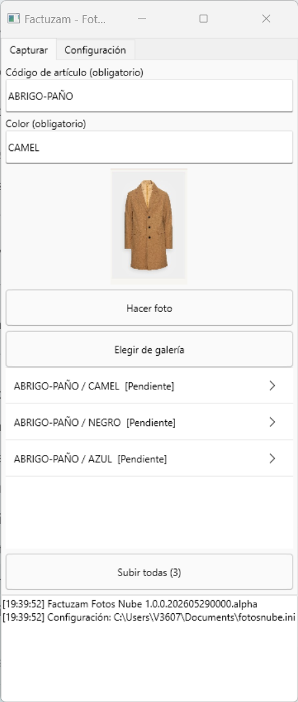
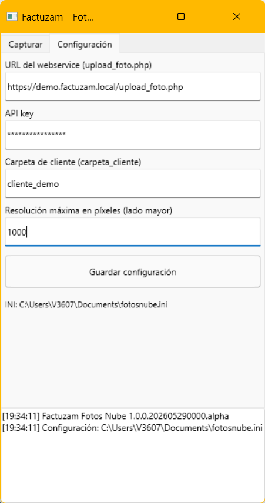

# 13 · Aplicaciones móviles

[◀ Volver al índice](README.md)

Factuzam dispone de aplicaciones móviles independientes para consultar
información o capturar datos fuera del puesto Windows. Cada app usa una
credencial y permisos propios; no se conecta directamente a MariaDB.

---

## Factuzam Fotos Nube: fotografiar artículos desde Android

**Factuzam Fotos Nube** permite hacer fotos con la cámara del móvil —o
elegirlas de la galería—, asociarlas a un **artículo y color** y subirlas
por lotes al servicio de fotos. Después pueden descargarse e integrarse en
el catálogo desde Factuzam.

### Configuración inicial

En la pestaña **Configuración** indica:

| Campo | Contenido |
|-------|-----------|
| **URL** | Dirección del servicio `upload_foto.php` facilitada por el administrador. |
| **API key** | Credencial de acceso al servicio de fotos. |
| **Carpeta de cliente** | Identificador de la instalación en el servidor. Debe existir previamente; no se crea desde el móvil para evitar duplicados por errores de escritura. |
| **Resolución máxima** | Tamaño máximo del lado mayor. El valor predeterminado es **1000 px** y el límite de seguridad es 4000 px. |

Pulsa **Guardar configuración**. Los valores quedan en el almacenamiento
privado de la aplicación; la pantalla muestra la ruta de su fichero de
configuración.

> La API key es una credencial. No la incluyas legible en capturas, correos
> ni incidencias: enmascárala antes de compartir la pantalla.

### Capturar y subir un lote

1. Escribe el **código exacto del artículo**.
2. Escribe el **color**. Debe coincidir con el texto de color que forma el
   SKU en Factuzam, no con el color básico usado solo para clasificar.
3. Pulsa **Hacer foto** o **Elegir de galería**. La imagen se reduce a la
   resolución configurada y se añade a la cola como **Pendiente**.
4. Repite el proceso para todos los artículos y colores del lote.
5. Pulsa **Subir todas**. Cada elemento pasa por **Subiendo...** y termina
   en **Subida OK** o **Error**. El registro inferior muestra el resultado.

Si hay varias imágenes del mismo artículo/color, la app les asigna los
índices 1, 2, 3... en el orden de la cola. Por ejemplo, la primera foto de
`BLUSA01` en `011-AZ` se publica como la imagen 1 de ese grupo.

Para que el emparejamiento sea fiable, Factuzam sanea el color con la misma
regla que el SKU: mayúsculas, espacios convertidos en guiones y sin símbolos
como `/`, `%` o `€`. Si el proveedor llama al color `011-AZ` y su color
básico es `AZUL`, en la app se escribe **011-AZ**.

### Incorporar las fotos al catálogo de Factuzam

La subida al servidor no sustituye automáticamente la foto local. En el
puesto Windows:

1. Configura el servicio y la carpeta compartida de fotos en
   *Otros ▸ Parámetros del entorno ▸ Fotos/Servicios web*.
2. Abre el artículo o la línea de una sesión de compra.
3. Usa **Bajar fotos del servidor**. Factuzam descarga las imágenes,
   relaciona el color con el SKU y crea sus copias de 300 px, 600 px y
   resolución real en `appDirFotos`.
4. Comprueba el resultado con `[Ctrl]+[F]` o en la
   [Consulta de stocks](08-menu-ayuda.md#consulta-de-stocks).

---

## VentasFzam: ventas del día en el móvil

**VentasFzam** es una aplicación de consulta en modo **solo lectura**. Permite
seguir las ventas diarias desde el teléfono sin abrir el TPV y sin riesgo de
modificar facturas, cobros o stock.

### Qué muestra

Cada línea de venta incluye:

- Hora, SKU y descripción.
- Temporada y proveedor.
- Importe vendido.
- Foto del artículo en resolución de 300 px, cuando está disponible.

Al tocar una línea se abre su detalle con familia, color, precio de coste,
PVP, descuento en porcentaje y euros, precio de venta y total.

La cabecera resume cuatro indicadores del día:

| Indicador | Contenido |
|-----------|-----------|
| **Venta** | Total vendido con IVA, para que cuadre con la caja. |
| **Coste** | Coste acumulado de los artículos mostrados. |
| **Margen** | Importe y porcentaje calculados sobre la base imponible, no sobre la venta con IVA. |
| **Descuento** | Descuento total aplicado. |

### Manejo diario

- **◀ / ▶** cambia al día anterior o siguiente.
- Tocar la **fecha** vuelve directamente a hoy.
- El **buscador** filtra en el teléfono sobre los datos descargados; el
  resultado aparece de inmediato y los cuatro totales se recalculan. La
  cabecera indica **(filtrado)** mientras haya una búsqueda activa.
- Las ventas anuladas o sustituidas no aparecen ni suman. La rectificativa
  sustitutiva correcta sí aparece; las rectificaciones por diferencias
  computan con su signo.

Las fotografías se descargan después de mostrar la lista para no retrasar
la consulta y quedan almacenadas en la caché del teléfono. Si se cambia de
día mientras se descargan, la app descarta las imágenes pendientes de la
consulta anterior.

> El día se determina por la **fecha de la factura**, no por el instante en
> que el servidor recibió el evento. Así los totales respetan el cierre del
> negocio y el huso horario de la instalación.

### Puesta en marcha (administrador)

La consulta móvil necesita que la instalación publique las ventas en el
servicio web:

1. En **Otros ▸ Parámetros del entorno ▸ Servicios web**, configurar
   `appApiUrl` (URL general), `appApiToken` (API key/token) y
   `appApiReferencia` (referencia de la instalación).
2. En **TPV ▸ Parámetros de Caja ▸ Servicios web**, activar **Enviar ventas
   completas al webservice de respaldo** (`vgerEnviarVentasWS`) en los
   perfiles o cajas que correspondan. El valor inicial es `False`.
3. Crear una credencial móvil con permiso de lectura de ventas.
4. En **VentasFzam ▸ Configuración (⚙)**, indicar URL base, token y
   referencia.

Factuzam guarda cada cambio de una venta como un evento en una cola local y
lo envía en segundo plano. La caja no espera a la red y la cola fiscal de
Verifactu funciona de forma independiente. Los eventos se reintentan con el
mismo identificador para evitar duplicados.

### Supervisar los envíos

Abre **Otros ▸ Colas de envíos ▸ Web Service Fzam** para revisar el estado,
los intentos y el historial HTTP de cada evento. **Actualizar** refresca la
consulta y **Ir a Documento** abre la venta relacionada; la pantalla no
permite modificar ni reintentar filas. Los envíos pendientes se procesan cada
60 segundos de forma predeterminada y usan espera exponencial antes de pasar
a `ERROR` al agotar los 20 intentos configurados.

Consulta estados, permisos y recuperación en
[Otros ▸ Colas de envíos ▸ Web Service Fzam](07-menu-otros.md#web-service-fzam).

> Las ventas históricas sincronizadas antes de incorporar un dato nuevo —por
> ejemplo, la temporada— pueden mostrarlo vacío hasta que vuelvan a enviarse.
> Las ventas nuevas lo incluyen desde el primer envío.

---

## Recuento móvil de inventarios

La app de recuento permite escanear existencias desde terminales Android y
devolver las cantidades a un inventario abierto. El envío y la recogida se
controlan desde Factuzam; el móvil no regulariza el stock por sí solo.

Consulta el procedimiento completo en
[Almacén ▸ Inventarios ▸ Recuento móvil](06-menu-almacen.md#recuento-movil).

---

[◀ Cambios y novedades](12-cambios-y-novedades.md) · [Índice](README.md) · [Siguiente ▶ Arquitectura y desarrollo](14-arquitectura-y-desarrollo.md)
